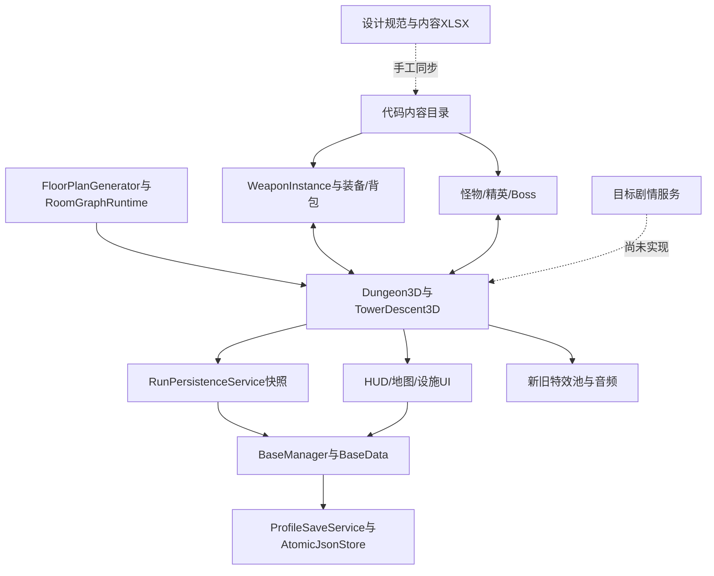

# 工程结构、数据链与文档同步审计

审计日期：2026-09-12。工程版本：0.1.0。代码基线：`31ed360644768808e6faef5cd3b341b731888625`。引擎：Godot 4.6.2。初始工作树无已跟踪修改。

## 1. 结论

**工程已具备局部解耦基础，但没有达到七大系统可完整独立开发、独立验收的目标。文档数量充足，当前状态、数据口径、设计修订和开发证据之间的关联不完整，不能直接作为可靠的版本签署依据。**

已具备稳定价值的边界包括：纯数据楼层规划、房间图查询、武器实例、装备交换、HUD快照映射、时间/能源计算、存档封套。主要问题集中在塔楼生命周期、统一结算、基地事务、场景/UI编排和特效迁移。应沿现有边界提取服务，不需要推倒重写。

本次已经整理设计与开发记录、建立模块/功能索引、纠正若干确定过期的事实。下面问题描述对应审计基线；后续修复在各问题内追加状态，不改写原始证据。文档治理完成不等于工程整改完成。

**状态判定修订（更新至2026-09-12）：** 审计发现不再统一称为“不匹配”或“错误”。44项跟踪现分为24项已一致、12项开发中·部分完成、2项工程/文档不匹配、3项待设计／核验、3项文档缺失；28项已处理、16项未处理。E15、E19、E20、E21按用户决定列为P3灰色暂缓，其中E15/E20仍保留为未处理的不匹配项，E19/E21属于等待版本条件的核验项。E18已建立开发中的独立电力系统设计；E22–E24与D08–D11已关闭，D02按设计中管理。G02已补齐独立测试功能文档并按功能版本1.0关闭文档缺口；G03枪械工坊、G04局内商人已建立独立玩法文档，因目标事务和独立专项尚未完成而归入开发中。已有正式子链路但尚未完成全部目标契约的项目属于开发进度；下文A01–A10保留问题域和风险证据，不代表每个未完成目标都是代码错误。逐项分类以[结构化差异清单](evidence/discrepancy_inventory_20260912.json)为准。

## 2. 范围与证据边界

- 扫描 `src/` 全部164个GDScript、54221行、18个一级目录，以及project.godot的19个Autoload；核读主要运行链、数据服务、测试与版本规范。
- 核查正式入口 `TowerDescent3D.tscn`、父类Dungeon、玩家/敌人/武器、背包、基地、存档、剧情、时间、主页/外观、UI、VFX/SFX/音乐、画质/性能、训练场及资产生产工具。
- 读取内容XLSX和资产台账；从隔离运行的正式Godot注册表导出数据，按ID对照字段。公式扫描与字段对照分别处理。
- 执行核心61项、行动自动存档/重载/音乐补充用例、两个持久化失败探针和后处理临时场景探针。
- 自动化使用仅修改用户数据目录的项目壳，资源和代码链接当前工作区；所有Autoload在启动前已被隔离，未将测试指向玩家正式存档。探针另用独立用户目录避免影响核心套件。
- 未执行全量101项、真实画面人工巡检、目标设备GPU测试或长时浸泡；不签署视觉品质、发布性能或所有分支正确性。静态依赖按符号/路径识别，动态get/call/group仍需人工判断，统计不是完整调用图。

原始核心输出、故障探针、结构与数据对照的长期摘要见 [evidence](evidence/README.md)。临时原始产物位于 `outputs/project_audit_20260912/`，删除它不影响本报告及版本内证据。

## 3. 模块健康性

逐模块结论与32个功能的设计/代码/数据/测试定位见 [功能契约索引](../MODULE_INDEX.md)。核心判断如下：

| 层面 | 已有能力 | 尚不健康的边界 |
|---|---|---|
| 内容 | ItemRegistry、BlueprintRegistry、Fate/Boss/Elite目录和XLSX | XLSX不是生成源；ID、字段与默认值仍手动双写 |
| 领域规则 | FloorPlanGenerator、EquipmentTransactionService、WorldTimeDomain、BaseEnergyService | 部分规则读取Autoload、持有Node树或直接修改BaseData |
| 运行编排 | Dungeon/Tower、状态机、存档快照和全局管理器 | 多功能集中于父子世界脚本，没有独立RunSession/楼层/区段/结算事务服务 |
| 场景适配 | 角色视觉与碰撞分离、设施包装、统一交互控制器 | UI和场景仍承担扣款、解锁、清档、实例迁移的业务编排 |
| 表现 | 共用模型工厂、HUDPresenter、对象池、音乐目录 | 两套特效池并存且新池回收错误；调参/后处理缺设计与验收入口 |
| 验收 | 122个verify场景、核心61项、前置加载检查与看门狗 | 渲染归类遗漏、退出0带错误、缺运行前存档隔离、关键故障用例未覆盖 |

### 实际数据链

数据相连是存在的；问题在于有些连接通过公共字段、场景私有方法和多次落盘完成，不能保证独立替换及失败一致性。

## 4. 优先问题与证据

优先级表示对开发/发布的影响，不把静态风险都宣称成已发生的游戏故障。

### A01｜已关闭：到达门与区段提交未由持久化成功控制（原P0）

**已复现到达门故障；区段卸载为代码审查确认的同类缺口。**

**后续状态（2026-09-12）：** 用户明确决定E01、E02按当前工程行为修改文档。本版本正式采用运行态先行、快照最终一致：FloorBundle在内存生成/验证/登记后即可开门；隔离前门交互先关闭后侧路线并卸载旧段，再继续开门；两者均不等待持久化成功。进程在后续快照成功前结束时，允许读档回到最后成功快照。下列内容保留为原文档与工程不一致的历史证据，不再视为当前缺陷。

- `src/world3d/TowerDescent3D.gd:2196` `_activate_stair_arrival`调用`_commit_floor_bundle`后直接开启门；2942行函数只创建/登记场景，没有持久化成功检查。
- 3142行`_finalize_airlock_commit`锁后门后直接卸载旧段，返回void，不能表达写盘失败/恢复结果。
- 设计05与09要求先验证、持久化，再放行；09 §5.4/5.5明确不可通过读档恢复已提交区段。
- 隔离探针在真实持久化分支开启、`force_save_failure_for_test=true`时调用正式到达门处理入口：`accepted=true`、`arrival_open=true`、`generated_floors=[0,2]`，`revision_before=revision_after=1`。

探针通过测试适配入口调用同一处理函数，不是键盘到门全流程或断电测试。它足以证明写盘成功未成为开门前置条件；正常到达门测试通过不能覆盖这个缺口。

原整改建议已由本次设计决定取代。生命周期服务抽取仍可作为解耦工作，但不得将持久化成功重新设为开门/卸载门禁，除非后续再次修订设计。

### A02｜P0：部分经济操作与结算没有完整原子语义

**扣款返回值错误已复现；跨步骤结算为代码审查风险。**

**后续状态（2026-09-12）：** 差异表E03、E05、E06已修复。普通资源扣款现在只在写盘和回读成功后返回成功；成功撤离与死亡通过`commit_run_settlement`一次提交当前已纳入的长期域，失败整体回滚，重试和重载重放保持幂等。专项`verify_extraction_points_spend_transaction`与`verify_run_settlement_transaction`均通过。下列内容保留为修复前证据。工坊两步升级及精英／剧情等后续扩域仍未收口，因此A02问题域尚未全部关闭。

- `src/base/BaseManager.gd:702` `spend_extraction_points`扣内存后调用save_base但忽略返回，最终true；set_blueprint_tier/add_extraction_points也忽略写盘失败。
- `src/ui/WorkshopMenu.gd:146`先扣钱再升Tier，随后显示成功。两个独立落盘操作没有统一回滚。
- 塔楼成功撤离在`TowerDescent3D.gd:288`依次record_run、add_extraction_points、clear_active_run_checkpoint，随后发成功事件；失败结果没有统一收口。死亡结算在`Dungeon3D.gd:4727`附近亦由场景编排多个写入。
- 故障探针：初始500魂已写盘，强制失败后扣70，接口返回true、内存430、磁盘仍500。

基地商店专用事务已经有幂等与回滚，不能因此推断所有BaseManager操作都安全。整改应复用其思想，建立升级/恢复/结算命令，一次提交、一致回滚，成功事件在持久化成功之后发出。

### A03｜P1：新VFX池回收信号错误，迁移后缺少对应验收

**运行错误已复现。**

**后续状态（2026-09-12）：E07已关闭。** `retired(effect)`现在只绑定`asset_id`，不再重复绑定effect；`verify_vfx_pool_lifecycle`覆盖到期回收、同实例复用、active/inactive计数与退出清理。调用者迁移范围仍由E08独立跟踪。

- `VfxEffectBase3D.gd:7/60`的retired信号自带effect参数。
- `VfxPool3D.gd:64`又bind(asset_id, eff)，最终传3个参数；107行回调只收(effect, asset_id)两个参数。
- 核心怪物测试重复输出“expected 2 argument(s), but called with 3”。特效隐藏后未能从active移入inactive，后续会继续创建；长期增长为代码路径推断，本次未做长测量化。
- WeaponModel3D与Projectile3D仍走CombatEffectPool3D；近战/敌人转向新池，兼容分支和直接Prefab实例化仍存在。`verify_3d_melee_feedback_flow`继续断言旧池slash/impact计数，不能签署新池接入。

整改：先修回收回调契约，再补新池重复借出/回收、场景退出、激活计数与多实例回归；完成调用者迁移后才退役旧池。14.6中的错误注册路径与常量名本次只修正文档。

### A04｜P1：世界父子类承担太多模块职责

- `Dungeon3D`5104行/249函数；`TowerDescent3D`4468行/163函数，两者合计9572行，约占src的17.7%。
- Dungeon同时引入UI、物品/装备、敌人/精英、地图、持久化和12个Autoload符号；Tower继承并直接使用父类的_rooms/_records/_inventory/_insurance等状态。
- FloorPlanGenerator、RoomGraphRuntime、RunPersistenceService、HUDPresenter已是良好抽取基础。它们没有使所有场景编排自动解耦。

行数仅作为集中度证据；问题是楼层、结算、UI与持久化必须一起理解/修改。建议依次抽取楼层提交、区段生命周期、单局结算和界面适配，不以切碎函数文件为完成标准。

### A05｜P1：缺少统一领域接口与跨域写权限约束

**后续状态（2026-09-12）：E11已关闭。** `RunPersistenceService`已分离schema、run_id、checkpoint_id与layout_id，旧schema占位身份可迁移；精英遭遇身份改用run_id。其他跨域写权限与事件接口仍属A05后续范围。

- 架构02列出的floor_bundle_committed、segment_committed等为建议事件；src未找到这些具体事件声明/发射，也没有独立FloorBundleService、SegmentLifecycleService、NarrativeTriggerService或RevivalPolicy。
- `EliteRosterService.gd:208`直接调用BaseManager私有`_ensure_data`并读写BaseManager.data。GameManager.currency也被世界脚本直接赋值并手动补emit。
- `RunPersistenceService.gd:18–19`把checkpoint_id/layout_id均赋成schema字符串；这不是每局/每层稳定身份。`Dungeon3D.gd:1950`又把checkpoint_id用于精英encounter_id。当前清预约可缓解部分问题，但不满足文档身份模型，未来持久化去重可能混淆行动。

整改：明确内容、实例、行动、布局、事务与schema各自生成者和生命周期；统一命令返回与只读快照。事件总线不是唯一解法，清晰的局部信号/接口同样有效。

### A06｜P1：存储底层尚不足以证明完整故障安全

已有封套校验、备份恢复、revision检查和写后回读，是有效基础。但`AtomicJsonStore.gd:27–58`写临时文件后没有检查写入错误或先校验临时内容，先删除旧bak再把当前主档旋转到bak；若主档已坏且上一备份是唯一有效档，下一次提升失败可能丢失有效备份。BaseManager写后发现错误时只恢复元数据，不代表业务载荷和磁盘都回滚。revision读→写之间也没有进程锁，不等于并发CAS。

这是静态失败窗口分析，未在本次模拟磁盘满、rename错误或两个真实进程竞争。应增加这些故障注入并保留最后有效备份；不要因已有“Atomic”类名就签署所有故障原子性。

### A07｜P1：测试入口与“通过”口径不完整

**后续状态（2026-09-12）：E13、E14已关闭，E15暂缓。** runner现在于Autoload前建立唯一隔离`user://`，预检和正式场景共同使用；完整日志中的未声明ERROR/SCRIPT ERROR会使场景失败，资源泄漏以独立失败码报告，故障注入预期错误按场景登记。真实渲染场景归类E15按用户决定降为P3暂不处理，因此A07问题域未整体关闭。

- 核心61项中有11项非零失败、1项180秒超时；49项退出0。退出0集合中仍存在未预期回收错误/退出资源警告，所以“49项退出0”不等于49项全部无错误验收。
- verify_monster_ai_light_effects退出0但含VFX信号错误；runner仅看进程退出码。
- full按现有列表枚举为101项，仍会包含未被renderer_scenes识别的真实截图用例，例如first_elite_visual、player3d_head_accessory_visual、wardrobe_layout_visual；base_fixture_glow在core且包含get_viewport图片读取。
- postfx只有`.gd`没有同名`.tscn`；按统一scene命令立即LOAD_FAILURE。临时包装场景可以探查代码，但不能算修复正式验收入口。
- suite未在Autoload启动前隔离user://；BaseManager的_ready会加载甚至迁移存档、EliteRosterService会处理预约。场景内部test_mode和晚设save_path不能保证所有启动副作用隔离。
- 预加载检查位于运行看门狗之外，仍存在加载卡住不受当前180秒保护的窗口。

整改：集中场景清单/运行模式/超时，运行前分配隔离用户目录，预检和执行都受时限控制；区分预期故障日志与非预期错误，将后者计入失败。补独立领域测试集，减少验证私有场景字段的耦合。

### A08｜P1：内容数据库与运行时投影不一致

内容表没有本次检测到的重复ID；两份XLSX公式错误搜索都匹配0条。**这不代表字段与代码一致，也未证明Excel原生重算正确。**

**后续状态（2026-09-12）：** 下表保留原审计证据。D01、D03–D11、D13已完成相应对齐：弹药名称、5个电池/手电正式ID与状态、基地商店购买去向、两件大型近战价格、普通房间钥匙价格和小电池子类已经同步。D02的现行999上限已一致，但最终弹药平衡仍为设计中；尚未关闭的是D12 Boss专钥匙目标链路。

| 内容 | 表格位置/值 | 实际运行时 | 影响 |
|---|---|---|---|
| 弹药 | 掉落物品B18“通用弹药”、G18堆叠999 | item_ammo_pack“通用弹药”、stack_max=999 | 当前一致；最终平衡仍标为设计中 |
| 电池/手电模块ID | A42:A46使用item_battery_l、item_cell_pack、item_flashlight_basic/advanced/efficient | 运行注册表同ID | 已一致 |
| 大型近战买卖 | 掉落物品P47:Q48为断刃165/83、战斧240/120 | 运行价格相同 | 已一致 |
| Boss专钥匙 | 表中item_boss_descent_key | ItemRegistry无此ID，Tower持有_boss_descent_key_count | 目标内容与计数式授权仍需明确迁移 |
| 商店说明 | 基地商店A2“购买进入保险柜” | 行记录L5:L11与正式99F代码均为当前I键背包 | 表内说明冲突 |

普通房间钥匙现已冻结参考价值40、出售20且不进入购买货架；小电池已补`subtype=battery`，两项均通过商店目录专项。

本次核对一致的部分：7项商店的ID、名称、买卖价、顺序、库存规则；48运行卡的ID/名称，表中额外30张为目标设计；12精英稳定ID/名称与1个deployed状态；7种Enemy3D基础profile的HP/速度与表一致，三个Boss内容ID存在。基础profile不等于楼层/主题/成长倍率之后的最终值。

内容实际范围为：武器表24行、命运78、怪物/Boss10、精英12、掉落45、商店7；运行物品44、卡48、精英12、独立Boss3。行数不同有合理的目标内容原因，必须按ID与状态解释，不能机械要求总数相等。原审计轮次没有修改XLSX；后续只对用户明确选择“文档对齐工程”的7项完成同步，其他未冻结设计仍保持不动。

### A09｜P1：资产台账与磁盘版本不一致

已有角色、武器、道具、设施制作/导入技能，source→GLB→包装→场景的生产链也存在。`scripts/check_asset_registry.py --scope full`本次检查418条登记，报告214条sha_mismatch；未报告其他该脚本覆盖的问题类别。

例：主玩家CHR-PLY-CAPSULE01指向production/v021运行包装，但登记摘要与文件不同。武器与设施中也有大量差异。检查仅对可解析单文件路径与64位SHA做精确比较，不覆盖所有多文件包、全部Blender内部对象或链路语义。

214条差异不等于214个损坏资产。应先核对每批修改的设计/记录/来源与正式引用，再确认版本与哈希，禁止一次性回填现状消除证据。

### A10｜P1：设计、状态与历史混在一起

已确认的例子：

| 原位置 | 原问题 | 本次处理 |
|---|---|---|
| 完成度§2剧情 | “已完成”与“独立系统未完成”同一行 | 改为独立系统未完成，保留目标设计 |
| 完成度交互 | 仲裁仍未完成，但已有PlayerInteractionController3D与专项 | 校正实现事实，保留契约补齐项 |
| 架构/关卡/存档 | 行动保存与精英服务已存在，却仍描述为待接入/elite_archive.dat | 校正事实，准确标明原子提交缺口 |
| 主设计手电 | §6基地暂停耗电，§16却写基地满电 | 按已有更新设计统一为不自动充电 |
| 测试规范/战斗/性能 | 多轮21/21、41/41、62/62混入规范 | 历史结果迁至development/history，当前结果独立记录 |
| 特效规范 | 注册路径src/combat3d/VfxPool3D、常量VFX_MUZZLE_FLASH不匹配代码 | 校正为src/vfx与FX01_MUZZLE_FLASH |
| 后处理/训练场/工坊/局内商人 | 原有代码或测试，但完整功能契约/逐功能开发记录不足 | G02已补独立测试文档并关闭；G03/G04已补独立玩法文档，按开发中管理；后处理仍为文档缺口 |

原v0.1顶层文档中68个src脚本名未被直接提及；这只是检索可发现性指标，并不等于68个功能无设计。按功能审阅后，确实存在上表和功能索引中的契约缺口。

抽样历史从2026-08-28起的35个修改src提交中，15个提交未同时修改docs/。这不能单独证明违反“设计先行”（可能已有设计或稍后补录）；结合PostfxOverlay缺设计、参数/测试漂移，说明目前没有可靠的设计修订→实现→验收关联。日期、资产版本、schema与游戏0.1.0也缺少统一映射。

## 5. 本次核心回归结果

运行命令：隔离项目中的 `scripts/run_verification_suite.sh aggregate core`。共61项，49项退出0、11项退出1、1项超时退出143；聚合返回1。执行日志见[evidence/core_output.txt](evidence/core_output.txt)。

| 未通过场景 | 主要结果 | 判断 |
|---|---|---|
| verify_tower_lighting_wall_combat_regressions | 手电能量超预算、基地灯关闭后未恢复目标照明 | 需核对新调参设计与实际灯控，不降低阈值掩盖 |
| verify_full_3d_game_flow | 节点2703超过原型预算 | 预算/范围不同步，当前验收失败 |
| verify_3d_enemy_behavior_flow | VFX回收信号错误，另有行为断言 | 回收错误已定位，其他断言见日志 |
| verify_3d_melee_feedback_flow | 旧池未记录slash/impact与几何 | 新旧池迁移与测试口径失配 |
| verify_scene_facility_shared_palette | 部分v002/v003材质无公共色盘/非最近邻 | 导入/版本契约未通过，待逐资产核对 |
| verify_base_fixture_glow | assert失败后无法退出，180秒超时 | 用例退出契约缺失；亦含真实截图调用 |
| verify_base_world_flow | 563节点、移动动画/locked环断言失败 | 旧表现基线与当前资产需核对 |
| verify_base99_structural_asset_integration | 四项V021结构/旧楼梯判定失败 | 版本迁移与测试仍绑定旧标识 |
| verify_base99_wall_content_v021 | 两处墙上内容坐标与基准不同 | 需确认作者新坐标与验收版本 |
| verify_base99_remaining_facilities_v021 | 预期46包，实际45 | 删除/替换需有设计和版本记录 |
| verify_3d_performance_budget | HUD267>171、HUD+预览278>190、总节点2549>2480 | 性能预算未通过 |
| verify_graphics_settings_ui_flow | 预期9项效果控制未满足 | 新后处理/画质服务契约不统一 |

额外执行：runtime_autosave与tower_runtime_restart_restore通过，证明普通行动快照保存/重载已经实装；它们不是开门故障或真实进程崩溃恢复测试。music_system退出0，未知ID错误是用例主动验证的拒绝分支，退出仍有6资源未释放告警。postfx正式scene入口缺失，临时包装后输出POSTFX_OVERLAY_RUNTIME_OK；这只验证脚本/API/uniform路径，没有验证真实画面。

测试中未预期的VFX错误与资源告警不能和BaseShop拒绝旧revision、Music拒绝未知ID等预期故障混为一谈。整改测试框架时需要场景级预期错误声明。

## 6. 已完成的文档治理

1. 建立docs入口、文档驱动开发规范、设计/开发记录模板、功能索引与设计阅读目录。
2. 实际迁移17处历史章节或整页，共1156行；保留原日期、历史参数、结论和原路径跳转。原变更日志不再与主设计并列承担规则职责。
3. 保留用户设计与尚未完成的目标，纠正确定过期的实现描述。代码与表格冲突不擅自选代码作为最终设计。
4. 将本次审计与故障证据保存到版本目录，设计正文不插入整轮日志。
5. 提供文档结构检查命令，验证版本、导航、功能ID和文件引用，并将文档先行约定写入仓库根AGENTS.md；它不代替设计语义审查，尚未接CI。

这不是所有历史文档的语义重写。剩余大章节里仍有“已实装”背景、设计来源日期和跨功能叙述；它们可以作为当前范围说明。尚无独立契约的功能继续列为待补，不假装通过目录整理完成全部工程链路。

## 7. 按文档实施的整改顺序

| 顺序 | 工作包 | 先冻结/更新的设计 | 完成判据 |
|---|---|---|---|
| 1 | 修复升级与结算事务 | BASE-WORKSHOP、RUN-SETTLE与09 | 写盘失败不报告升级/结算成功，不重复扣款或结算；E01/E02按最终一致口径关闭 |
| 2 | 修复VFX回收与测试入口、隔离/退出标准 | VFX-POOL与11/14.6 | 新池循环借还、退出清理；逻辑/渲染明确分类，非预期错误使验收失败 |
| 3 | 对齐内容表和资产版本 | 01、ASSET-PIPELINE及具体功能设计 | 5组ID明确映射，字段差异清零或有批准差异表；逐批核对214哈希，不盲目更新 |
| 4 | 从Dungeon/Tower提取生命周期与UI适配 | 02/05/09命令与快照契约 | 领域测试可用替身运行，正式主流程与故障测试通过；场景不写业务私有字段 |
| 5 | 补齐剧情、复活、后处理功能契约；继续完善商店/工坊独立事务与专项 | 对应功能ID、目标版本与修订 | 每项有唯一设计依据、数据/失败契约和真实开发记录；G02保持独立验收，G03/G04完成目标事务后再转已完成 |
| 6 | 建立版本签署门禁 | 文档规范与11 | 设计修订、实现提交、测试环境/结果、数据库/资产版本能相互追溯；再执行完整发布验收 |

不建议在事务与验收仍不可靠时同时扩展七个系统。可以先独立推进纯计划、快照映射、数据检查和已有稳定领域模块；其余工作先补契约，再按上述顺序施工。
