# 远征关卡01 设计

工程版本 0.1.0。本页是**远征关卡01 作为一张独立关卡的目标设计**：它应该长什么样、玩家在里面怎么走、边界在哪里。
当前实现事实与接口见[关卡生成与爬楼](../05_技术施工_关卡生成与爬楼.md)；版图 schema 与门槽公式见[关卡版图白盒与生成规范](../05.2_关卡版图白盒与生成规范.md)；区块归属见[关卡区块设计 §3.0](../05.1_关卡区块设计.md)。

> **文档归属 —— 本页是设计文档，不是账本文档。**
>
> - **归类**：`docs/v0.1/design/`（v0.1 目标规则主设计区，按关卡编号归类；与按功能归类的设计页并列，见[设计区索引](README.md)）。
> - **主设计归属**：FeatureID **`WORLD-PLAN`**，事实所有者 `FloorPlanGenerator`。登记见[功能索引](../MODULE_INDEX.md)与[机器可追溯副本](../feature_registry.json)。
> - **资产事实的唯一权威是账本，不是本页。** AssetID、版本、制作状态、源文件路径、GLB/Prefab、哈希与授权一律以[美术资产账本](../../../assets/registry/README.md)的**场景分账本**为准：映射真源 [`ledger_index.json`](../../../assets/registry/ledger_index.json)，场景域落在 [`ShellStorm2_场景账本_v001.xlsx`](../../../assets/registry/ledgers/ShellStorm2_场景账本_v001.xlsx) 的《资产主表》。本页只**转述**账本状态并注明「转述自哪个 AssetID」，**不自行判定**某件资产做完了没有；§3.1.1 的转述同步由 `scripts/check_expedition_room_asset_status.py` 盯着，账本一改本页必须同轮改。
> - **对外可接通的文档**分四类（账本文档 / 同类关卡产出文档 / 设计来源与施工对照 / 验收与门禁），逐条列在 **§9**。

> **这一关和其他关的区别：** 塔楼是"逐层往下爬"的多层结构；远征关卡01 是**单层独立行动** —— 一张版图、一条主路、一个撤离点，打完就回家。

> **本轮改版（2026-09-24 · 第二次，已落设计源）：** 版图从「15 房（主路 9 + 支线 6）」**收敛为 13 房**，并且**从写死坐标改为按种子程序化生成**（`mode = constrained`）。
>
> - **主路仍 9 房**、顺序固定：安全屋 → `room_01`…`room_06` → Boss竞技场 → 撤离屋（8 段衔接全部墙贴墙）。
> - **支线减为 4 间**，每间**直接挂在主路中间那 4 间内容房**（`room_02` / `room_03` / `room_04` / `room_05`）上 ⇒ **这 4 间主路房各多一扇门（共 3 扇）**，`room_01` 与 `room_06` 仍是 2 扇。
> - **每间内容房的房型（进而尺寸、进而整张版图）每局按种子从 §3.4 的房型池抽取** ⇒ 同样一条主路，每局的长短、形状、房间大小都不同。L2 `floor_00.json` 里存的那份 13 房坐标退化为**「兜底样例」**（12 次换种子重抽仍失败时才用），不再等于实跑版图。
>
> ⇒ **本页因此分两层读**：**§2 / §3.1 / §4.2 描述的是「示例版图」**（就是 L2 兜底样例那一份，用来画图与举例子）；**§3.4 的内容房型池 + §4.6 的生成算法才是实跑口径**。几何已落 `floor_00.json`，跑绿 `LEVEL_PLAN_VALIDATE_OK` 与 `LEVEL_PLAN_RUNTIME_GUARD_OK`。

---

## 1. 关卡身份

| 项目 | 值 |
|---|---|
| 关卡标识 `level_id` | `expedition_01` |
| 界面显示名 | 远征关卡01 |
| 设定名 | 远征前哨站 |
| 所属区块 `block_id` | `expedition` |
| 场景树归属 | 独立场景，区块根只有一个 `Blocks/Expedition` |
| 场景文件 | `scenes/ExpeditionLevel01_3D.tscn` |
| 派生的关卡 id `run_id` | `expedition_01` |
| 设计源目录 | `source/art/whitebox/tower_zones/expedition_01/v001/data/` |
| 关卡登记点 | `GameDesignConfig.EXPEDITION_LEVELS` 首条（兼任"未指定关卡时的默认终点"） |
| 专属门禁 | `tests/verification/verify_expedition_level01_flow.gd` |
| 副标题（读取界面用） | 单层独立行动 · 入口安全屋 → 九房主路 → 撤离点 |
| 目标文案（HUD 用） | 肃清内容房，穿过命运之门，抵达终点撤离点。 |

**进入路径：** 99F 基地中央远征情报室（`mission_operations`）→ 选关菜单 → 读取界面 → 本关卡。
**离开路径：** 撤离点撤离 / 死亡 / 入口安全屋的弃局门 —— 三条都结算并返回基地。

本关卡**不继承塔楼主场景**，父场景是公共关卡基座 `Dungeon3D.tscn`，覆写脚本 `TowerDescent3D.gd` 并设 `expedition_mode = true`。它的区块树里没有 `Blocks/Rooftop`、`Blocks/Base`、`Blocks/Battle`、`Blocks/Stairs` —— 塔楼内容不是"被排除"，而是根本不参与加载。

---

## 2. 玩法循环

> **读法（重要）：** 下面的房名与尺寸取自**示例版图** —— 也就是 L2 `floor_00.json` 里那份兜底样例的房型分配。实跑时 `room_01`…`room_06` 每间的**房型与尺寸按种子抽取**（见 §3.4），此处标「拐角走廊01」的位置下一局可能是「办公室」；**但主路顺序（9 房一线到底）与门数规则（中间 4 间各 3 门、两端各 2 门）恒不变**。

```text
基地中央远征情报室（选关）
  → 读取界面（过场）
  → 入口安全屋       15×15（起点；这里有唯一一扇主动弃局门）
  → 拐角走廊01       45×40（主路 1/6 · L 形长廊）
  → 数据库房间01     70×50（主路 2/6 · 机柜列掩体 · 支线岔口）
  → 办公室01         60×70（主路 3/6 · 最大单间 · 长距离交火 · 支线岔口）
  → 拐角走廊02       45×40（主路 4/6 · 凹字折返 · 支线岔口）
  → 通道桥房间       60×50（主路 5/6 · 唯一立体战斗空间 · 支线岔口）
  → 数据库房间02     70×50（主路 6/6 · 堆场遭遇战）
  → Boss 竞技场      50×40（本关终局战斗）
  → 撤离屋           25×25（常驻撤离信标）
  → 撤离成功 → 结算 → 返回基地
```

**主路 9 房一线到底、8 段衔接全部墙贴墙**（相邻房间直接共墙，中间不再插过渡走廊模块）。**4 间支线房直接挂在主路中间那 4 间内容房上**：数据库房间01 挂 1 间、办公室01 挂 1 间、拐角走廊02 挂 1 间、通道桥房间 挂 1 间 —— 玩家在主路上自行决定绕不绕支线，想快就打直线，想多拿构筑就拐进去。`room_01`（第 1 房）与 `room_06`（第 6 房）**不挂支线**，各只有 2 扇门。

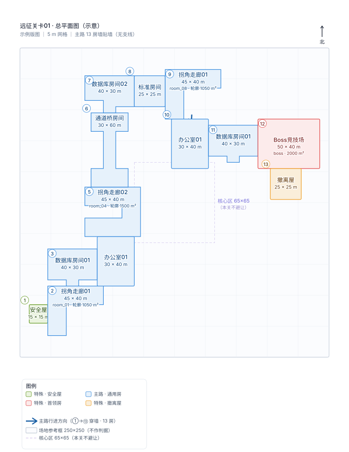

*总平面图（**示例版图**，示意）。**主路（蓝色实线，①→⑨）**：**① 入口安全屋 → ② 拐角走廊01 → ③ 数据库房间01 → ④ 办公室01 → ⑤ 拐角走廊02 → ⑥ 通道桥房间 → ⑦ 数据库房间02 → ⑧ Boss竞技场 → ⑨ 撤离屋**，八段衔接全部**墙贴墙**（净距 0 = 共墙）。**支线（灰色虚线，⑩~⑬）直接挂在主路中间 4 间内容房上**：数据库房间01（③）挂 ⑩数据库房间01；办公室01（④）挂 ⑪标准房间；拐角走廊02（⑤）挂 ⑫标准房间；通道桥房间（⑥）挂 ⑬通道桥房间。画面上方为北（平面 +y = 世界 +z = 南）。*

> 📐 **[→ 打开远征关卡01 平面图集](refs/expedition01/远征关卡01平面图集.html)**（总平面图 + 13 张房间详图 + 房间明细表 + 面积构成）。单张图在 [`refs/expedition01/plans/`](refs/expedition01/plans/)，逐房型详图排在下面 **§3** 各房型小节里。图是**示意稿**，由本页表格驱动（改表 → 重跑 `scripts/render_expedition01_plan_sheet.py`），画的是**示例版图**的坐标；几何真源是设计源 `floor_00.json`。


三个出口的语义：

| 出口 | 触发位置 | 结果 |
|---|---|---|
| 撤离成功 | 撤离屋的撤离信标 | 正常结算，带走本局收益 |
| 死亡 | 任意内容房 / Boss 竞技场 | 按死亡规则结算 |
| 主动弃局 | 入口安全屋的出口门 | 未开始就退出，不推进进度 |

**每间内容房的门后都有命运卡三选一** —— 这是本关的成长节奏：直线主路只顺路经过 6 间内容房（六段主路房），4 间支线全走则 **10 间 = 最多 10 次构筑选择**。**"这局走多深"成了玩家自己的决定**，单次远征的时长因此有了弹性区间。

---

## 3. 房型库

本关共 **13 个房间**，由 **8 个房型**构成：**9 间主路房**（安全屋 / 拐角走廊01 / 数据库房间01 / 办公室01 / 拐角走廊02 / 通道桥房间 / 数据库房间02 / Boss竞技场 / 撤离屋）+ **4 间支线房**（复用通用房型）。房型都有编号与中文名；**主路房各出现一次、且房型每局按种子抽取**（见 **§3.4**）—— 本节及下面各小节用的房名是**示例版图**里的那一次分配。这一关不像塔楼那样靠"同房型多实例"堆层，而是**一条墙贴墙主路 + 四间直挂主路中间 4 房的支线房**。


*总平面图（**示例版图**）· 主路 9 房墙贴墙 + 4 支线房直挂主路中间 4 房 · 画面上方为北。（与 [§2](#2-玩法循环) 同一张图：§2 用它讲**动线**，这里用它看**房型分布**。）*

**图纸是怎么来的、怎么改。** 本页所有平面图（上面这张总平面图 + 各房型小节里的详图）都由 `scripts/render_expedition01_plan_sheet.py` 生成，而**数据源就是本页**——尺寸与定位取自下方 §3.1 总表，坐标与父房取自 §4.2 坐标草案（两者画的都是**示例版图** = L2 里那份兜底样例）。所以改表的路径是：**改本页表格 → 重跑脚本 → 文档里的图跟着变**，不需要手改任何 SVG。脚本另有打包版输出 [`远征关卡01平面图集.html`](refs/expedition01/远征关卡01平面图集.html)（含房间明细表、面积构成与绘制口径）。图纸是**示意稿**、画的是**示例版图**；**实跑版图按种子现算**，几何真源始终是设计源 `floor_00.json`。

> ⚠️ **8 个模板是「不许改」的那一层。** 房间模板固定为 `safe_15x15` / `corridor_45x40`（变体 `l_turn` / `u_turn`）/ `db_70x50`（变体 `db_01` / `db_02`）/ `office_60x70` / `bridge_60x50` / `boss_50x40` / `extraction_25x25` / `std_25x25`。**版图是用这 8 个固定模板拼装出来的，门的位置可以随拼装改变，模板自身的尺寸与内部结构不变。** 若两个模板因面积/尺寸互相咬合（错位 ≤5 m 由门洞与门口净空吸收；更大错位只能改坐标，不能改模板）。

### Blender 资产完成度：判定规则

§3.1 总表之后的《Blender 资产完成情况》与 §6 都按这套口径判定。**账本是唯一权威** —— 本页只做转述与对位，不自行判定"这个做完了"。

| 级别 | 名称 | 判定证据（三项须同时成立） |
|---|---|---|
| ⬜ | 未开始 | 无 Blender 源文件，且账本无对应行 |
| 🟨 | 有源 · 未登记 | Blender 源文件存在，但账本里查无对应行 —— **含 manifest 自己声明了 `asset_ledger` 却查无此行的（声明与事实不符，按未登记算）** |
| 🟦 | 已登记 · 未导出 | 账本有行，制作状态为"…源已完成"类，且 GLB / Prefab 列仍为「未制作」 |
| 🟩 | 已导出 · 未接入 | 账本有行，GLB 或 Prefab 路径已存在且非「未制作」，但使用位置未标已接入 |
| ✅ | 已接入 | 账本有行，且制作状态含"已接入" |

三条配套规则：

1. **账本改，本页必须同轮改。** `scripts/check_expedition_room_asset_status.py` 逐行比对，三条都会判失败：① 表里每个 AssetID 的级别必须与账本行推出的级别一致（级别 emoji 写在「账本制作状态」列）；② 「级别」列必须等于该行「账本制作状态」里出现过的**最低**级（即下面规则 3 的复算）；③ 账本里存在远征相关行而本页漏写。脚本自身的判据由 `tests/tooling/test_check_expedition_room_asset_status.py` 盯着（一个对照组 + 四类不一致，每类各报红一次）。
2. **复用别区块的资产要显式标注。** 房型若不做独立源而沿用其它区块的既有资产，必须写明来源 AssetID 与版本，并照抄该行的状态（本关的实例：安全屋沿用战局区块 `ENV-BATTLE-L01-SAFE-ENTRY` v007）。
3. **一房多源逐项列出，对外取最低级别。** 同一房型同时存在白模、房间种类源、组件库时逐条给状态，房型整体级别取其中**最低**的那个（本关的实例：Boss 竞技场白模已登记、房间种类源未登记 ⇒ 房型整体算 🟨）。

### 3.1 总表（示例版图）

> **这是「示例版图」的房型分配** —— 也就是 L2 `floor_00.json` 里存的那份兜底样例。**实跑每局的房型从 §3.4 的池子里按种子抽取**，`room_0N` 用哪个房型、尺寸多大都会变；但**主路 9 房的存在与顺序、支线 4 间各挂中间 4 房之一、8 个模板的尺寸**都不变。

| 编号 | 中文名 | 定位 | 房型 | 尺寸 宽×深 (m) | 面积 (m²) | 参考图 |
|---|---|---|---|---|---|---|
| `entry` | 安全屋 | 特殊 | SAFE_ROOM | 15 × 15 | 225 | 沿用塔楼 v007 安全房壳体 |
| `room_01` | 拐角走廊01 | 主路 | COMMON_ROOM | 45 × 40 | 1800 | [图](refs/expedition01/拐角走廊01.jpg) |
| `room_02` | 数据库房间01 | 主路 | COMMON_ROOM | 70 × 50 | 3500 | [图](refs/expedition01/数据库房间01.jpg) |
| `room_03` | 办公室01 | 主路 | COMMON_ROOM | 60 × 70 | 4200 | [图](refs/expedition01/办公室01.jpg) |
| `room_04` | 拐角走廊02 | 主路 | COMMON_ROOM | 45 × 40 | 1800 | [图](refs/expedition01/拐角走廊02.jpg) |
| `room_05` | 通道桥房间 | 主路 | COMMON_ROOM | 60 × 50 | 3000 | [图](refs/expedition01/通道桥房间.jpg) |
| `room_06` | 数据库房间02 | 主路 | COMMON_ROOM | 70 × 50 | 3500 | [图](refs/expedition01/数据库房间02.jpg) |
| `boss` | Boss竞技场 | 特殊 | BOSS_ROOM | 50 × 40 | 2000 | 沿用已产出的故障数据库竞技场 |
| `extraction` | 撤离屋 | 特殊 | EXTRACTION_ROOM | 25 × 25 | 625 | — |
| `branch_01` | 数据库房间01 | 支线 | COMMON_ROOM | 70 × 50 | 3500 | [图](refs/expedition01/数据库房间01.jpg) |
| `branch_02` | 标准房间 | 支线 | COMMON_ROOM | 25 × 25 | 625 | — |
| `branch_03` | 标准房间 | 支线 | COMMON_ROOM | 25 × 25 | 625 | — |
| `branch_04` | 通道桥房间 | 支线 | COMMON_ROOM | 60 × 50 | 3000 | [图](refs/expedition01/通道桥房间.jpg) |

示例版图房间面积合计 **28400 m²**；含内墙的**估算占用 ≈ 29090 m²**（走廊估算为 0 —— 12 段衔接全部墙贴墙）。按单层口径的可用区 62200 m²（250×250 扣外墙）计，占用约 **46.8%** —— 但**本关面积门禁已放开**，此值仅供对照，不参与判定，见 **§4.7 面积预算**。⚠️ 这只是**示例版图**的数字；实跑版图随房型抽取而变，**面积合计每局都不同**。

> 尺寸都是按图判读并与 5 m 模数对齐的结果。**判读依据写在每个房型下面**，觉得哪一间不对直接说，我改。

#### 3.1.1 Blender 资产完成情况（与账本同步）

> 判定口径见本章开头的《Blender 资产完成度：判定规则》。「账本制作状态」列照抄账本原值，**账本一改这里必须同轮改**（`check_expedition_room_asset_status.py` 盯着）。

| # | 房型 | Blender 源文件 | 账本 AssetID | 账本制作状态 | 级别 |
|---|---|---|---|---|---|
| 1 | 安全屋 15×15（`safe_15x15`） | **复用**：`assets/art/environments/tower_zones/battle/source/room_instances/entry_safe_room/v007/env_battle_l01_safe_entry_layout_source_v007.blend` | `ENV-BATTLE-L01-SAFE-ENTRY` v007 | ✅ 正式美术已接入；源文件已规范迁移 | ✅ 已接入 |
| 2 | 拐角走廊 45×40（`corridor_45x40`：变体 `l_turn` / `u_turn`） | `assets/art/environments/tower_zones/expedition/source/room_types/l_corridor/v003/L型走廊种类_数据连廊_45x40m_v003.blend` | `ENV-EXPEDITION-L01-L-CORRIDOR` v003 | 🟦 房间种类源已完成；QA PASS | 🟦 已登记·未导出 |
| 3 | 数据库房间 70×50（`db_70x50`：变体 `db_01` / `db_02`） | — | — | — | ⬜ 未开始 |
| 4 | 办公室 60×70（`office_60x70`） | — | — | — | ⬜ 未开始 |
| 5 | 通道桥房间 60×50（`bridge_60x50`） | — | — | — | ⬜ 未开始 |
| 6 | Boss竞技场 50×40（`boss_50x40`） | ① 白模 `source/art/whitebox/tower_zones/expedition_01/v001/blender/远征关卡01_白模_Boss竞技场_50x40m_v001.blend`<br>② 房间种类美术 `assets/art/environments/tower_zones/expedition/source/room_types/boss_room/v002/Boss房种类_故障数据库_50x40m_v002.blend`<br>③ 组件库 `assets/art/environments/tower_zones/expedition/source/common_components/v001/expedition_boss_room_components_source_v001.blend` | ① `ENV-EXPEDITION-L01-BOSS-ARENA` v001<br>② 未登记<br>③ 未登记 | ① 🟦 白模源已完成；QA PASS<br>② 🟨 有源、账本无行<br>③ 🟨 有源、账本无行 | 🟨 有源·未登记（房型整体取最低级） |
| 7 | 撤离屋 25×25（`extraction_25x25`） | —（信标是运行时资产，见 `PRP-EXTRACTION-BEACON-3D`） | — | — | ⬜ 未开始 |
| 8 | 标准房间 25×25（`std_25x25`） | — | — | — | ⬜ 未开始 |

> 上表按 **8 个房型**列行，不按 13 个房间实例列行。⚠️ **实例次数只是「示例版图」里的次数**：实跑每局的房型由种子抽取（见 §3.4），某个房型可能一局出现很多次、另一个一次也不出现。示例版图里：数据库房间 70×50 出现 **3** 次（`room_02` + `room_06` + `branch_01`）、通道桥 60×50 出现 **2** 次（`room_05` + `branch_04`）、拐角走廊 45×40 出现 **2** 次（L 形 + 凹字各一次）、标准房间 25×25 出现 **2** 次（`branch_02` + `branch_03`）；办公室 60×70 出现 1 次；安全屋 / Boss竞技场 / 撤离屋各 1 次。

**读数：8 个房型里 1 个可直接进游戏（安全屋，复用战局区块 v007）、1 个有源待导出（拐角走廊 45×40，含 L 形与凹字两个变体，121 包）、1 个半途（Boss 竞技场：白模已登记、房间种类源与组件库未登记）、其余 5 个（数据库房间 / 办公室 / 通道桥 / 撤离屋 / 标准房间）连源都还没有。**

⚠️ **两处账本缺口 —— 本页只如实标注，不改账本，建议另开事务补登记：**

- **Boss 房房间种类美术**（`boss_room/v001`、`v002`，各 214 包）：两份 `room_type_manifest.json` 都声明了 `asset_ledger: …::3D-场景通用`，但账本里查无此行 —— 属规则里的「声明与事实不符」。
- **远征通用组件库** `expedition_boss_room_components_source_v001.blend`：同样有源无行。

### 3.2 主路房型（9 间）

> 各小节标题里的 `room_0N` 是**示例版图**的位置编号 —— 实跑时该位置的房型按种子抽取（见 §3.4），可能不是这个小节讲的房型。**小节正文讲的是「房型」本身**（不随种子变），按房型名索引即可。

#### entry · 安全屋（15 × 15）

*平面示意（尺寸与内部结构；与其它房型同比例，1 m = 6 px）*

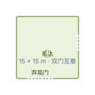

- **结构**：单一双门布局 —— 前门指向拐角走廊01，另一扇是"传送抵达侧"的封闭气闸门，兼"退出战局"交互位。两门互相垂直。
- **本关作用**：起点房；唯一的主动弃局门在这里。运行时房间 id 由 `legacy_room_id = "start"` 决定（设计源 key 是 `entry`）。
- **美术现状**：✅ 复用战局区块 `v007` 安全房资产，已接入（见 §3.1.1）。

#### room_01 · 拐角走廊01（45 × 40）

*参考图（Blender 造型参考）*

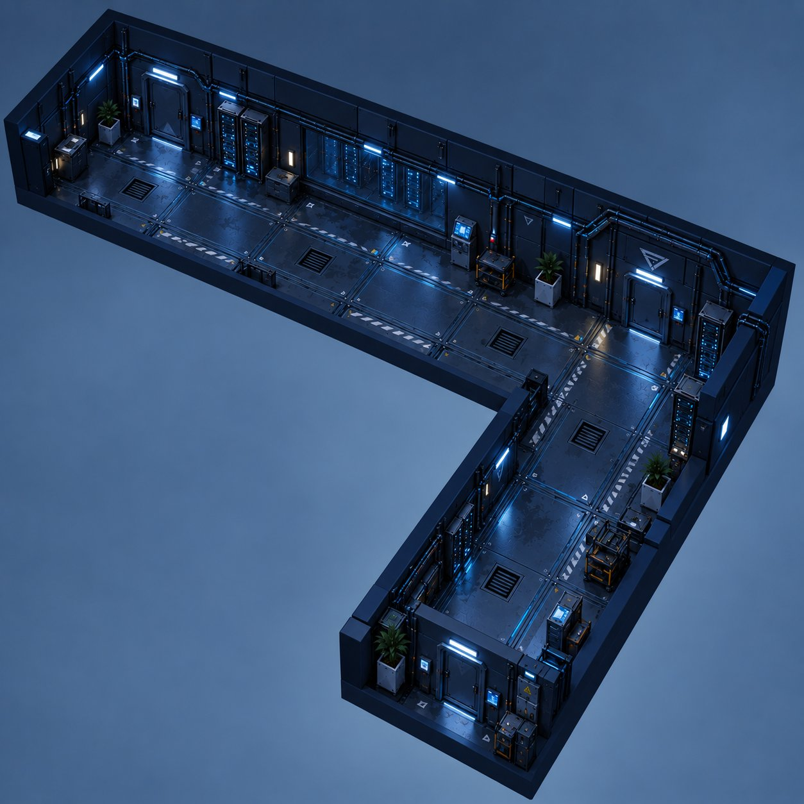

*平面示意（尺寸与内部结构；与其它房型同比例，1 m = 6 px）*

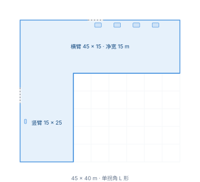

- **结构**：单拐角 L 形走廊（模板 `corridor_45x40` 的 `l_turn` 变体），净宽 **15 m（三砖）**。横臂 `45 × 15`，竖臂 `15 × 25`。
- **判读依据**：横臂数到 9 格、竖臂 5 格，宽一律 3 格。
- **本关作用**：把玩家从安全屋引入主路的**第一段**，承担"第一印象"—— 长廊 + 拐角，视野一次只放一段。**不挂支线**（主路第 1 房，只有进 / 出两扇门）。
- **美术现状**：**已有房间种类源**（原 L 型走廊，v003 = 45×40 m / 121 包），已归属本关区块，同时覆盖 `u_turn`（凹字）变体。

#### room_02 · 数据库房间01（70 × 50）

*参考图（Blender 造型参考）*

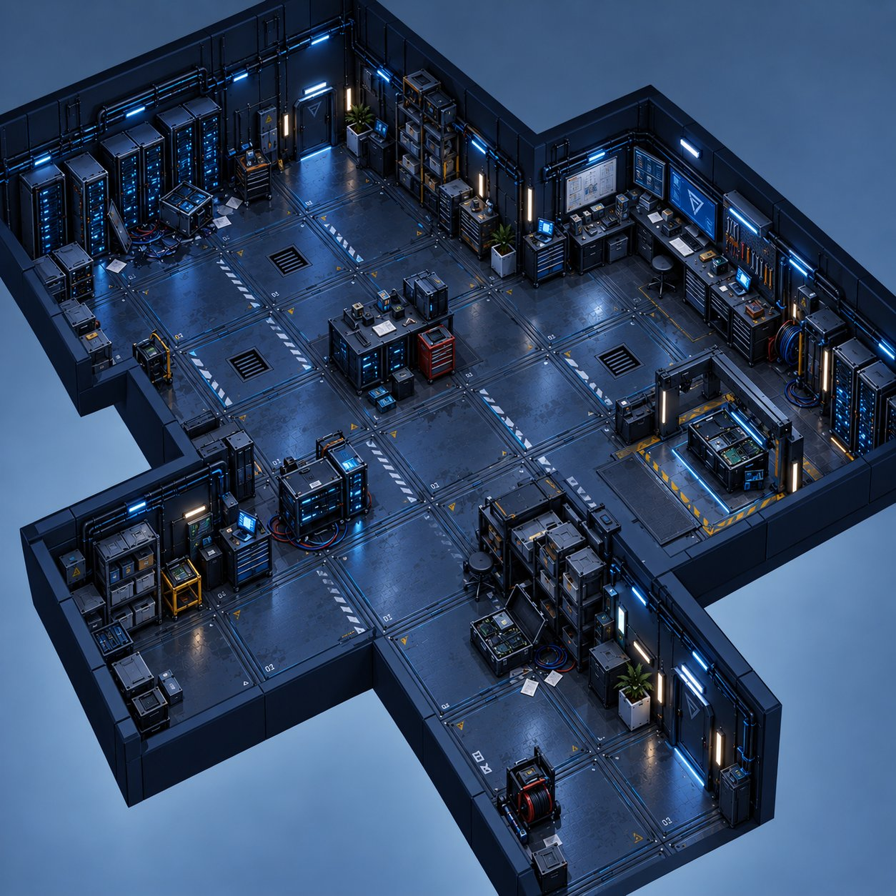

*平面示意（尺寸与内部结构）*

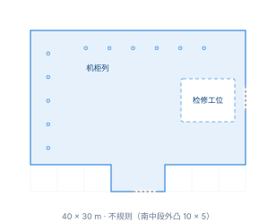

- **结构**：**不规则**。主体矩形 + 左下角凸出块 + 下方中段内凹；右上角是检修工位区（工作台、工具车、屏幕墙），机柜贴着西墙与北墙成列。
- **判读依据**：最长边 14 格 = 70 m，纵向 10 格。
- **本关作用**：主路第 2 房；机柜列天然形成"走廊式"掩体，凸出块可做侧翼包抄位。**支线岔口**：数据库房间01（`branch_01`）从这里接出（示例版图）。
- **美术现状**：无。

#### room_03 · 办公室01（60 × 70）

*参考图（Blender 造型参考）*

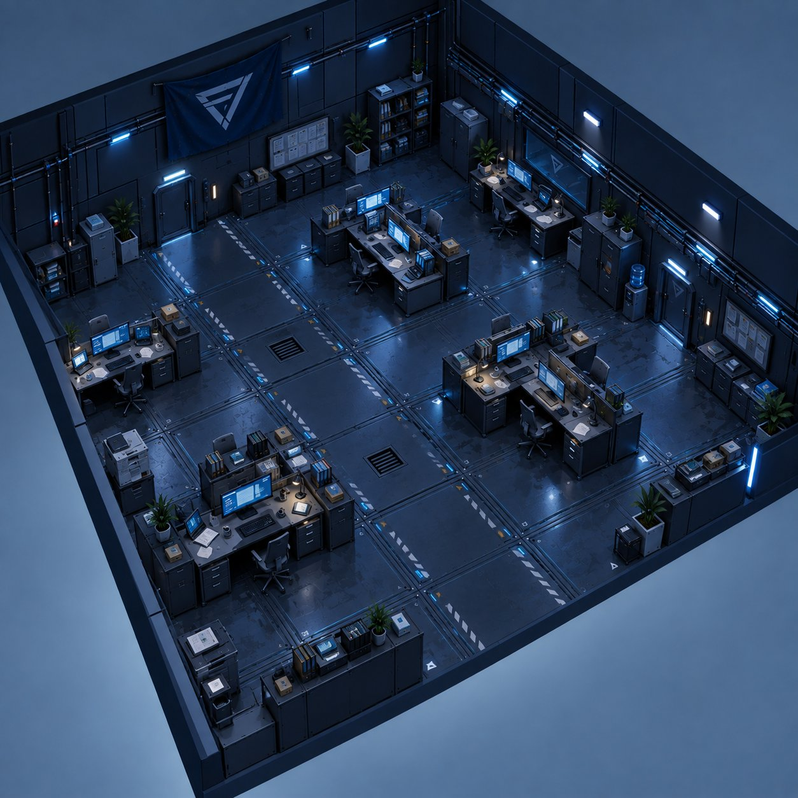

*平面示意（尺寸与内部结构）*

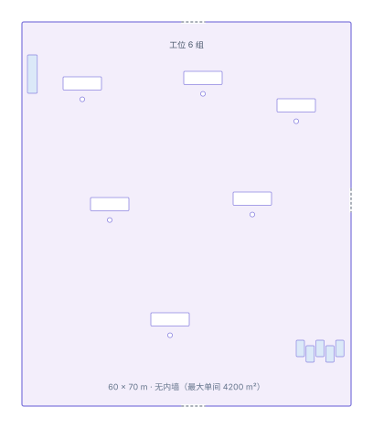

- **结构**：方形开放办公区，无内墙。内部 5～6 组工位（桌 + 椅 + 屏 + 主机），墙边是文件柜、白板、图腾、绿植与窗带。
- **判读依据**：按"约 60 × 70"落定；图上横向 12 格、纵向 14 格与之相符。
- **本关作用**：主路第 3 房，也是本关最大的单间（4200 m²）。视线通透、掩体零散 —— 适合作为**长距离交火**的主战场。**支线岔口**：标准房间（`branch_02`）从这里接出（示例版图）。
- **美术现状**：无。

#### room_04 · 拐角走廊02（45 × 40）

*参考图（Blender 造型参考）*

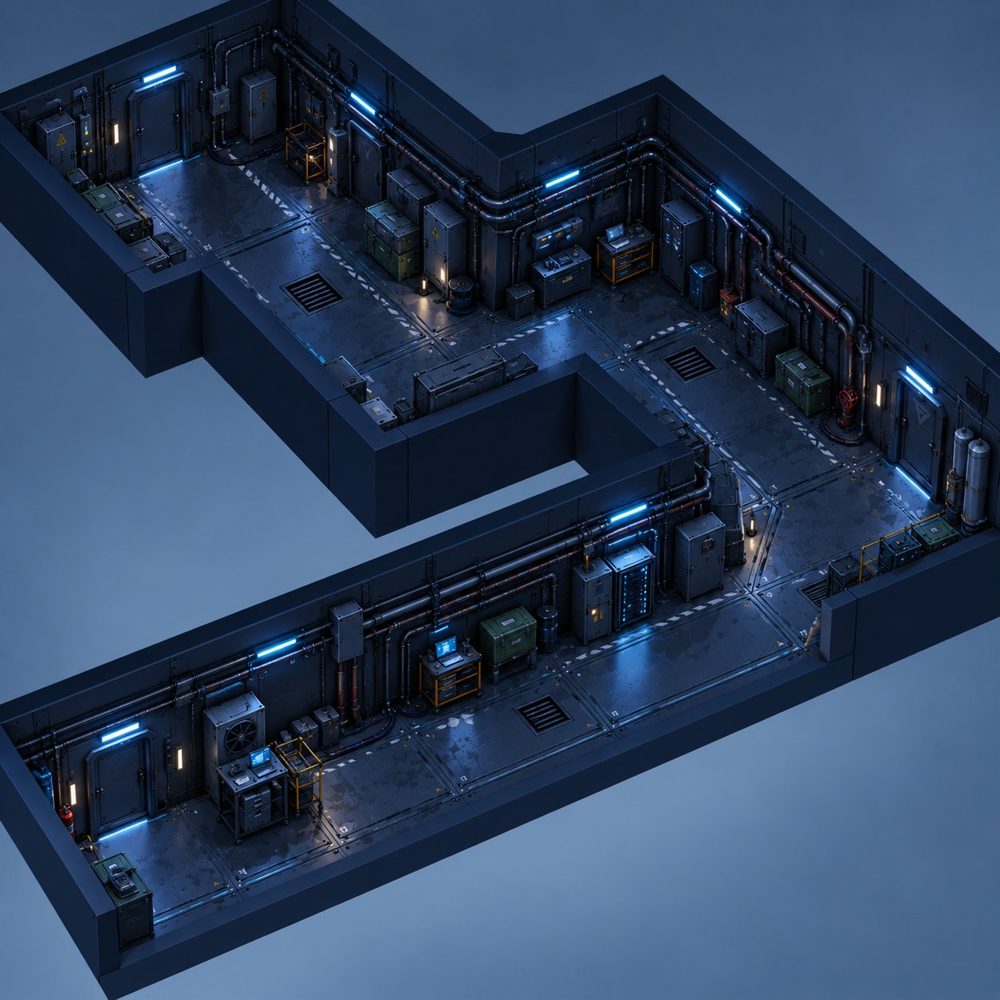

*平面示意（尺寸与内部结构）*

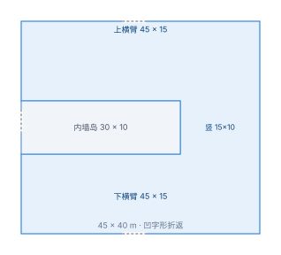

- **结构**：三段 15 m 宽走廊**折返**成"凹"字形（模板 `corridor_45x40` 的 `u_turn` 变体）—— 上横臂 `45 × 15`、右侧竖向 `15 × 10`、下横臂 `45 × 15`，中间夹一块内墙岛，开口朝西。
- **判读依据**：上、下横臂各数到 9 格，宽度均为 3 格；中间竖向段约 2 格。
- **本关作用**：主路第 4 房，双横臂 + 内墙岛给了"绕柱接战"的空间。**支线岔口**：标准房间（`branch_03`）从这里接出（示例版图）。
- **美术现状**：与拐角走廊01 共用同一个房间种类源（`corridor_45x40`，v003）。

#### room_05 · 通道桥房间（60 × 50）

*参考图（Blender 造型参考）*

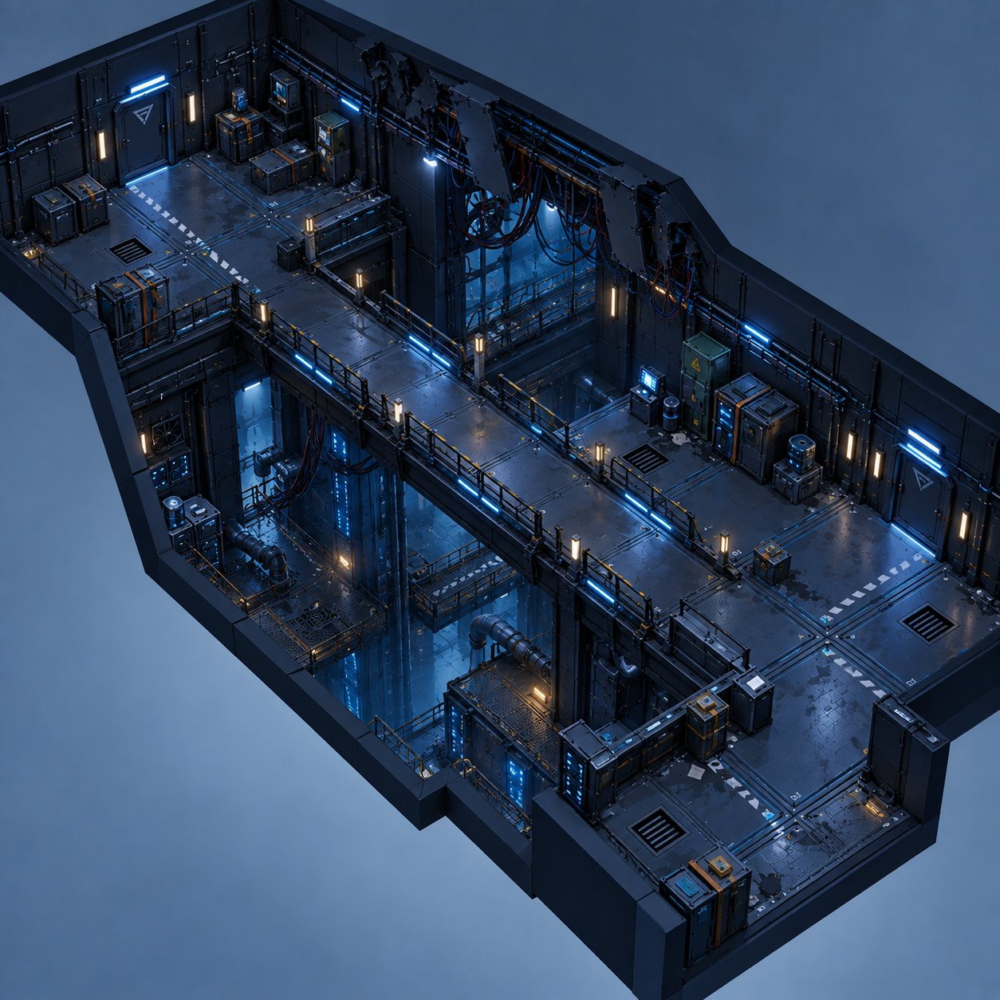

*平面示意（尺寸与内部结构；下沉坑与跨桥是示意，坑深待定）*

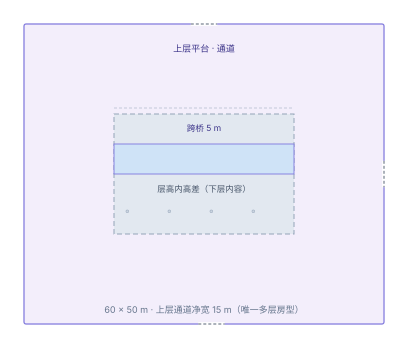

- **结构**：**上下两层**。四周是宽 15 m 的上层平台（通道），中央是下沉坑；一座桥横跨坑顶；坑内有管线、支架、设备与下层平台 —— **下层内容要做**，不是空腔。
- **判读依据**：横向 12 格、纵向 10 格；上层通道宽 3 格，与"通道为 15 m 宽"一致；坑约 6 × 4 格（30 × 20 m）。
- **本关作用**：主路第 5 房，本关唯一的**立体战斗空间**。高差带来压制位与被压制位，是节奏上的转折点。**支线岔口**：通道桥房间（`branch_04`）从这里接出（示例版图）。
- **美术现状**：无。⚠️ 这是本批里**唯一需要多层几何与碰撞**的房型 —— 其余房间都是单层平房。
- **待定**：坑深（层高 12 m 里下层占多少）、桥宽、下层是否单独给一条动线。

#### room_06 · 数据库房间02（70 × 50）

*参考图（Blender 造型参考）*

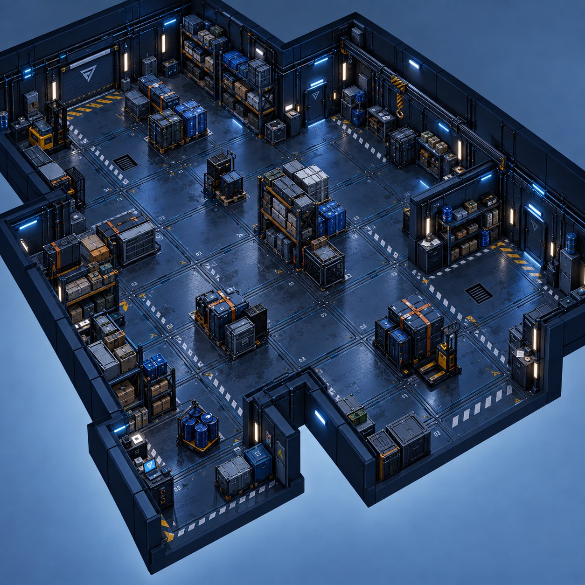

*平面示意（尺寸与内部结构）*

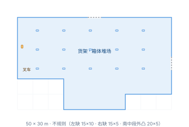

- **结构**：**不规则**。主体矩形 + 左下与右下各一处内凹（形成两个 L 形缺口）；场内是货架与箱体堆场，西侧有一台叉车。
- **判读依据**：最长边 14 格 = 70 m，纵向 10 格。
- **本关作用**：主路第 6 房（最后一间内容房）；堆场布局给的是"视线断续"的遭遇战。**不挂支线**（只有进 / 出两扇门），之后主路拐进 Boss 竞技场。
- **美术现状**：无。

#### boss · Boss竞技场（50 × 40）

*参考图（Blender 造型参考）* —— 沿用已产出的故障数据库竞技场。

*平面示意（尺寸与内部结构）*

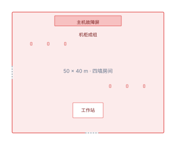

- **结构**：完整四墙房间，场内是故障数据库主题（主屏、机柜成组、工作站）。
- **本关作用**：终局战斗。主路在数据库房间02 之后向东拐进 Boss 房，再向北出撤离屋。
- **美术现状**：🟨 白模已登记、房间种类美术有源未登记（见 §3.1.1）。
- ⚠️ 门位：本页 §4.2 坐标让它的进出落在**西墙与南墙**（西接数据库房间02、南接撤离屋）；设计页 §3.3 记的美术源是**南进西出** —— 落地前必须裁决，详见 **§4.4**。

#### extraction · 撤离屋（25 × 25）

*平面示意（尺寸与内部结构）*

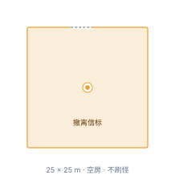

- **结构**：空房 + 常驻撤离信标（`STANDARD`，非锁定），不刷怪。
- **本关作用**：终点。主路最后一房，只有一扇门（接 Boss 房）。
- **美术现状**：⬜ 无源；信标是运行时资产（`PRP-EXTRACTION-BEACON-3D`）。

### 3.3 支线房型（4 间，直挂主路中间 4 房）

4 间支线房**直接挂在主路中间那 4 间内容房上**（`room_02` / `room_03` / `room_04` / `room_05` 各挂 1 间）。支线房的门数统一为 **1**（只接父房，链不再加深）。**支线房的房型也从 §3.4 的池子里按种子抽** —— 下面小节写的是**示例版图**里的那一次分配。

#### branch_01 · 数据库房间01（70 × 50）｜挂 room_02

*参考图（Blender 造型参考）*


*平面示意（尺寸与内部结构）*

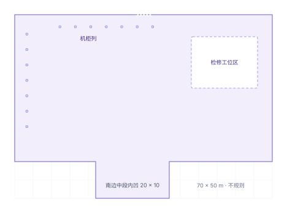

- **结构**：同主路 `room_02`（示例版图），模板 `db_70x50`（70 × 50 不规则，机柜 + 检修工位区）。
- **本关作用**：数据库房间01（主路第 2 房）的支线；机柜列形成"走廊式"掩体。
- **美术现状**：无。

#### branch_02 · 标准房间（25 × 25）｜挂 room_03

*平面示意（尺寸与内部结构；空房，无内部设施）*

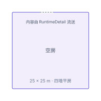

- **结构**：模板 `std_25x25`，四墙平房，无内部设施（内容由 RuntimeDetail 流送的家具/危险区填充）。
- **本关作用**：办公室01（主路第 3 房）的支线。
- **美术现状**：无。

#### branch_03 · 标准房间（25 × 25）｜挂 room_04

*识别结构与 `branch_02` 同房型（标准房间，25 × 25），平面示意同上一张。*

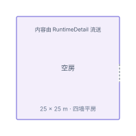

- **本关作用**：拐角走廊02（主路第 4 房）的支线。
- **美术现状**：无。

#### branch_04 · 通道桥房间（60 × 50）｜挂 room_05

*参考图（Blender 造型参考）*


*平面示意（尺寸与内部结构）*

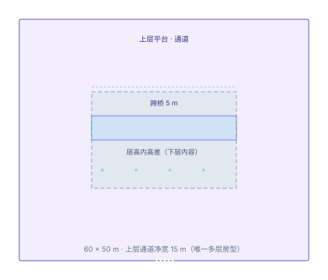

- **结构**：同主路 `room_05`（示例版图），模板 `bridge_60x50`（60 × 50，上层平台 + 下沉坑 + 跨桥）。
- **本关作用**：通道桥房间（主路第 5 房）的支线；本关第二处立体战斗空间。
- **美术现状**：无。⚠️ 与 `room_05` 共用同一房型资源，多层几何与碰撞一并覆盖。

### 3.4 内容房型池（`content_template_pool`）—— 实跑口径

> **这一节才是「每局会变」的那部分。** §3.1 / §3.2 / §3.3 写的是**示例版图**的房型分配；**实跑时 `room_01`…`room_06` 与 4 间支线房的房型都从下面这个池子里按种子抽** —— 抽到哪个房型，那间房就长成什么样（尺寸、内部结构随模板）。

| 模板 ID | 房型 | 尺寸 宽×深 (m) | 变体 | 模板说明 |
|---|---|---|---|---|
| `corridor_45x40` | 拐角走廊 | 45 × 40 | `l_turn` / `u_turn` | L 形 / 凹字形折返走廊，净宽 15 m |
| `db_70x50` | 数据库房间 | 70 × 50 | `db_01` / `db_02` | 不规则轮廓，机柜列 / 货物堆场 |
| `office_60x70` | 办公室 | 60 × 70 | — | 方形开放办公区，无内墙（最大单间） |
| `bridge_60x50` | 通道桥房间 | 60 × 50 | — | 上层平台 + 下沉坑 + 跨桥（唯一多层几何） |
| `std_25x25` | 标准房间 | 25 × 25 | — | 四墙平房，空内容（RuntimeDetail 流送） |

**抽取规则**：先保证**每个房型族至少出现一次**，再补足其余槽位、最后整体洗牌 —— 避免纯随机的"整局只出两三种房"。池子写入 `level_plan.json` 的 `generation_policy.content_template_pool`。

**8 个模板 ≠ 5 个池子条目**：`safe_15x15`（安全屋）、`boss_50x40`（Boss竞技场）、`extraction_25x25`（撤离屋）**不在池子里** —— 它们是三个特殊房，模板固定。池子只有 5 个 `COMMON_ROOM` 模板。

**Boss 竞技场的首领身份未定** —— 从名册里挑一位（深渊档案官 / 熔炉狱监 / 空洞合唱团），或者留空让这一关不出 Boss（留空是合法状态，运行时会提示"首领房未指派首领 · 区域已放行"）。

---

## 4. 版图与主路

> ⚠️ **本节几何已落设计源**（`floor_00.json`），跑绿 `LEVEL_PLAN_VALIDATE_OK`。**但要先读这句**：`mode = constrained` ⇒ **实跑版图按种子现算**，本节 §4.2 的坐标只是 **L2 里那份兜底样例（示例版图）**。生成算法见 §4.6。

### 4.1 主路

```text
安全屋 → 拐角走廊01 → 数据库房间01 → 办公室01 → 拐角走廊02 → 通道桥房间 → 数据库房间02 → Boss竞技场 → 撤离屋
```

主路 **9 房一线到底**，**八段衔接全部墙贴墙**（净距 `0` = 相邻两房共墙，不再插过渡走廊模块）。主路顺序与房型无关 —— **不管每局抽到哪 6 个房型，这 9 个位置和它们的先后都不变**。

**墙贴墙的机制说明（落地必读）：** 校验器 `LevelPlanValidator` 默认要求父子房之间 `corridor_clear ≥ 5.0`（`corridor_too_short`），仅通过 `edge_policy` 的 `allow_zero_length` 白名单放行净距为 `0` 的父子边。所以主路这 **8 条边**、以及 **4 条支线边**，**共 12 条父子边都必须显式写进 `edge_policy`**（见 §7 第 6 条）。⚠️ **constrained 路径下这份白名单由生成器写**（`_constrained_edge_policy` 按实算净距逐条取舍：净距 0 才进白名单，>0 不能进，否则报 `edge_policy_stale`）；L2 里那份是示例版图的白名单。运行时侧 `TowerDescent3D._build_tower_horizontal_corridor` 对 `length ≤ 0.05` 走通用零长分支（墙直接贴着墙），无需额外代码。

### 4.2 坐标草案（示例版图）

> **这是「示例版图」的坐标** —— L2 `floor_00.json` 里存的那份兜底样例。**实跑每局由 `FloorPlanGenerator._generate_constrained_floor` 按种子现算**（先抽房型 → 再贴墙自避走摆位），坐标与尺寸都会变。落地时**不要**把本表当成"实跑一定长这样"，见 §4.6。

| 编号 | 中文名 | 尺寸 宽×深 (m) | 中心 (x, y) | 父房 | 占地 x 区间 | 占地 y 区间 |
|---|---|---|---|---|---|---|
| `entry` | 安全屋 | 15 × 15 | (−17.5, 2.5) | — | −25 ~ −10 | −5 ~ 10 |
| `room_01` | 拐角走廊01 | 45 × 40 | (12.5, 0) | `entry` | −10 ~ 35 | −20 ~ 20 |
| `room_02` | 数据库房间01 | 70 × 50 | (10, 45) | `room_01` | −25 ~ 45 | 20 ~ 70 |
| `room_03` | 办公室01 | 60 × 70 | (−55, 50) | `room_02` | −85 ~ −25 | 15 ~ 85 |
| `room_04` | 拐角走廊02 | 45 × 40 | (−52.5, −5) | `room_03` | −75 ~ −30 | −25 ~ 15 |
| `room_05` | 通道桥房间 | 60 × 50 | (−55, −50) | `room_04` | −85 ~ −25 | −75 ~ −25 |
| `room_06` | 数据库房间02 | 70 × 50 | (10, −50) | `room_05` | −25 ~ 45 | −75 ~ −25 |
| `boss` | Boss竞技场 | 50 × 40 | (70, −50) | `room_06` | 45 ~ 95 | −70 ~ −30 |
| `extraction` | 撤离屋 | 25 × 25 | (72.5, −17.5) | `boss` | 60 ~ 85 | −30 ~ −5 |
| `branch_01` | 数据库房间01 | 70 × 50 | (10, 95) | `room_02` | −25 ~ 45 | 70 ~ 120 |
| `branch_02` | 标准房间 | 25 × 25 | (−52.5, 97.5) | `room_03` | −65 ~ −40 | 85 ~ 110 |
| `branch_03` | 标准房间 | 25 × 25 | (−87.5, −7.5) | `room_04` | −100 ~ −75 | −20 ~ 5 |
| `branch_04` | 通道桥房间 | 60 × 50 | (−55, −100) | `room_05` | −85 ~ −25 | −125 ~ −75 |

**包络 195 × 245 m**（x ∈ [−100, 95]，y ∈ [−125, 120]），落在 250×250 场地内，其余三边留有余量（北边 `branch_04` 的 `y = −125` 恰好压校验器边界，见 §4.3 末尾的场地口径告警）。

**版本变化（相对上一版 15 房草案）：** 支线从 **6 间**减为 **4 间**（删掉挂在走廊01 / 走廊02 上的两条标准房间支线），挂点改为**主路中间 4 间内容房各挂 1 间**（`room_02` / `room_03` / `room_04` / `room_05`）⇒ 带支线的主路房各 **3 扇门**，两端 `room_01` / `room_06` 仍是 **2 扇**。几何另从"坐标写死"改为**按种子程序化生成**（`mode = constrained`），本表退化为兜底样例。

### 4.3 摆位规则（示例版图已校验）

| 规则 | 本草案的实际值 |
|---|---|
| 尺寸与中心过 5 m 模数 | 全部通过（中心 − 尺寸/2 均为 5 的整数倍） |
| 房间不重叠 | 全部通过（13 间两两不相交） |
| 在场地内 | 全部通过（包络 195×245，落在校验器 `map_rect` = `Rect2(−125, −125, 250, 250)` 内） |
| **父子衔接净距** | 相邻房 **一律 0 m（墙贴墙）**，共 12 条边 |
| 父子房共轴偏移 ≤ 5 m | 最大 **5.00 m**（见下面那条说明） |
| 与核心区（65×65 居中 2.5,2.5）相交 | 不判定（本关 `enforce_core_exclusion = false`，不避让） |

> ⚠️ **上表只针对「示例版图」**（L2 兜底样例）。实跑版图由 `FloorPlanGenerator._generate_constrained_floor` 现算：这几条规则由生成器**逐条保证**（吸附 / 边界 / 不重叠 / 净距 0 白名单都是算法的硬检查），但**边数与坐标每局不同**。

**为什么会有 2.5 ~ 5 m 的偏移：** 5 m 网格下，**奇数格宽的房**（15 / 25 / 45）中心必须落在 `5k + 2.5` 上，**偶数格宽的房**（40 / 50 / 60 / 70）中心必须落在 `5k` 上。两者天然差 2.5 m；再加上房间尺寸各不相同，某几条边的横向错位会累到 5 m（如 走廊01 → 数据库01）。校验器允许 ≤5 m 的偏移正是为此 —— 墙贴墙的接口在错位处需要门洞与门口净空吸收。生成器 `_lateral_candidates` 只在这个容差窗口内取子房的合法相位。

**为什么没有过渡走廊：** 拐角走廊与其它房间的衔接不插中间走廊模块 —— 12 条父子边全部 `allow_zero_length`，靠共享墙上的门洞完成通行。constrained 路径下这份白名单由 `_constrained_edge_policy` 按**实算净距**逐条生成。

**南北约定（跨语言红线）：** 平面 `+y` → 世界 `+z` → 南；平面 `−y` → 世界 `−z` → 北。写反不会报几何错，只会让门连错方向。

> ⚠️ **场地口径有两套，落地前须知。** 校验器 `LevelPlanValidator` 的硬边界是 **以原点为中心** 的 `Rect2(−125, −125, 250, 250)`（x, y ∈ [−125, 125]），示例版图全部房间都落在其内（`branch_04` 的北边 `y = −125` 恰好压线）。L1 `level_plan.json` 的 `site` 字段（`center_m = [2.5, 2.5]`）**只被绘图脚本读取**，是绘图参考框；它比校验边界在**北边**少 2.5 m，所以总平面图上 `branch_04` 会略微探出绘图框 —— **以校验器边界为准，绘图框只是示意**。

### 4.4 门与连接

- 门契约全场统一：净空 **2.2 × 2.5 m**，门槛底 `0.3 m`，门楣底 `2.8 m`。
- 每面墙的合法门槽位置由工具 `RoomDoorLane` 算出来，**不手填**。
- 每间房的门数（= 父房边 + 子房边；安全屋另加弃局门）：

| 房间 | 门数 | 连到谁 |
|---|---|---|
| 安全屋 `entry` | 2 | 拐角走廊01（前门）+ 弃局门（无目标） |
| 拐角走廊01 `room_01` | 2 | 安全屋（进）+ 数据库房间01（出） |
| 数据库房间01 `room_02` | 3 | 拐角走廊01 + 办公室01 + 数据库房间01 `branch_01` |
| 办公室01 `room_03` | 3 | 数据库房间01（进）+ 拐角走廊02（出）+ 标准房间 `branch_02` |
| 拐角走廊02 `room_04` | 3 | 办公室01 + 通道桥房间 + 标准房间 `branch_03` |
| 通道桥房间 `room_05` | 3 | 拐角走廊02 + 数据库房间02 + 通道桥房间 `branch_04` |
| 数据库房间02 `room_06` | 2 | 通道桥房间 + Boss竞技场 |
| Boss竞技场 `boss` | 2 | 数据库房间02（进）+ 撤离屋（出） |
| 撤离屋 `extraction` | 1 | Boss竞技场 |
| 4 间支线房 | 各 1 | 各自的父房（链不再加深） |

**门数是硬规则、不随种子变**：主路中间 4 间（`room_02`…`room_05`）各 3 门（进 + 出 + 1 条支线），两端 `room_01` / `room_06` 各 2 门。上表的「连到谁」按**示例版图**列；实跑时房型会换，但**支线挂点与门数不变**（生成器把支线按 `parent_key` 紧跟父房插入槽位表，父房四周最空时先占位）。

- ⚠️ **Boss 房门位由生成算法定**：贴墙摆位会给 Boss 房两个贴合方向（一个进、一个出），**哪两面墙取决于种子**。设计页 §3.3 / §6 记的美术源门位（南进西出）**以生成结果为准再裁决** —— 要么让美术源门洞对齐生成方向，要么在模板里预留多方向门洞。

### 4.5 内容分配

- **10 间内容房**（6 条主路房 + 4 间支线房），类型从池子里洗牌。
- 池子共 **10 项**：`[COMBAT ×5, SCAVENGE ×3, STORAGE ×1, EVENT ×1]`（4 种类型 / 10 张牌，与 10 间内容房一一对应）。已写入 `level_plan.json` 的 `generation_policy.content_type_pool`。
- Boss 竞技场不出现在池子里，它固定是 `BOSS`；安全屋与撤离屋不是内容房。
- 分配由数据驱动生成器 `FloorPlanGenerator._assign_content_types_data_driven` 按 `run_seed` 洗牌后**按房间表顺序逐个发放**（主路 6 房先拿，支线 4 房后拿）⇒ 主路房拿到哪 6 张牌随种子变化，但**全场 10 间的类型多重集恒等于池子**。

### 4.6 随机性边界（`mode = constrained`）

**版图不再是写死的**：`floor_00.json` 的 `mode = "constrained"`，实跑时由 `FloorPlanGenerator._generate_constrained_floor` **按种子现算**几何。随机性分三层：

1. **房型抽取**：10 间内容房（6 主路 + 4 支线）的房型从池子 `generation_policy.content_template_pool` 抽取 —— 池子 = 5 个 `COMMON_ROOM` 模板（`corridor_45x40` / `db_70x50` / `office_60x70` / `bridge_60x50` / `std_25x25`，见 §3.4）。抽取保证**每个房型族至少出现一次**（再多补随机、最后整体洗牌），避免整局只出两三种房。
2. **摆位**：主路 `安全屋 → room_01…room_06 → Boss → 撤离屋` 贴墙自避走（净距恒 0），支线按 `parent_key` **紧跟父房插入**槽位表（越早摆可选面越多）；**带回溯的搜索**保证「8 个模板任意组合都能摆下」。
3. **内容类型洗牌**：见 §4.5。

⇒ **固定的是**：主路 9 房的存在与顺序、支线 4 间各挂中间 4 房之一、8 个模板的尺寸、门数规则、`edge_policy` 净距 0 白名单。**每局变的是**：每间内容房的房型（进而尺寸）、整张版图的形状与包围盒、每间的坐标。**种子来源**：`run_seed ^ level_id.hash() ^ (floor_number << 17) ^ (attempt * 2654435761)`。

**兜底**：单次摆位失败会换房型重抽，最多 `CONSTRAINED_MAX_ATTEMPTS = 12` 次（实测单次成功率 ≈ 94%，端到端 300 种子 0 回退、平均 ≈ 194 ms）；12 次全败才回退到 L2 里存的那份**示例版图**（`used_fallback = true`，概率 ≈ 10⁻¹⁵）。

### 4.7 面积预算（口径已放开）

**裁决（2026-09-24）：本关面积约束整体放开，`area_budget_exceeded` 不再判定。**

面积门禁的唯一落点是 `LevelPlanValidator.validate_floor`：

```gdscript
var budget := AREA_BUDGET.calculate(rooms, policy)
if bool(budget.get("area_budget_enforced", true)):
    ... # 才比对 estimated_used > target_usable_area
```

`generation_policy.enforce_area_budget = false` 时，`area_budget_enforced` 为假，**跳过整段判定**；缺省（塔楼层）仍按原口径判定。本关已在 `level_plan.json` 写入：

| 键 | 值 | 作用 |
|---|---|---|
| `enforce_area_budget` | `false` | 关掉 `area_budget_exceeded` 判定 |
| `enforce_core_exclusion` | `false` | 不避让 65×65 核心筒（单层无核心筒） |
| `target_occupancy_ratio` | `0.42` | 仅作参考口径留存，判定时不再生效 |

**放开后仍留存的参考数字（仅供对照，不参与判定；为示例版图的值）：**

| 项 | 值 |
|---|---|
| 房间面积合计 | 28400 m² |
| 内墙估算（周长 × 0.30） | ≈ 690 m² |
| 走廊估算（12 段全墙贴墙） | 0 m² |
| 估算占用 `used` | ≈ 29090 m² |
| 单层可用区（250² − 外墙 300） | 62200 m² |
| 占用比 `used / 可用区` | ≈ 46.8% |

> ⚠️ 上表是**示例版图**的数字。constrained 模式下每局抽到的房型不同 ⇒ 面积合计与占用比**每局都不同**，"面积"在本关更不能当约束用。

**为什么放开：** 版图几何由 8 个**固定模板**拼装决定（模板尺寸不许改、不许缩放合并），而且**每局按种子重新拼一遍** ⇒ 面积是几何的**结果**而不是**约束**。硬压面积只会逼着砍房间或改模板尺寸，与本关"主路够长（9 房）+ 支线固定 4 条"的设计意图直接冲突。故取消该硬约束，改为**只保留校验器对几何本身的自洽检查**（不重叠 / 在场地内 / 父子可衔接）。

**连带：** `LevelAreaBudget` 需支持按 policy 关闭 `area_budget_exceeded`（已实现）；`level_plan.json` 已写 `enforce_area_budget: false`。**塔楼不受影响**：塔楼层的 policy 不含该开关，走默认的"塔楼口径"。

---

## 5. 设计边界：这一关不做什么

| 不做 | 原因 |
|---|---|
| 下行楼梯 / 电梯 | 单层结构，没有下一层可下。**通道桥房间的"下层"是同层内的高差，不是楼层** |
| 设施房（`facility`） | 那是基地的功能房，不属战斗内容 |
| 塔楼四区块内容 | 独立场景，只挂 `Blocks/Expedition` |
| 由设计源改写玩法数值 | 设计源只写"要谁、几只、掉什么"，单只怪的血量/伤害/速度一律由引擎出 |
| **改房间模板的尺寸或内部结构** | 8 个模板是拼装的固定件；版图只改**门位置与坐标**，不改模板本身（改模板会让所有复用它的房间一起变） |
| 支线房超过一段链 | 4 间支线房**直挂主路中间 4 房**，链最深只有一段；再深会让"走支线"的时间不可预估 |

### 5.1 支线房

> 上一版设计曾把"支路房"列为"不做"（理由是"单层行动时长由主路决定"）。**本轮调整为**：主路收长为 9 房（含 6 间内容房），支线**4 间直挂主路中间 4 房**、深度只一段，让**时长由玩家自己选**（直线最快、4 条支线全拐最久）。

4 间支线房全部**直接挂在主路中间 4 间内容房上**（各 1 间）。

| 支线房 | 挂在哪（主路） | 该主路房的门数 |
|---|---|---|
| `branch_01` | 数据库房间01（`room_02`） | 3 |
| `branch_02` | 办公室01（`room_03`） | 3 |
| `branch_03` | 拐角走廊02（`room_04`） | 3 |
| `branch_04` | 通道桥房间（`room_05`） | 3 |

`room_01` 与 `room_06`（主路两端）**不挂支线**，各只有 2 扇门。支线房的**房型从 §3.4 的池子里按种子抽**（与主路内容房同池），上表第一列的房名是**示例版图**的分配。

支线房同样过门触发命运卡，因此**"这局走多深"直接等于"这局拿几次构筑"**。

---

## 6. 配套美术资产现状

逐房型的资产完成情况、账本 AssetID 与判定级别见 **§3.1（《3.1.1 Blender 资产完成情况》）** —— 那张表与账本同步、有门禁盯着，本节不再重复维护第二份状态表，只留结论与工程注意事项。

**一句话：8 个房型里 1 个能直接进游戏（安全屋复用战局资产）、1 个有源待导出（拐角走廊 45×40）、1 个半途（Boss 竞技场：白模已登记、房间种类源未登记）、5 个连源都没有。**

工程注意事项（与完成度无关，但改版图或落资产时要一起想）：

| 房型 | 注意事项 |
|---|---|
| 安全屋 | 复用战局 `v007`，运行时会**按门向把整房旋转 0/90/180/270°** ⇒ 不必为远征另做方位版本 |
| 拐角走廊 45×40 | 房间种类源已就位（121 包），**同一房型覆盖 `l_turn` 与 `u_turn` 两个变体**；⚠️ constrained 下它可能被抽到主路或支线的任意位置、门向随生成结果变 ⇒ 门洞要按"哪面墙都可能开门"准备（或严格按 `RoomDoorLane` 的门槽规则留活口） |
| 数据库房间 70×50 | 不规则轮廓（凸块 / 内凹）要按变体区分；示例版图 3 个实例，**实跑实例数每局变** |
| 通道桥 60×50 | **唯一需要多层几何与碰撞**的房型（上层平台 + 下沉坑 + 跨桥）；坑深 / 桥宽 / 下层是否单独给动线都还没定 |
| 办公室 60×70 | 最大单间（4200 m²），无内墙，家具全靠 RuntimeDetail 流送 |
| 标准房间 25×25 | 最简房型，四墙平房 + 空内容；是支线的默认填充房型 |
| Boss竞技场 | 白模门位记的是「南进西出」，与生成算法给的贴合方向**可能不一致** ⇒ 落地前必须先裁决（见 §4.4） |
| 撤离屋 | 无源；信标是运行时资产（`PRP-EXTRACTION-BEACON-3D`） |

---

## 7. 落地要连带做的事

改这一关的版图不是"改一个 json"就完事 —— 数据、代码、验收三边都要动，缺一边就静默不生效或直接红：

| # | 要改的 | 为什么 |
|---|---|---|
| 1 | 设计源 L1/L2/L3 | 8 个房型对应的模板文件 + 重写 `floor_00.json` 的 **13 房表**（已落）。⚠️ `mode = constrained` ⇒ L2 房表退化为**拓扑蓝图（key / role / parent_key）+ 兜底样例**，实跑几何按种子现算 |
| 2 | 内容池长度 | **10 项**（5 战斗 + 3 搜刮 + 1 储藏 + 1 事件），与 10 间内容房（主路 6 + 支线 4）一一对应 |
| 3 | 逐关卡断言的期望值 | `verify_expedition_level01_flow.gd` 里写死了房间清单、主路房数、房型池 —— 版图一变就红 |
| 4 | **面积预算口径与参数** | `LevelAreaBudget` 支持按 policy 关闭面积判定、并按 policy 读 `target_occupancy_ratio`；`level_plan.json` 写 `enforce_area_budget: false`。见 §4.7 |
| 5 | `min_main_content_rooms` 与 `branch_count_range` | 主路内容房 **6**（`room_01…room_06`，constrained 下数量不变）；`branch_count_range = [4, 4]`（顶级支线 4 条）。⚠️ **这两项必须与 `floor_00.json` 同轮改** |
| 6 | `floor_00.json` 的 `edge_policy` | 墙贴墙的 **12 条**父子边（8 主路 + 4 支线）必须写 `allow_zero_length`（见 §4.1），否则全部报 `corridor_too_short`。⚠️ constrained 路径下这份白名单**由生成器按实算净距写**，L2 里的只是示例版图的那份 |
| 7 | 房间身份：靠 `role`；key 名只有 `start` / `extraction` 是硬依赖 | 入口 / 撤离 / Boss 房由 **`role`（或 `content_type`）** 辨认；**`start` 与 `extraction` 两个 key 字面量**、以及**主路房数**才是真硬依赖。支线房用 `role = "branch"`。见 §7.1 / §7.2 |

**第 7 条必须分两层说，否则会做错。** 房间身份由 **`role`** 承担，**不是由 key 名字承担**；而验收脚本又按名字断言，所以「运行时能改什么」与「改了就红什么」是两件事。

#### 7.1 真契约（`role` 定身份，key 名只有两处是硬依赖）

判据的唯一口径是 `GameDesignConfig.is_boss_room()` 与 `FloorPlanGenerator.FUNCTIONAL_ROLES`：

| 房间 | 运行时怎么认 | 连带影响 |
|---|---|---|
| 入口安全房 | `role = "stair_entry"` **＋ 运行时 id 必须字面量 `start`** | `role` 决定尺寸取 `SAFE_ROOM_SIZE`（15×15）、缺省 `type = "STAIR_LOBBY"`；运行时 id 被 `TowerDescent3D` 的远征分支直取 —— `_room_by_id.get("start")` 用来算玩家出生点（`_expedition_entry_spawn_offset()`）并触发 `_on_room_entered` ⇒ **role 与运行时 id 两项都是硬依赖**。设计源 key 可以叫 `entry`，`legacy_room_id = "start"` 负责把它映射成运行时 id |
| 撤离房 | `role = "extraction"` / `content_type = "EXTRACTION"` **＋ key 必须字面量 `extraction`** | 缺省 `type = "EXTRACTION"`；`validate_expedition()` 用 `room_by_key.get("extraction", {})` **直取** ⇒ **key 名是硬依赖**；另断言「撤离房必须是主路最后一房的子房」（`extraction_not_after_last_room`）—— ⚠️ **这条只在内置路径的 `validate_expedition()` 里**，设计源走的是 `LevelPlanValidator.validate_normalized()`，**没有**这条检查；13 房设计源的撤离房父房是 **`boss`**（主路 01—06 之后还有 Boss 房），与内置路径的「父房 = `room_05`」不同 |
| Boss 房 | `role = "boss"` **或** `content_type = "BOSS"`（两种写法都认） | 运行时会把它**钉成** `type = "BOSS"`（玩法不变量）⇒ 设计源即便不写 `content_type` 也不会丢身份。**没有 key 名约束** |
| 主路内容房 | `role = "main"` | `main_path_keys` 就是按 `role == "main"` 收的；**数量必须等于 `min_main_content_rooms`**（本关 6），否则报 `main_content_rooms_*` 类错误 |
| **支线房** | `role = "branch"` | 计入 `branch_count_range`。**只算「顶级支线」**：父房 `role` 不是 `branch` 的才算一条。本关 4 间支线房的父房**全是主路房**（`role = "main"`）⇒ 顶级支线 **4 条**，与 `branch_count_range = [4, 4]` 一致 |

⇒ **结论，分两类**：

- **真硬依赖**（改了就静默不生效或直接红）：各房间的 `role` 取值、入口房运行时 id 必为 `start`、撤离房 key 必为 `extraction`、主路房数（= `min_main_content_rooms`）、`branch_count_range`。
- **不是运行时契约**（只被验收脚本按名断言）：`room_0N` / `branch_NN` 这套编号、以及**首房是否叫 `room_01`**。

> ⚠️ **本条历经两轮修正。** 最初写成「入口房 id 必须是 `start`、主路首房 key 必须是 `room_01`、Boss 房 key 必须是 `boss`、撤离房 key 必须是 `extraction`」并统称「代码里的硬依赖」—— 逐处核对后：`start` 与 `extraction` **为真**，`room_01` 与 `boss` **不成立**。照原表述施工会误以为**四**个 key 名都不可动。

#### 7.2 验收脚本层（运行时不管，但改了就红）

`tests/verification/verify_expedition_level01_flow.gd` 里**两条路径的期望值不一样**，改版图时要同时看：

| 断言 | 位置（常量名） | 内置回退路径（`generate_expedition`） | 数据驱动路径（`generate_from_level_plan`，本关实际走这条） |
|---|---|---|---|
| 主路房间清单 | `BUILTIN_MAIN_ROOM_IDS` / `PLAN_MAIN_ROOM_IDS` | `room_01` … `room_05`（5 项） | `room_01` … `room_06`（6 项） |
| 全房间清单 | `BUILTIN_ROOM_IDS` / `PLAN_ROOM_IDS` | `start, room_01 … room_05, extraction`（7 房，**有序**比） | `start, room_01 … room_06, boss, extraction, branch_01 … branch_04`（13 房，按**排序后集合**比） |
| 房间尺寸 | 逐房断言 | 除入口房外一律 25×25 | 入口 15×15 / Boss 50×40 / 撤离 25×25 固定；**其余 10 间内容房的尺寸 ∈ 8 个模板的尺寸集合**（`mode=constrained` ⇒ 每局变，不能再钉死单值；见 §4.6） |
| 内容池 | `BUILTIN_ROOM_TYPE_POOL` / `PLAN_CONTENT_TYPE_POOL` | `[COMBAT, COMBAT, SCAVENGE, STORAGE, EVENT]`（5 项，只覆盖主路 5 房） | 10 项，覆盖 10 间内容房（主路 6 + 支线 4）；断言多重集恒等于池子 |
| 拓扑计数 | `content_room_count` / `branch_count` / `branch_room_count` | 不判 | 10 / 4 / 4 |
| 支线挂法 | `PLAN_BRANCH_PARENT` | 不判 | `branch_01→room_02`、`branch_02→room_03`、`branch_03→room_04`、`branch_04→room_05` |
| 撤离房父房 | `PLAN_EXTRACTION_PARENT` | 主路最后一房（`room_05`，由 `validate_expedition` 断言） | **`boss`**（主路 01—06 之后还有 Boss 房，见 §4.4） |
| 未回退 | `plan.used_fallback` | 不适用 | 必须为 `false`：回退后清单/尺寸/内容池全对，只有「每局版图不同」失效，单点断言看不出来 |
| 入口房取用 | `_room_by_id.get("start")` | **按运行时 id 取** | 不变（设计源 key 是 `entry`，靠 `legacy_room_id` 映射） |
| 包络判据 | `_verify_level_enclosure()` | 按内置路径的房间包围盒 | 按 13 房的包围盒 + 一格（5 m）留白 |

> 内置回退路径（`generate_expedition`）仍留作"设计源缺失时"的兜底，因此它的旧 7 房期望值**必须保留**；数据驱动路径的 13 房期望值另立 `PLAN_*` 常量，两者互不干扰。
>
> **房序为什么按集合比。** `constrained` 生成器把支线**紧跟父房**插入槽位表（实测序为 `start, room_01, room_02, branch_01, room_03, …`），而生成失败回退到 L2 样例时是**文件序**（`entry, room_01…06, boss, extraction, branch_01…04`）⇒ 顺序不是契约，集合才是。内置路径两条分支的房序一致，故仍按有序比。
>
> **为什么另加一段多种子扫描（`_verify_constrained_generation_seeds`）。** 生成器整体失效时会**静默回退**到 L2 样例 —— 此时房间清单、尺寸、内容池**全都仍然正确**，只看单点断言会全绿，而随机化已经没了。故对 16 个种子逐个断言 `used_fallback == false`。

#### 7.3 那通用房编号为什么仍定成 `room_01…room_06` / `branch_01…branch_04`

正因为**它没有运行时约束**，才按**可读性与扩展性**来定：`room_NN` 与「主路第 N 间」一一对应，`branch_NN` 与「支线第 N 间」一一对应；走廊/门的调试日志、验收断言、平面图编号都能直接对上；而 `common_01` 这类名字会与房型名（`COMMON_ROOM`）混淆。**中文名（拐角走廊01、办公室01…）是纯展示层，改它不影响任何代码。**

---

## 8. 制作路径

**不要直接改 `floor_00.json`。** 版图是几何真源，手改坐标就是规范 §1.1 认定的漂移根因（历史上白盒倒置成代码派生物就是这么来的）。

```text
① 说「准备生成一个新关卡」/「改远征关卡01 的版图」
   → 技能把《新关卡设计表》第一部分原样发给你
② 你填表（关卡本身 / 层清单 / 房间模板 / 房间表 / 主路 / 例外）
③ 技能按表产出 L1 / L2 / L3 三层设计源
④ 技能跑校验 —— 两条判据都要看到：
   LEVEL_PLAN_VALIDATE_OK（设计数据自洽）+ LEVEL_PLAN_RUNTIME_GUARD_OK（产出可用）
⑤ 登记与报告
⑥ 若要真能玩到：打开运行时开关 + 登记关卡清单 + 对齐房间编号 + 写专属门禁
```

设计表的模板在 [`新关卡设计表.md`](新关卡设计表.md)，已填过的实例是 [`新关卡设计表_测试关卡99.md`](新关卡设计表_测试关卡99.md)。

**第 3~6 步里"工具自动算"的量**（房间运行时编号、版图 id、门的侧向与门槽位置、面积预算）**一律不要手填**。

---

## 9. 与其他文档的关系

本页对外接通**四类**文档。除第一类（账本）是资产事实权威外，其余三类都是本页的解释来源或下游，**不反向定义本页的设计意图**。

### 9.1 账本文档（资产事实的唯一权威）

§3.1.1 的完成情况表是下面这些文件的**转述**，不是第二份账。

| 文档 | 用途 |
|---|---|
| [美术资产账本入口](../../../assets/registry/README.md) | 总目录 + 9 本分账本的路径、域归属、跨文件契约与门禁清单 |
| [`ledger_index.json`](../../../assets/registry/ledger_index.json) | **单一映射真源**：「域 → 文件 → 大类 → AssetID 前缀 → Prefab 分页」只在这里定义；**任何门禁、工具、Skill 与文档都不许硬编码账本路径** |
| [`ShellStorm2_场景账本_v001.xlsx`](../../../assets/registry/ledgers/ShellStorm2_场景账本_v001.xlsx) | 本关房型资产所在的分账本（域 `scenes`，AssetID 前缀 `ENV` / `ART` / `BPK` / `PRP`） |
| 同分账本的 **《资产主表》** 页 | 资产行**只落这里**；`3D-场景通用` 等分页只是 Prefab 分类视图，用同一个 AssetID 关联 |
| [`ledger_split_baseline.json`](../../../assets/registry/ledger_split_baseline.json) | 拆分无损基线 —— **基线外的 AssetID 会被 `verify_ledger_split.py` 直接判失败** ⇒ 本关新增房型资产必须做最小外科补录 |

> 与账本对接**只用 AssetID，不用中文名**。同名房间可能是不同资产，同一资产也可能被多关复用（本关的安全屋就是复用战局区块的 `ENV-BATTLE-L01-SAFE-ENTRY`）。

### 9.2 同类玩法的关卡产出文档

| 文档 | 关系 |
|---|---|
| [新关卡设计表](新关卡设计表.md) | **改本关版图必须走的填表入口**（模板）。同类关卡共用同一张表 |
| [新关卡设计表 · 测试关卡99](新关卡设计表_测试关卡99.md) | **同族单层关卡**已填完的实例 —— 区块同为 `expedition`、版图同为 `authored`。本关填表可直接照它的字段口径 |
| [关卡区块设计](../05.1_关卡区块设计.md) | 五区块归属；本关的 `Blocks/Expedition` 契约在 **§3.0** |
| [天台组件库](rooftop_component_library.md) | 塔楼区块（天台 / 99F / 98F）的组件制作范围、尺寸与接口 —— 与本关同属「区块级关卡产出」，口径可互参 |
| [远征关卡01 建设记录](../development/2026-09-19_expedition_level01_buildout.md) | 本关从内置房表切到设计源那次的**实际交付记录**（记当时怎么做的，不是目标） |
| [远征关卡01 Boss竞技场白模](../development/2026-09-22_远征01竞技场白盒.md) | Boss 房 50×40 白模的交付记录，含「精确 1/3 无法落地」的两条硬约束推导（5m 整模数 + 禁缩放/合并） |

### 9.3 设计来源与施工对照

| 文档 | 关系 |
|---|---|
| [关卡版图白盒与生成规范](../05.2_关卡版图白盒与生成规范.md) | 本关版图 schema（L1/L2/L3）、门槽 lane 公式、运行时包络与「干净场景」契约。⚠️ **§7.4 / §7.5 记的是 2026-09-19 已落地的旧 7 房口径**（25×25 房型表、主路恰好 5 房、包络 `Rect2(-10,-50,135,70)`），与本页 §3 的 **13 房（且按种子程序化生成）并存且冲突** —— 以本页为目标设计，§7.4/§7.5 当现状事实读（该页 §7.4 / §7.5 已各加导航指针，§7.5 另标注包络数值须随房型表重算） |
| [关卡区块设计 §3.0](../05.1_关卡区块设计.md) | 区块归属、进入链路、场景树契约（本页 §1 的来源之一）。§3.0 已加导航指针 |
| [关卡生成与爬楼](../05_技术施工_关卡生成与爬楼.md) | 生成器接口、门与楼层、撤离与结算的**实现口径**。§3.0 是本页 §1 的另一来源，且已加导航指针（明示「固定单层 7 房」为内置回退形态、本页 13 房（constrained）为设计源形态） |

### 9.4 验收与门禁

| 入口 | 管什么 |
|---|---|
| `tests/verification/verify_expedition_level01_flow` | 本关专属门禁（已注册进 `core` 批次）。**内含写死的房间清单与尺寸期望，版图一变就红** —— 见 §7 第 3 条 / §7.2 |
| `tests/verification/verify_level_plan_design_source` | 设计源自洽 + 运行时产出护栏（`LEVEL_PLAN_VALIDATE_OK` / `LEVEL_PLAN_RUNTIME_GUARD_OK`） |
| `scripts/check_expedition_room_asset_status.py` | 盯本页 §3.1.1 ↔ 场景分账本 的同步（判据 A / B / B2 / C / D） |
| `tests/tooling/test_check_expedition_room_asset_status.py` | 上条门禁自己的自测（一个对照组 + 四类不一致各报红一次） |
| `scripts/render_expedition01_plan_sheet.py` | 本页图纸的生成器。**图由本页表格驱动**，改表就重跑 |
| `python3 scripts/check_documentation_contracts.py` | 全库文档总门禁（链接、版本、功能追踪、域边界、媒体资产） |

---

## 10. 其它地方的约束（改本关之前先读这一节）

本关的设计意图只在本页定义，但**落地会被下面这些地方卡住**。它们不是本页的下游，而是必须先满足的硬约束 —— 漏一条就是静默不生效或直接红。

### 10.1 代码里的常量（`src/map/FloorPlanGenerator.gd`）

| 常量 | 当前值 | 含义 |
|---|---|---|
| `EXPEDITION_ROOM_SIZE` | `Vector2(25, 25)` | 内置路径的内容房与撤离房尺寸（**本关已走数据驱动，此值只在内置回退路径生效**） |
| `EXPEDITION_ROOM_COUNT` | `5` | **内置路径的主路内容房数**，`validate_expedition()` 直接断言（**本关已走数据驱动，此值只在内置回退路径生效**） |
| `EXPEDITION_CONTENT_TYPES` | `["COMBAT","COMBAT","SCAVENGE","STORAGE","EVENT"]` | 内置路径的 5 项内容池（**本关已走数据驱动，此值只在内置回退路径生效**） |
| `EXPEDITION_GRID_STEP_M` | `35.0` | 内置路径的蛇形格步 = 25m 房 + 10m 门间净距（**本关已 authored，此值只在内置回退路径生效**） |
| `EXPEDITION_GRID_ORIGIN_M` | `2.5` | 内置路径房间中心落在 `2.5 + 5k` 上（**本关已 authored，此值只在内置回退路径生效**） |

> ⚠️ 本关（`expedition_01`）**已提供设计源**（`level_plan.json` 的 `runtime_enabled = true`），运行时走 `generate_from_level_plan` 数据驱动路径 —— **13 房拓扑、6 主路内容房、10 项内容池**都由 `level_plan.json` + `floor_00.json` 决定，且 `mode = constrained` ⇒ **几何按种子现算**。**上表的内置常量一律不在本关生效**。它们只被"设计源缺失时的兜底路径"与个别断言引用，改版图时按需复核。

### 10.2 房间身份靠 `role`，key 名只有 `start` / `extraction` 是硬依赖

完整说明见 **§7 第 7 条**（§7.1 真契约 / §7.2 验收脚本层 / §7.3 编号理由）。那一节**本轮再次修正过**：原稿把「主路首房 key 必 `room_01`」与「Boss 房 key 必 `boss`」也写成了代码硬依赖 —— 实际这两项在运行时**都不成立**。落地设计源前务必按 §7.1 的表格逐条对，别按旧表述走。
（本关实例：设计源入口房 key 用 `entry`、靠 `legacy_room_id = "start"` 映射运行时 id；主路内容房 key 只能用 `room_01…room_06`，因为 `main_path_keys` 的**数量**是硬契约。）

### 10.3 治理与索引侧的约束

| 约束 | 位置 |
|---|---|
| 主设计排序须「玩法设计在前、技术施工在后」 | [文档驱动开发规范 §8](../../DOCUMENTATION_STANDARD.md)。本页在 `MODULE_INDEX.md` 与 `feature_registry.json` 的 `WORLD-PLAN` 条目里都已按此排到最前 |
| 37 项功能追踪门禁 | `scripts/check_feature_traceability.py` 断言 `MODULE_INDEX` 里的设计链接**必须**出现在 `feature_registry.json` 的 `design_docs` 里 ⇒ **删本页链接或改文件名会直接红** |
| 本关的待裁决登记 | [`docs/v0.2/PLAN.md`](../../v0.2/PLAN.md) 附录 **A16**（「远征 01 走廊白模与 BOSS 房席位」，模块 `WORLD`，承接口 `WORLD-PLAN`）—— 属 v0.1 既存的「v0.2 / 待裁决 / 待施工」**引用区**，不是正式条目 |
| 文档区归类与账本边界 | [设计区索引](README.md) 的「按关卡编号归类的关卡设计」小节 |
| 场地口径两套 | §4.3 末尾的告警：校验器硬边界以**原点**为中心（`Rect2(−125,−125,250,250)`），L1 `site` 字段只是绘图参考框 |
