# 远征关卡01 设计

工程版本 0.1.0。本页是**远征关卡01 作为一张独立关卡的目标设计**：它应该长什么样、玩家在里面怎么走、边界在哪里。
当前实现事实与接口见[关卡生成与爬楼](../05_技术施工_关卡生成与爬楼.md)；版图 schema 与门槽公式见[关卡版图白盒与生成规范](../05.2_关卡版图白盒与生成规范.md)；区块归属见[关卡区块设计 §3.0](../05.1_关卡区块设计.md)。

> **文档归属 —— 本页是设计文档，不是账本文档。**
>
> - **归类**：`docs/v0.1/design/`（v0.1 目标规则主设计区，按关卡编号归类；与按功能归类的设计页并列，见[设计区索引](README.md)）。
> - **主设计归属**：FeatureID **`WORLD-PLAN`**（关卡结构）与关联 **`ASSET-PIPELINE`**（组件/房间生产）。`FloorPlanGenerator` 负责关卡计划；Blender 源拥有组件几何材质；正式 Godot 房间 TSCN 拥有房内布局、灯光、启用和实例参数。登记见[功能索引](../MODULE_INDEX.md)与[机器可追溯副本](../feature_registry.json)；现行生产规则见[10.1](../10.1_3D场景美术生产流程.md)。
> - **资产事实的唯一权威是账本，不是本页。** AssetID、版本、制作状态、源文件路径、GLB/Prefab、哈希与授权一律以[美术资产账本](../../../assets/registry/README.md)的**场景分账本**为准：映射真源 [`ledger_index.json`](../../../assets/registry/ledger_index.json)，场景域落在 [`ShellStorm2_场景账本_v001.xlsx`](../../../assets/registry/ledgers/ShellStorm2_场景账本_v001.xlsx) 的《资产主表》。本页只**转述**账本状态并注明「转述自哪个 AssetID」，**不自行判定**某件资产做完了没有；§3.1.1 的转述同步由 `scripts/check_expedition_room_asset_status.py` 盯着，账本一改本页必须同轮改。
> - **对外可接通的文档**分四类（账本文档 / 同类关卡产出文档 / 设计来源与施工对照 / 验收与门禁），逐条列在 **§9**。

> **这一关和其他关的区别：** 塔楼是"逐层往下爬"的多层结构；远征关卡01 是**单层独立行动** —— 一张版图、一条主路、一个撤离点，打完就回家。

> **现行流程与实现边界（2026-09-30 文档核对）：** 当前 `runtime_enabled=true`、`mode=constrained`、`pin_content_templates=true`：房型/变体按房号固定，种子只在已声明端口约束内改变整房摆位，不要求每局随机房内变体。13房已有静态 TSCN；标准房仅通用壳体接入，82实例源布局未转正。组件更新须保留房间编辑，但现有生成器尚无自动合并保护，禁止未审查重生成正式 TSCN。三层数据登记仍未实现，见 §8。
>
> **以下2026-09-24/25裁定保留历史追溯：** 房数、尺寸、取消支线仍有效；其中“每局抽房型”已被2026-09-26的固定房型替代，“Godot只能重放”被正式TSCN编辑权替代。历史通过数仅对原时点成立。
>
> **历史改版（2026-09-24 · 第二次，当时已落设计源）：** 版图从「15 房（主路 9 + 支线 6）」**收敛为 13 房**，并且**从写死坐标改为按种子程序化生成**（`mode = constrained`）。
>
> **2026-09-25 追加本轮修正（业主裁定）：**
>
> - **房型 id 锁定。** L3 模板 id 是一份**封闭集合**（本节 8 个），未获明示不得新增 / 改名 / 删除；「同一房型的另一种摆法 / 朝向」用 `template_rotation_deg` 表达，**不许另起 id**（曾临时新增的 `bridge_50x60` 已撤销）。
> - **场地边界与面积上限全项目取消。** 拼接房间不再考虑是否超出场地，面积只提供最终数据、不设上限（见 §4.7；塔楼与单层一视同仁，不再是「单层例外」）。
> - **通道桥房只在桥跨向两端墙开门**，最多 2 连接且必须同轴。
> - **每间内容房的房型（进而尺寸、进而整张版图）每局按种子从 §3.4 的房型池抽取** ⇒ 同样一条主路，每局的长短、形状、房间大小都不同。L2 `floor_00.json` 里存的那份坐标退化为**「兜底样例」**（12 次换种子重抽仍失败时才用），不再等于实跑版图。
>
> **2026-09-25 追加裁定（支线取消 · 已落地）：**
>
> - **支线取消。** 原 4 间支线房（`branch_01`…`branch_04`）**已从设计、设计源与验收断言中移除**，本关不再使用。
> - **主路加深：内容房 6 间 → 10 间**（`room_01`…`room_10`）⇒ 主路共 **13 房**（安全屋 + 10 间内容房 + Boss竞技场 + 撤离屋）、**12 段衔接全部墙贴墙**。「命运卡构筑次数」因此**维持 10 次不变** —— 原先 = 主路 6 + 支线 4，现在 = 10 间主路内容房。
> - **两个池子长度都不用改**：内容池 **10 项**（§4.5）原先对应「主路 6 + 支线 4」、现在对应 10 间主路内容房；房型池 **5 个 `COMMON_ROOM` 模板**（§3.4）照旧按「每族至少一次」抽给 10 间。
> - **本轮已同步到实跑口径（2026-09-25 第三轮）：** L1 `level_plan.json`（`min_main_content_rooms = 10` / `branch_count_range = [0, 0]`）、L2 `floor_00.json`（13 房主路一条线到底、12 条 `edge_policy`）、L3 三个模板缩尺（`db_70x50 → 40×30`、`office_60x70 → 30×40`、`bridge_60x50 → 30×60 工字型`）、验收脚本 `tests/verification/verify_expedition_level01_flow.gd`、轮廓门禁与其自测、`GameDesignConfig` 副标题，以及**本页 §3.1 / §3.2 / §4.2 与图集**。⇒ 本页 §2 / §3.1 / §4.2 的「示例版图」现在**就是** L2 里那份兜底样例（13 房），与实跑口径的差别只剩「每局房型按种子抽」这一层（§4.6）。
>
> **2026-09-25 追加裁定（内容类型按房号钉死 · 刷怪编成半钉死 · 已落地）：**
>
> - **内容类型不再按种子洗牌。** 10 间内容房（`room_01`…`room_10`）的 `content_type` **直接写在 L2 设计源上、按房号固定**（见 §4.5）⇒ 每局的内容分布完全一致。
> - **刷怪编成 = 半钉死**（同日二次裁定）：`enemy_spawn_plan` 的**波次数按房号钉死**，每波给一个**种类池（`pool`）+ 抽几种区间（`kinds`）+ 总数量区间（`count`）**；同一局同一房恒定（抽取种子 = `run_seed + 房 id` 派生，可复现），不同局 / 不同房不同。旧「逐值固定」写法 `{"monsters":[{"type","count"}]}` 仍**逐字有效**（向后兼容），两写法**互斥**、同波只能二选一，判据 = 该波是否 `has("pool")`。
> - **房型仍按种子抽**（§3.4 / §4.6 前两层不变）：编成挂在**房号**上，不挂在房型上。
> - **类型多重集不变**：仍严格等于 `content_type_pool`（COMBAT×5 / SCAVENGE×3 / STORAGE / EVENT）⇒ `verify_expedition_level01_flow` 的「多重集恒等于池子」断言继续成立。池子自本轮起只作**多重集参照**，生成器不再消费它（钉死值优先）。

---

## 1. 关卡身份

| 项目 | 值 |
|---|---|
| 关卡标识 `level_id` | `expedition_01` |
| 界面显示名 | 远征关卡01 |
| 设定名 | 远征前哨站 |
| 所属区块 `block_id` | `expedition` |
| 场景树归属 | 独立场景，区块根只有一个 `Blocks/Expedition` |
| 场景文件 | `scenes/ExpeditionLevel01_3D.tscn` |
| 派生的关卡 id `run_id` | `expedition_01` |
| 设计源目录 | `source/art/whitebox/tower_zones/expedition_01/v001/data/` |
| 关卡登记点 | `GameDesignConfig.EXPEDITION_LEVELS` 首条（兼任"未指定关卡时的默认终点"） |
| 专属门禁 | `tests/verification/verify_expedition_level01_flow.gd` |
| 副标题（读取界面用） | 单层独立行动 · 入口安全屋 → 01—10 号房 → 撤离点（运行时取值在 `GameDesignConfig.EXPEDITION_LEVELS`，`src/framework/GameDesignConfig.gd` L27，已与本行同步） |
| 目标文案（HUD 用） | 肃清内容房，穿过命运之门，抵达终点撤离点。 |

**进入路径：** 99F 基地中央远征情报室（`mission_operations`）→ 选关菜单 → 读取界面 → 本关卡。
**离开路径：** 撤离点撤离 / 死亡 / 入口安全屋的弃局门 —— 三条都结算并返回基地。

本关卡**不继承塔楼主场景**，父场景是公共关卡基座 `Dungeon3D.tscn`，覆写脚本 `TowerDescent3D.gd` 并设 `expedition_mode = true`。它的区块树里没有 `Blocks/Rooftop`、`Blocks/Base`、`Blocks/Battle`、`Blocks/Stairs` —— 塔楼内容不是"被排除"，而是根本不参与加载。

---

## 2. 玩法循环

> **读法：** 当前房号对应的房型/变体由 L2 固定（`pin_content_templates=true`），不再每局把走廊换成办公室。示例图展示固定房型在一份兜底坐标中的摆法；运行时仍可按种子旋转、平移整房。主路13房、无支线，内容房及Boss各2门，安全屋2门（含弃局门），撤离屋1门。

```text
基地中央远征情报室（选关）
  → 读取界面（过场）
  → 入口安全屋       15×15（起点；这里有唯一一扇主动弃局门）
  → 内容房 ×10       房型/变体按房号固定（`room_01`…`room_10`，见 §3.4）
                     · 示例版图：拐角走廊01 45×40 / 数据库房间01 40×30 / 办公室 30×40 /
                       拐角走廊 凹字 45×40 / 通道桥房间 30×60（工字型）/ 数据库房间02 40×30 /
                       标准房间 25×25 / 拐角走廊 L 形 45×40 / 办公室 30×40 / 数据库房间01 40×30
                     · 每间门后都是命运卡三选一 ⇒ **最多 10 次构筑**
  → Boss 竞技场      50×40（本关终局战斗）
  → 撤离屋           25×25（常驻撤离信标）
  → 撤离成功 → 结算 → 返回基地
```

**主路一线到底、段段墙贴墙**（相邻房间直接共墙，中间不再插过渡走廊模块）。主路 **13 房**（安全屋 + 10 间内容房 + Boss竞技场 + 撤离屋）、**12 段衔接**；**支线已取消**（2026-09-25 裁定，见本节顶部）⇒ 每间主路房只有 **2 扇门**（进 + 出），结构上不再有第三扇。

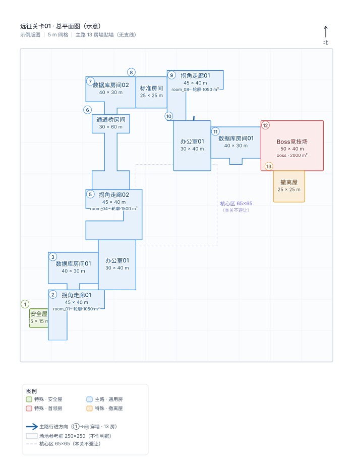

*总平面图（**示例版图**，示意）。**主路（蓝色实线，①→⑬）**：**① 入口安全屋 → ② 拐角走廊01 → ③ 数据库房间01 → ④ 办公室01 → ⑤ 拐角走廊02 → ⑥ 通道桥房间 → ⑦ 数据库房间02 → ⑧ 标准房间 → ⑨ 拐角走廊01 → ⑩ 办公室 → ⑪ 数据库房间01 → ⑫ Boss竞技场 → ⑬ 撤离屋**，十二段衔接全部**墙贴墙**（净距 0 = 共墙）。**⑥ 通道桥房间是 30 × 60 工字型**：南北两端各 15 m 为**上层平台**（通道），中间 30 m 段中央留 **10 m 宽跨桥**（沿 y 跨、连通两端平台），桥的东西两侧各 10 m 宽为**下层**（下沉）—— 上层平台俯视呈「工」字。门只开在南北两块短板（桥跨向两端）。画面上方为北（平面 +y = 世界 +z = 南）。*

> 📐 **[→ 打开远征关卡01 平面图集](refs/expedition01/远征关卡01平面图集.html)**（总平面图 + 13 张房间详图 + 房间明细表 + 面积构成）。单张图在 [`refs/expedition01/plans/`](refs/expedition01/plans/)，逐房型详图排在下面 **§3** 各房型小节里。图是**示意稿**，由本页表格驱动（改表 → 重跑 `scripts/render_expedition01_plan_sheet.py`），画的是**示例版图**的坐标；几何真源是设计源 `floor_00.json`。


三个出口的语义：

| 出口 | 触发位置 | 结果 |
|---|---|---|
| 撤离成功 | 撤离屋的撤离信标 | 正常结算，带走本局收益 |
| 死亡 | 任意内容房 / Boss 竞技场 | 按死亡规则结算 |
| 主动弃局 | 入口安全屋的出口门 | 未开始就退出，不推进进度 |

**每间内容房的门后都有命运卡三选一** —— 这是本关的成长节奏。⚠️ **支线取消后，节奏完全由主路自身承担**：主路内容房由 6 间**加深到 10 间** ⇒ **最多 10 次构筑选择**，与旧口径（主路 6 + 支线 4 全走也是 10 次）**次数相同**。单次远征的时长因此主要取决于玩家推进主路的速度与清房彻底程度，不再有「绕不绕支线」这个额外变量。

---

## 3. 房型库

本关共 **13 个具体房间**、**8 个房型**：安全屋 + 10间内容房（`room_01`…`room_10`）+ Boss + 撤离屋，一线到底、无支线。每个房号唯一，同一房型可以多实例复用。当前房型/变体分配固定，示例版图与实跑的差异在整房坐标和朝向，不在每局换房型；`db_02` 目标与当前借用 `db_01` 的差距单独标注。

> 📌 **本节各小节讲的是「房型」本身（不随种子变、不随房数变）**；`room_0N` 只是示例版图里的位置编号。支线取消只影响**房数**（6 → 10 间内容房），**8 个房型一个没少**。


*总平面图（**示例版图**，主路 13 房）· 墙贴墙 · 画面上方为北。（与 [§2](#2-玩法循环) 同一张图：§2 用它讲**动线**，这里用它看**房型分布**。）*

**图纸是怎么来的、怎么改。** 本页所有平面图（上面这张总平面图 + 各房型小节里的详图）都由 `scripts/render_expedition01_plan_sheet.py` 生成，而**数据源就是本页**——尺寸与定位取自下方 §3.1 总表，坐标与父房取自 §4.2 坐标草案（两者画的都是**示例版图** = L2 里那份兜底样例）。所以改表的路径是：**改本页表格 → 重跑脚本 → 文档里的图跟着变**，不需要手改任何 SVG。脚本另有打包版输出 [`远征关卡01平面图集.html`](refs/expedition01/远征关卡01平面图集.html)（含房间明细表、面积构成与绘制口径）。图纸是**示意稿**、画的是**示例版图**；**实跑版图按种子现算**，几何真源始终是设计源 `floor_00.json`。

> ⚠️ **8 个模板是「不许改」的那一层。** 房间模板固定为 `safe_15x15` / `corridor_45x40`（变体 `l_turn` / `u_turn`）/ `db_70x50`（变体 `db_01` / `db_02`）/ `office_60x70` / `bridge_60x50` / `boss_50x40` / `extraction_25x25` / `std_25x25`。**版图用这 8 个固定模板拼装；模板内 `connection_ports` 的门洞局部坐标固定，不得为了接房而移动。** 拼装器只能整体旋转、平移房间，使指定的两个端口坐标重合且朝向相反；若四种直角旋转均无法重合，设计源必须判定失败，不能用“≤5 m 容差”或门口净空吸收错位。

### Blender 资产完成度：判定规则

§3.1 总表之后的《Blender 资产完成情况》与 §6 都按这套口径判定。**账本是唯一权威** —— 本页只做转述与对位，不自行判定"这个做完了"。

| 级别 | 名称 | 判定证据（三项须同时成立） |
|---|---|---|
| ⬜ | 未开始 | 无 Blender 源文件，且账本无对应行 |
| 🟨 | 有源 · 未登记 | Blender 源文件存在，但账本里查无对应行 —— **含 manifest 自己声明了 `asset_ledger` 却查无此行的（声明与事实不符，按未登记算）** |
| 🟦 | 已登记 · 未导出 | 账本有行，制作状态为"…源已完成"类，且 GLB / Prefab 列仍为「未制作」 |
| 🟩 | 已导出 · 未接入 | 账本有行，GLB 或 Prefab 路径已存在且非「未制作」，但使用位置未标已接入 |
| ✅ | 已接入 | 账本有行，且制作状态含"已接入" |

三条配套规则：

1. **账本改，本页必须同轮改。** `scripts/check_expedition_room_asset_status.py` 逐行比对，三条都会判失败：① 表里每个 AssetID 的级别必须与账本行推出的级别一致（级别 emoji 写在「账本制作状态」列）；② 「级别」列必须等于该行「账本制作状态」里出现过的**最低**级（即下面规则 3 的复算）；③ 账本里存在远征相关行而本页漏写。脚本自身的判据由 `tests/tooling/test_check_expedition_room_asset_status.py` 盯着（一个对照组 + 四类不一致，每类各报红一次）。
2. **复用别区块的资产要显式标注。** 房型若不做独立源而沿用其它区块的既有资产，必须写明来源 AssetID 与版本，并照抄该行的状态（本关的实例：安全屋沿用战局区块 `ENV-BATTLE-L01-SAFE-ENTRY` v007）。
3. **一房多源逐项列出，不混淆阶段。** 同一正式房型所需源有多项时按门禁取最低级；独立标为过程资产的白模（Boss `6a`）不并入正式房型完成度。旧“Boss种类源未登记”示例已由后续登记替代。源完成、组件转正与具体房间接入分别说明，不能只用单一级别推断整房完成。

### 3.1 总表（示例版图）

> **这是当前按房号固定的房型分配。** `pin_content_templates=true` 时 L2 的 `template_id/template_variant` 不按种子洗牌；示例坐标只是一份摆位，整房旋转后轴向尺寸可交换。默认布局或变体的具体接入状态见 §3.1.1。
>
> ✅ **本表已同步到 13 房实跑口径（2026-09-25 第三轮）：** 主路 **13 房**（安全屋 + `room_01`…`room_10` + Boss + 撤离）、无支线。`room_06` 的尺寸按裁定取 **40 × 30**（与模板 `db_70x50` 唯一的 `size_m` 一致；旧稿写的「50 × 30」是残留）。坐标见 §4.2。**房型模板 JSON、`floor_00.json`、验收断言与图集均已同轮改完。**
>
> ⚠️ **支线挂点已作废（2026-09-25 支线取消）**：旧口径下 4 间支线房曾分别挂在 `room_02` / `room_03` / `room_04` / `room_06` 上、使这 4 间主路房各多一扇门。**支线取消后每间主路房回到 2 门**（进 + 出）。见 §2 顶部裁定与 §4.4。

| 编号 | 中文名 | 定位 | 房型 | 尺寸 宽×深 (m) | 面积 (m²) | 参考图 |
|---|---|---|---|---|---|---|
| `entry` | 安全屋 | 特殊 | SAFE_ROOM | 15 × 15 | 225 | 沿用塔楼 v007 安全房壳体 |
| `room_01` | 拐角走廊01 | 主路 | COMMON_ROOM | 45 × 40 | 1800 | [图](refs/expedition01/拐角走廊01.jpg) |
| `room_02` | 数据库房间01 | 主路 | COMMON_ROOM | 40 × 30 | 1200 | [图](refs/expedition01/数据库房间01.jpg) |
| `room_03` | 办公室01 | 主路 | COMMON_ROOM | 30 × 40 | 1200 | [图](refs/expedition01/办公室01.jpg) |
| `room_04` | 拐角走廊02 | 主路 | COMMON_ROOM | 45 × 40 | 1800 | [图](refs/expedition01/拐角走廊02.jpg) |
| `room_05` | 通道桥房间 | 主路 | COMMON_ROOM | 30 × 60 | 1800 | [图](refs/expedition01/通道桥房间.jpg) |
| `room_06` | 数据库房间02 | 主路 | COMMON_ROOM | 40 × 30 | 1200 | [图](refs/expedition01/数据库房间02.jpg) |
| `room_07` | 标准房间 | 主路 | COMMON_ROOM | 25 × 25 | 625 | — |
| `room_08` | 拐角走廊01 | 主路 | COMMON_ROOM | 45 × 40 | 1800 | [图](refs/expedition01/拐角走廊01.jpg) |
| `room_09` | 办公室01 | 主路 | COMMON_ROOM | 30 × 40 | 1200 | [图](refs/expedition01/办公室01.jpg) |
| `room_10` | 数据库房间01 | 主路 | COMMON_ROOM | 40 × 30 | 1200 | [图](refs/expedition01/数据库房间01.jpg) |
| `boss` | Boss竞技场 | 特殊 | BOSS_ROOM | 50 × 40 | 2000 | 沿用已产出的故障数据库竞技场 |
| `extraction` | 撤离屋 | 特殊 | EXTRACTION_ROOM | 25 × 25 | 625 | — |

按本表尺寸：**主路 13 房面积合计 16675 m²**；含内墙的**估算占用** ≈ **17224 m²**（内墙按「每房矩形周长 × 0.30」估，走廊估算为 0 —— 衔接全部墙贴墙）。**面积与场地边界自 2026-09-25 起全项目退出判据**（见 §4.7）：数字照算照报、**不再作准入判据**。这是固定房型的面积统计；当前房型不抽换，整房平移/直角旋转不改变房间面积合计，版图包络仍可随摆位变化。

> ⚠️ **原支线 4 房（`branch_01`…`branch_04`）已于 2026-09-25 裁定取消，本表不再列入**（见 §2 顶部裁定与 §3.3）。上表因此只列**主路 13 房**（安全屋 + 10 间内容房 + Boss + 撤离）。

> 尺寸都是按图判读并与 5 m 模数对齐的结果。**判读依据写在每个房型下面**，觉得哪一间不对直接说，我改。

#### 3.1.1 Blender 资产完成情况（与账本同步）

> 判定口径见本章开头的《Blender 资产完成度：判定规则》。「账本制作状态」列照抄账本原值，**账本一改这里必须同轮改**（`check_expedition_room_asset_status.py` 盯着）。

| # | 房型 | Blender 源文件 | 账本 AssetID | 账本制作状态 | 级别 |
|---|---|---|---|---|---|
| 1 | 安全屋 15×15（`safe_15x15`） | **复用**：`assets/art/environments/tower_zones/battle/source/room_instances/entry_safe_room/v007/env_battle_l01_safe_entry_layout_source_v007.blend` | `ENV-BATTLE-L01-SAFE-ENTRY` v007 | ✅ 正式美术已接入；源文件已规范迁移 | ✅ 已接入 |
| 2 | 拐角走廊 45×40（`corridor_45x40`：变体 `l_turn` / `u_turn`） | `assets/art/environments/tower_zones/expedition/source/room_types/l_corridor/v003/L型走廊种类_数据连廊_45x40m_v003.blend`＋组件库 `.../source/common_components/v012/`；`u_turn` 差异布局 `.../source/room_instances/f00_room_04/v001/room_layout.json` | `ENV-EXPEDITION-L01-L-CORRIDOR` v012 | ✅ 两变体正式接入：共用 27 个组件；`l_turn` 121 实例（`room_01` / `room_08`），`u_turn` v001 123 实例（`room_04`：60 地砖 / 46 实墙 / 17 普通组件），房间专用组件 0；13 房 TSCN 化后由各房间静态场景持有顶层 prefab 实例 | ✅ `l_turn` / `u_turn` 已接入 |
| 3 | 数据库房间 **40×30**（`db_70x50`：变体 `db_01` / `db_02`）⚠️ 模板 id 名嵌的是旧尺寸、已锁定不改名 | `assets/art/environments/tower_zones/expedition/source/room_types/db_room/v002/`＋组件库 `.../source/common_components/v014/` | `ENV-EXPEDITION-L01-ROOM-DB-70X50` v014 | ✅ 正式美术已接入；组件库 v014（35 唯一组件 / 86 实例，运行时 3 处重放；主层 42 块地砖换通用 C01/C02）；房间静态 TSCN 已生成并由运行时加载 | ✅ `db_01` 已接入；`db_02` 变体待另轮制作 |
| 4 | 办公室 **30×40**（`office_60x70`）⚠️ 同上 | `assets/art/environments/tower_zones/expedition/source/room_types/office_room/v001/办公室房间种类_开放办公_30x40m_v001.blend`＋组件库 `.../source/common_components/v009/` | `ENV-EXPEDITION-L01-OFFICE-ROOM` v001 | ✅ 正式美术已接入；组件库 v009（25 唯一组件 / 106 个默认初始化实例）；room_03 / room_09 的正式布局各由独立静态 TSCN 持有，不按旧 JSON 持续重放覆盖。room_03 的 remove 覆写及计数口径见对应运行清单 | ✅ 已接入 |
| 5 | 通道桥房间 **30×60**（`bridge_60x50`：工字型，转置姿态用 `template_rotation_deg`）⚠️ 同上 | `assets/art/environments/tower_zones/expedition/source/room_types/bridge_room/v002/通道桥房间种类_工字型_30x60m_v002.blend`＋组件库 `.../source/common_components/v010/` | `ENV-EXPEDITION-L01-BRIDGE-ROOM` v002 | ✅ 正式美术已接入；组件库 v010（35 唯一组件 / 242 实例，运行时逐组件重放；坑底 36 块砖保持多层职责）；room_05 已生成独立静态 TSCN | ✅ 已接入 |
| 6 | Boss竞技场 **房型美术** 50×40（`boss_50x40`） | `assets/art/environments/tower_zones/expedition/source/room_types/boss_room/v002/Boss房种类_故障数据库_50x40m_v002.blend`＋组件库 **独立一库** `.../source/common_components/v011/` | `ENV-EXPEDITION-L01-BOSS-ROOM` v002 | ✅ 正式美术已接入；组件库 v011（38 唯一组件 / 210 实例 / 17 族，运行时逐组件重放；主层地砖换通用 C01/C02 棋盘砖）；boss 已生成独立静态 TSCN | ✅ 已接入 |
| 6a | Boss竞技场 **白模**（过程资产，属第 6 行房型，不计入房型完成度） | `source/art/whitebox/tower_zones/expedition_01/v001/blender/远征关卡01_白模_Boss竞技场_50x40m_v001.blend` | `ENV-EXPEDITION-L01-BOSS-ARENA` v001 | 🟦 Blender源已完成；QA PASS | 🟦 已登记·未导出 |
| 7 | 撤离屋 25×25（`extraction_25x25`） | —（信标是运行时资产，见 `PRP-EXTRACTION-BEACON-3D`） | — | ⚠️ 已生成运行时静态 TSCN 壳体，但正式撤离房房型源、信标契约与完整周界碰撞仍未完成 | 🟨 TSCN 已接入；正式美术未开始 |
| 8 | 标准房间 25×25（`std_25x25`） | `assets/art/environments/tower_zones/expedition/source/room_types/std_25x25/v001/标准房间种类_四墙平房_25x25m_v001.blend` | `ENV-EXPEDITION-L01-ROOM-STD-25X25` v001 | 🟦 房间种类源已完成（**组件拼装**：不自持几何，引用 office/bridge 两批已验收件）；QA PASS（9 组断言）；82实例房型布局尚未转正，room_07 当前仅通用壳体 TSCN 接入 | 🟦 源已登记·未导出；82实例布局未接入 |

> 上表按 **8个房型**列行（Boss白模另列 `6a`，共9行），不按房间实例列行。当前房型已固定，以下复用次数不是每局抽取值：数据库房间 40×30 出现 **3** 次（`room_02` + `room_06` + `room_10`）、拐角走廊 45×40 出现 **3** 次（`room_01` L 形 + `room_04` 凹字 + `room_08` L 形）、办公室 30×40 出现 **2** 次（`room_03` + `room_09`）、通道桥 30×60 出现 **1** 次（`room_05`）、标准房间 25×25 出现 **1** 次（`room_07`）；安全屋 / Boss竞技场 / 撤离屋各 **1** 次。

**读数：8 个房型里 6 个已有房型美术运行接入记录（安全屋复用战局区块 v007；拐角走廊 45×40 已接入 v012；数据库房间 40×30 → 组件库 v014；办公室 30×40 → 组件库 v009；通道桥 30×60 工字型 → 组件库 v010；Boss 竞技场 50×40 → 独立组件库 v011），1 个82实例源完成但布局未转正、当前只接入通用壳体（标准房间25×25，`room_07`），1 个仅生成运行时 TSCN 壳体但正式源未开始（撤离屋）。13 个具体房间均已有独立且区分命名的 `f00_<room_id>_static_layout.tscn`，静态视觉由 TSCN 中的顶层 PackedScene prefab 实例持有；代码继续负责门、触发器、刷怪、导航、流送、存档、交互与撤离。数据库房 `room_06` 当前运行时暂重放 `db_01` 默认布局，`db_02` 缺角变体仍待另轮制作。Boss 白模（第 `6a` 行）是过程资产，不计入房型完成度。**

**历史交付证据（以下2026-09-25至28日记录只对原时点成立）：** “未导出”“只能重放”“不做第二套摆位”分别已被后续组件接入与正式TSCN编辑权替代；记录保留，不作为当前操作命令或本次验收结论。

**历史补登记（2026-09-25，与当时源制作同一事务内完成）**：办公室 30×40（`office_room/v001`）与通道桥 30×60 工字型（`bridge_room/v002`）两处房型源，已在场景分账本《资产主表》补登记 —— `ENV-EXPEDITION-L01-OFFICE-ROOM` v001 / `ENV-EXPEDITION-L01-BRIDGE-ROOM` v002，级别均 🟦（已登记·未导出），本页同轮回写。

✅ **三套房型组件库接入（2026-09-27，本事务）**：办公室（组件库 v009；登记当日为 v006）、通道桥（v010；当日为 v007）、Boss 竞技场（**独立一库** v011；当日为 v008）三套房型源已按组件优先规则归并并逐件导出稳定 GLB / PackedScene，接入 `room_03` / `room_05` / `room_09` / `boss` 四处实例（实例数 106 / 242 / 106 / 210，`unresolved` 全 0；三房主层地砖统一换通用 C01/C02 棋盘砖）。账本 `ENV-EXPEDITION-L01-OFFICE-ROOM` / `ENV-EXPEDITION-L01-BRIDGE-ROOM` 制作状态转「正式美术已接入」，并新增 `ENV-EXPEDITION-L01-BOSS-ROOM` v002（《资产主表》第 247 行，账本 v0.1.16 → v0.1.17）。Boss 房原「白模 / 房间种类美术 / 组件库」三段式行随之拆为第 `6` 行（房型美术，✅）与第 `6a` 行（白模过程资产，🟦）。

✅ **标准房间 25×25 登记（2026-09-26，另一事务）**：`std_25x25` 房型源已落盘并登记为 `ENV-EXPEDITION-L01-ROOM-STD-25X25` v001（《资产主表》第 245 行，账本 v0.1.14 → v0.1.15）。

✅ **13 房静态 TSCN 化（2026-09-28，本事务）**：`start`、`room_01…room_10`、`boss`、`extraction` 各生成一份 `assets/art/environments/tower_zones/expedition/runtime/room_instances/expedition_01/f00_<room_id>_static_layout.tscn`；同一关卡的 13 个房间场景集中在一个目录内，文件名按房间 ID 区分，不再为每房建立一层子目录。房间场景只拥有顶层 PackedScene prefab 实例根，不递归改 prefab 内部 owner；`room_01` 因此稳定为“房间根 + 121 个 prefab 实例”，不再展开成数千个网格/碰撞节点。运行时 record 显式下发 `static_layout_scene_path`，`DungeonRoom3D` 加载 TSCN 后不再执行第二套静态组件重放，只继续创建动态门并保留触发器、刷怪、导航、流送、存档、交互与撤离职责。专项验收：`EXPEDITION_ROOM_STATIC_SCENES_OK checks=209 rooms=13`、`ROOM_TYPE_COMPONENT_REPLAY_OK checks=4540`，退出码 0 且无 RID / ObjectDB / resource 泄漏。⚠️ 完整 `verify_expedition_level01_flow` 仍因数据库房/撤离房周界碰撞与入口安全房旧快照兼容字段失败，不能据此宣称整关玩法全部回归通过。

✅ **静态房间恢复镜头墙体避障 + L 型转角两臂判定改为世界朝向（2026-09-28，另一事务）**：静态 TSCN 只固化**顶层** prefab 实例根、不递归进 prefab 内部，而 `camera_lower_wall` 是写在 prefab 内 `StaticBody3D` 上的**运行时 metadata**（不参与序列化）⇒ 改静态之后靠墙时的镜头下压功能整体失效，靠近南/北墙会穿镜。修法是在 `DungeonRoom3D._build_shell()` 载入静态布局后调用新增的 `_restore_static_layout_camera_wall_contract()`：直墙按 `tower_wall_direction`（`north`/`south` 才标，与动态路径 `direction in ["north","south"]` 同口径）、L 角按 `tower_wall_corner` 走 `_configure_corner_camera_collisions()`，**只复用既有碰撞体、不生成第二套墙体代理**。同时把 L 角的判定从「角位 id + 固定臂名」写死映射改为按**世界延伸轴**：臂沿世界 X 延伸（长度横跨房间东西＝南/北墙）才标，沿世界 Z 延伸（东/西墙）不标。原因是整房会按门向做 90° 整数倍旋转（安全房 `safe_room_orientation_steps=3`），旋转后两条臂的世界朝向互换，写死映射会同时产生「该标的没标」（朝南一侧照样穿镜，即本次报告的现象）与「不该标的标了」。另修正 `_spawn_room_corner()` 的配置时机：`_configure_corner_camera_collisions()` 必须排在 `add_child()` **之后**，否则父链未建立、累乘 basis 读不到整房旋转（`global_transform` 在节点未入树时不级联父链，故改用父链累乘的 `_world_basis_of()`）。安全房 `safe_room_*` 房间级 meta（版本 / 旋转步数 / 四角 L 开关与计数 / 房间包数）同步补入静态 TSCN：生成器复制 + `_build_shell()` 加载后回填，消除 `verify_expedition_level01_flow` 里 3 条「入口安全房未接入 v007 美术」的回归（该验收剩余 77 条「墙没有碰撞体」为**既有基线**，与本轮无关）。专项验收：`EXPEDITION_ROOM_STATIC_SCENES_OK checks=824 rooms=13`（较改造前 209 条新增直墙/L 角摄像机墙契约断言）、`CORNER_L_CAMERA_WORLD_OK gaps=0`（静态与动态两条装配路径一致）。

✅ **显式门洞锚点与单门实体衔接（2026-09-28，本事务）**：旧实现虽然能让两端“逻辑门”世界坐标相同，但两点都由房间中心与包围盒推导，实际把 room01 上方中点误当门洞；视觉真门洞因此整体错位。现改为 L2 `connection_ports` 真源：每个候选门洞都有稳定 `port_id`、房间局部 `position_m` 与局部朝外 `outward`，连接明确写成 `room01-A ↔ start-B`、`room01-B ↔ room02-A`。生成器用两端锚点重合且朝向相反同时求解平移和 90° 整数步旋转；room01 在固定种子下求解为 270°，端口与房型内容同步旋转。每条边只有父端持有一套门墙 / 门扇 / `RoomDoor3D`，另一端只绑定同一引用；未连接的 room01-C / room01-D 由默认实墙封闭。专项运行时探针通过 188 项断言：12 条边全部 0.01m 内重合、方向相反、恰好 12 个门实体；安全屋开门后 9 条射线全 `CLEAR`，越门 0.4m 即进入 room01。

✅ **五套组件库 UV 提亮 + 材质亚光化，三套重导出接入（2026-09-27，本事务）**：业主裁定「UV 配色整体向浅色系**保色相提亮 3 个挡位**；材质球大面积用**亚光**、小部分用金属/反光；**是调整，不新增材质球**」。五套组件库（`office_room/v009`、`bridge_room/v010`、`boss_room/v011`、`l_corridor/v002`、`db_room/v003`，合计 **261 个 blend**；前三套在 2026-09-27 同轮由 v006 / v007 / v008 升版为 v009 / v010 / v011，旧目录保留为**提亮前历史源**）逐库校正：

| 组件库 | 深色面占比（提亮前 → 后） | 金属面积占比（改前 → 后） | 改槽 |
|---|---|---|---|
| `office_room/v009` | 65.7% → 30.0% | 0.0% → 0.0%（无金属槽） | 0 |
| `bridge_room/v010` | 59.2% → 17.2% | 0.0% → 0.0%（无金属槽） | 0 |
| `boss_room/v011` | 72.6% → 24.5% | 37.4% → **2.9%** | 60 |
| `l_corridor/v002` | 13.9% → 4.8% | 12.0% → 9.7% | 268 |
| `db_room/v003` | 56.1% → 30.6% | 100.0% → **0.0%** | 148 |

- **提亮口径**：第 10 列冷调灰阶栏按图面行 +3、彩色族同族列 +3、封顶列 8；浅端溢出与近黑 `0_0`（`#05050c`）**原样保留**；行 0 饱和原色行与行 9 近黑阴影行不是渐变、不动。跨格 0、越界 0。深色面判据 = HSV 明度 `max(R,G,B)/255 < 40%`。
- **亚光口径（主面判据，按面积不按面数）**：`金属面积 >= 哑光+反光面积` ⇒ 按槽面积从大到小把 `01_精工金属` 槽改指 `02_细腻哑光`，直到 `金属 < 哑光+反光`；**只改槽指向**，不动 PBR 参数 / 几何 / UV / 色盘格、不新增材质种类。平衡单元 = 组件 × 镜像集合（`_制作源` 与 `_输出包` 各自独立判定）。金属占比为 **256 个输出包 / 输出侧口径**，合计 32.6% → **3.8%**；按判据保留金属的小件如 Boss 房 `workstation_a/b/c`、`chair`、`archive_shelf`、`debris_*` 与走廊 `前墙` / `侧墙`。
- **导入拼装（本事务）**：`office` / `bridge` / `boss` 三库（升版后为 `v009` / `v010` / `v011`）按新源重导出 **98 个稳定 GLB**（`export_image_format=NONE`、外链共享色盘不 Pack）、重建 **98 个 PackedScene** 与 `shell_component_catalog.json`（110 条），Godot 默认 APPDATA 重导（98/98 `.scn` 重建）后四处实例重放验收 **2051 项断言全通过**（106 / 242 / 106 / 210 实例，`unresolved` 全 0，门位净空 0 覆盖）。
- **逐房间运行时装配清单（本事务补齐）**：按 `04-battle-room-runtime-assembler`「房间输出」要求，四处实例各产出一份 `runtime/room_instances/f00_<room>/{room_runtime_manifest.json, acceptance/}`，`assembly_route` 全为 **`room_type_layout_replay`**（分支 A0：具体房间白模与房型默认尺寸、门槽与必需设施一致，无 `instance_overrides` ⇒ 直接重放房型 `component_instances.json`，当时以JSON直接初始化；现行规则允许Godot正式TSCN继续维护房间编辑）。清单记房间编号/种类/白模源/组件源、逐组件稳定 PackedScene 与碰撞责任、实例数、房间局部包络、门洞契约与门位、组件库源哈希，并附房型重放验收日志、运行时材质探针日志与**运行时门位探针日志**（`acceptance/{replay_verification_log,runtime_material_probe,runtime_doors}.txt`）。**门位以运行时探针实测为准**（`probe_runtime_doors.gd`，`RUN_SEED=77001199`；房型源按规范不冻结门位，实跑门位由 `FloorPlanGenerator` 按种子现算，详见 §4.4），静态兜底样例推导的相邻面只作对照（`door_apertures_static_reference`）；方向口径沿用跨语言红线 `+y` → 南 / `−y` → 北。清单**只放清单与验收证据**，不放过程源 / 白盒源 / 整屋 GLB。
- **运行时取证（本事务）**：九个取样件逐表面读运行时材质并渲染（`outputs/room_type_runtime_probe_after_import.png`）。除按判据保留金属的 Boss 房 `workstation_a`（保留 1 个 `metallic=0.860` 面）外，全部取样件可判面 `metallic ≤ 0.180`，且 `albedo` 全部绑定共享设施色盘 —— 证明提亮与亚光化已随资产重导进入运行时，而非只停在 Blender 源。
- ✅ **数据库房 v014 已进入导出与运行时链**：35 个独立 GLB/PackedScene 已生成并登记，`room_02` / `room_06` / `room_10` 按 `component_instances.json` 重放验收通过；每间 86 个实例、42 块通用 C01/C02 棋盘砖、44 个普通房型组件、`unresolved=0`、2 扇运行时门。`room_06` 暂使用 `db_01` 默认布局，`db_02` 仍待另轮制作。“L型走廊未进入导出链”是当日旧状态，已由v012组件与两变体接入记录替代。
- ⚠️ **不变量**：五套房型的**概念源** blend 与共享色盘 PNG（`ART-PALETTE-FACILITY-LOWLIGHT-DOPAMINE`）全程未改写，SHA-256 与账本登记逐位一致（已实测）——本次提亮只改 UV 色盘格的**导向**。
- ✅ **组件库按版本规范升版（2026-09-27 同轮收尾）**：按 `02-battle-room-component-decomposer` 第 184 行「生成组件源版本，不覆盖房间种类源，也不覆盖历史组件源」，把已接入的三套组件库由「原地改写、版本号不变」改为**另立新版本** —— `office_room` `v006 → v009`、`bridge_room` `v007 → v010`、`boss_room` `v008 → v011`。新目录承载提亮 + 亚光后的**当前源**（目录与母版同步改名），旧目录由 `git checkout HEAD --` 恢复为**提亮前的历史源**（只读留档，新旧母版 SHA-256 互不相同即证两版内容确有差异：office `f5e666ee…` → `926a881d…`、bridge `9f6a23ab…` → `f219156e…`、boss `9ffd58e5…` → `b05b0151…`）。同步改写全部引用：各库 `component_catalog.json`（`version` / `component_library` / 每包 `component_library_blend`）、`component_instances.json` 的 `library`（**改** ＝ 本库自身版本；`source_library` 与 `source_blend_sha256` 仍指向**整屋／房间种类源** v004 / v005 / v001，未动）、组件库级 `runtime_manifest.json` 与四处实例的 `room_runtime_manifest.json`、98 个 PackedScene 的 `metadata/asset_version` 与 `source_blend`、`FloorPlanGenerator.ROOM_TYPE_LAYOUT_SOURCES`、两个导出脚本的 `LIBRARIES`、逐房间清单生成器的 `ROOM_TYPE_BINDING` 与重放探针的 `expected_version`。**运行时路径一律不带版本号**（`04-battle-room-runtime-assembler` 第 155 行：替换即覆盖同路径同名文件），版本只写在 `source/`、`asset_manifest.json`、PackedScene metadata、布局快照与本账本。升版后重导出 98 个稳定 GLB、重建 98 个 PackedScene 与 `shell_component_catalog.json`（110 条，全 v009 / v010 / v011），Godot 重导（98/98 `.scn` 与 GLB 字节同步）后房型重放验收 **2051 项断言全通过**；材质探针按 `AGENTS.md` 第 10 行以**真实渲染器**（非 headless）复跑九件取样，结构面 `metallic=0.030`、`albedo_texture` 全部指向共享色盘。账本同轮回写《资产主表》第 243 / 244 / 247 行的版本串并追加《域变更日志》v0.1.21。

> ⚠️ **本行与其余 4 个有源房型有一处本质差别，读表时勿混淆。** 拐角走廊 / 办公室 / 通道桥三行是「**房型自持几何**」的组件源（各自从零拆出 121 / 106 / 242 个组件包）；标准房间这一行是「**实例布局源**」——**自持几何为 0**，房间由 82 个集合实例（25 地砖 + 18 实墙 + 2 门墙 + 37 陈设）拼成，全部 Library Link 引用 `office_room/v001`（54 包）与 `bridge_room/v002`（27 包）两批**已验收**资产包，不改组件几何 / 材质 / 根原点、不 Append、无缩放。配套清单 `component_inventory.json` 记的是**被引用的外部资产包**及本房用法，与那三行「记录本房自产组件」的语义不同。

**标准房间拼法（本事务定案，门位冻结）：**
- **门位 = 西墙 lane 0 进 + 东墙 lane 0 出**（对穿）。依据：§4.2.1 记 `room_06 → room_07` 与 `room_07 → room_08` 均走东/西墙；参考图 `refs/expedition01/plans/08-标准房间.svg` 门标记在左右墙中线。
- **中央东西向主通道对穿**，北半为办公区（office 家具：4 组工位 + 图腾柱 + 储物柜 + 打印机 + 货架 + 补给角 + 备餐台），南半为机械管廊区（bridge 上层件：服务器组 ×2 + 电力柜 ×2 + 上层机柜 ×4 + 控制台 ×2 + 隔断 ×2 + 板箱 ×2 + 板条箱 ×6 + 高位桥架 ×5）。
- 巡检入口：`build_std25_room_v001.py`（构建）→ `verify_std25_layout_v001.py`（9 组结构契约断言）→ `renders/`（6 机位验收图）。
- 支线取消、std 支线不再承担支线填充职责，但**仍在 §3.4 的 5 个 `COMMON_ROOM` 抽取池内**。

✅ **数据库房间 40×30 接入（2026-09-27，本事务）**：返工源 `db_room/v002` 归并为组件库 v014，并登记为 `ENV-EXPEDITION-L01-ROOM-DB-70X50` v014（《资产主表》第 246 行）。35 个唯一组件已导出 GLB/PackedScene，三处实例按默认布局接入 Godot 并通过运行时重放验收；`room_06` 的 `db_02` 缺角变体仍待另轮制作。本轮按参考图 `refs/expedition01/数据库房间01.jpg` 做 **`db_01`** 布局（主体 40×25 + 南侧中段外凸 10×5，占用 1050 m² / 包围盒 1200 m²）。

- **墙与地砖复用办公室件（业主指令）**：28 樘墙件 + 42 格地砖全部 Library Link 引用 `office_room/v001` 的**已验收组件包**，本文件自持墙/砖网格 **0**（不 Append、不复制网格、不改组件几何/材质/根原点、无缩放；QA 断言 `no_local_wall_or_tile_meshes` 守住）。地砖按 db 8×6 网格取落在轮廓内的 42 格，映射到 office 6×8 网格（`ox = ix`；`ix = −4 → 2`、`ix = 3 → −3` —— 差值 ±6 保留 `(ix+iy)` 奇偶相位，地面斜条棋盘不翻相）。
- **其余组件全部新制**：37 个数据库机房专属组件包 —— 地面系统 5 包（黄黑警示边带 / 分区编号标识 / 格栅与检修口 / 线槽与盖板 / 设备坑抬升平台）、区域固定设施 19 包（西侧机柜列 7 台 / 中部机柜组与推车 / 西墙检修台 / 东墙 L 形工作台 / 壁挂大屏组 / 红黄工具车 / 中央作业台 / 货箱堆场 / 北墙重型货架 / 多屉零件柜 / 落地电缆盘与壁挂线圈 / 白花箱绿植 / 东北设备机架 / 西南附区作业台 / 墙面冷光灯柱 / 墙面管道线束 / 落地仪器三脚架 等）、环境支持 13 包（吊顶结构 / 周圈圈梁 / 电缆桥架 / 顶部管道 / 通风管与风口 / 灯具 / 墙顶管线收口 / 转角护柱）。
- **门位不冻结**：三处实例（`room_02` 南+东 / `room_06` 北+东 / `room_10` 西+东）门位各异 ⇒ 全部 **16 个可开槽**保持净空（门洞通行体 = 门净宽 2.2 m + 0.10 余量 × 自结构边线向房内 1.45 m × z∈[0.30, 3.00]；z≥3.0 的高处壁挂件与门洞净宽之外的贴墙件不受限）。运行时按门位把对应标准墙件替换为门洞墙件。
- **变体 `db_02` 待另轮**：同一 `db_70x50` 模板的另一内部布局（双缺角 15×10 / 15×5，面积 975 m²，对应 `room_06` 的货架箱体堆场），已在 `room_type_manifest.json` 的 `footprint.variant_pending` 显式标注，本轮未做 —— 与 `l_corridor/v003` 一份源覆盖 `l_turn` / `u_turn` 两个变体同类。
- 巡检入口：`build_db_room_v001.py`（构建）→ 同目录 `qa_report.json`（26 项结构契约断言）→ `renders/`（6 机位验收图：顶视 / 等轴剖视 / 西侧机柜列 / 东墙工作台 / 中央作业区 / 外凸入口）。

**历史账本缺口（已被后续登记替代）：** 旧稿曾记录 Boss 房种类源和早期 `expedition_boss_room_components_source_v001.blend` 有源无行；现以 §3.1.1 的 `ENV-EXPEDITION-L01-BOSS-ROOM` v002 与独立组件库v011接入为准，不再把这两项旧缺口列为当前未登记。本次不修改账本。

**分阶段状态不可合并：** 标准房源82实例完成；其引用组件具有各自来源/验收，不等于本房82实例清单已转正；`room_07` 当前房间接入只覆盖通用壳体。待完成该布局的稳定组件映射、正式TSCN合并和运行验收后，才能提升完整房型接入状态。

### 3.2 主路房型（13 间）

> 各小节以当前固定房号/房型说明设计和接入状态。共用房型仍只有一套组件；房间可继承默认或维护Godot差异，不因编号不同重做组件。`room_06` 的目标 `db_02` 尚未制作，不用临时 `db_01` 替代目标设计。

#### entry · 安全屋（15 × 15）

*平面示意（尺寸与内部结构；与其它房型同比例，1 m = 6 px）*

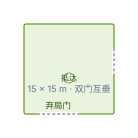

- **结构**：单一双门布局 —— 前门指向拐角走廊01，另一扇是"传送抵达侧"的封闭气闸门，兼"退出战局"交互位。两门互相垂直。
- **本关作用**：起点房；唯一的主动弃局门在这里。运行时房间 id 由 `legacy_room_id = "start"` 决定（设计源 key 是 `entry`）。
- **美术现状**：✅ 复用战局区块 `v007` 安全房资产，已接入（见 §3.1.1）。

#### room_01 · 拐角走廊01（45 × 40）

*参考图（Blender 造型参考）*

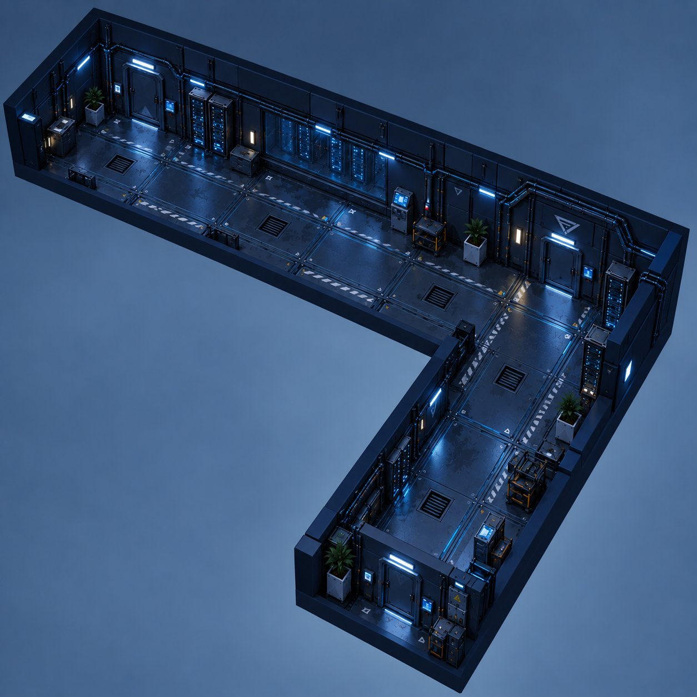

*平面示意（尺寸与内部结构；与其它房型同比例，1 m = 6 px）*

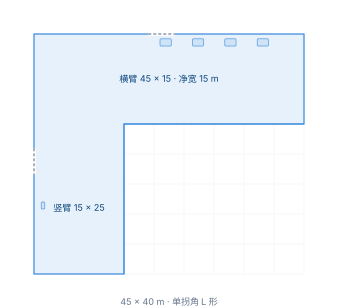

- **结构**：单拐角 L 形走廊（模板 `corridor_45x40` 的 `l_turn` 变体），净宽 **15 m（三砖）**。横臂 `45 × 15`，竖臂 `15 × 25`。
- **判读依据**：横臂数到 9 格、竖臂 5 格，宽一律 3 格。
- **本关作用**：把玩家从安全屋引入主路的**第一段**，承担"第一印象"—— 长廊 + 拐角，视野一次只放一段。主路第 1 房，只有进 / 出两扇门。
- **美术现状**：✅ `l_turn` 与 `u_turn` 均已正式接入。两者共用 `common_components/v012` 的 27 个唯一组件，不另立组件集。`room_01`、`room_08` 各重放 `l_turn` 默认布局 121 实例；`room_04` 重放 `u_turn/v001` 差异布局 123 实例（60 块主层地砖运行时换通用 C01/C02、46 个结构墙、17 个普通组件、`unresolved=0`、2 扇门），凹口内墙岛全部由同一 `wall_5m` 族摆出，房间专用组件 0。运行时落位会按声明足印校验新增门槽，不允许将 `u_turn` 静默改成 `l_turn`；`ROOM_TYPE_COMPONENT_REPLAY_OK checks=4539`。

#### room_02 · 数据库房间01（40 × 30）

*参考图（Blender 造型参考）*

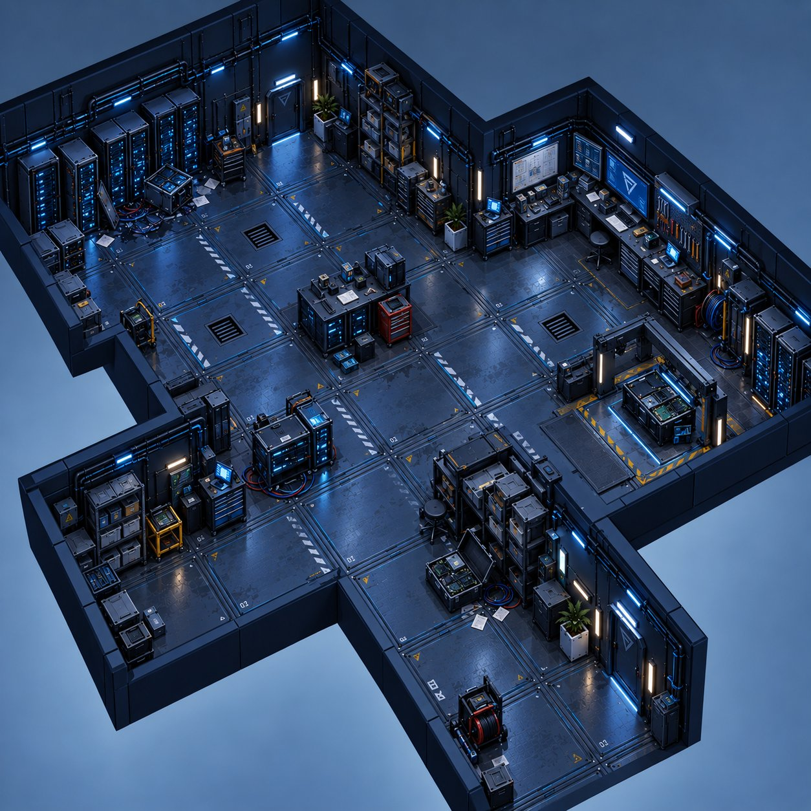

*平面示意（尺寸与内部结构）*

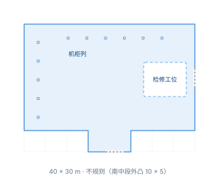

- **结构**：**不规则**。主体矩形 40 × 25 + **南侧中段外凸 10 × 5**（对应模板 `db_70x50` 的 `db_01`：主体 70 × 40 + 外凸 20 × 10，按 5 m 模数等比缩小）。机柜贴西墙与北墙成列，东北角是检修工位区（工作台、工具车、屏幕墙）。
- **判读依据**：宽 8 格 = 40 m、深 6 格 = 30 m；主体深 5 格、外凸 2 格宽 × 1 格深。
- **本关作用**：主路第 2 房；机柜列天然形成"走廊式"掩体，外凸块可做侧翼包抄位。
- **美术现状**：**正式美术已接入**（返工源 `db_room/v002`，组件库 v014，35 个唯一组件 / 86 个实例）；`db_01` 默认布局已用于 `room_02`、`room_06`、`room_10` 的运行时重放，三处通过验收。账本 `ENV-EXPEDITION-L01-ROOM-DB-70X50` v014（✅ 已接入）。

#### room_03 · 办公室01（30 × 40）

*参考图（Blender 造型参考）*

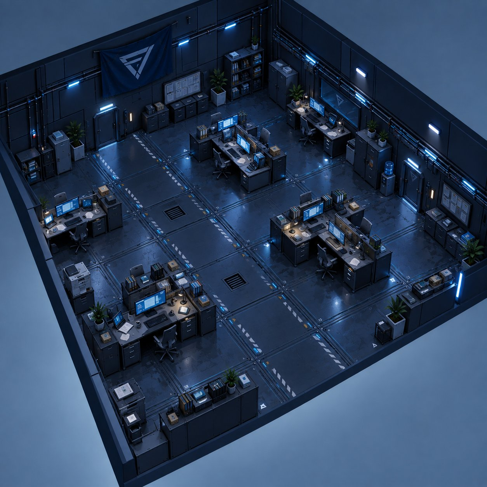

*平面示意（尺寸与内部结构）*

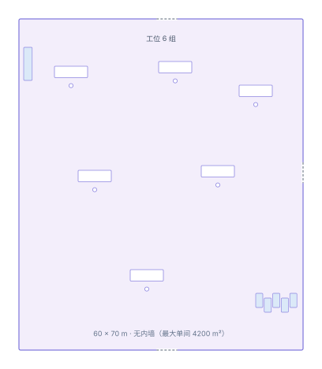

- **结构**：方形开放办公区，无内墙。内部 4 组工位（桌 + 椅 + 屏 + 主机），墙边是文件柜、白板、图腾与绿植。
- **判读依据**：宽 6 格 = 30 m、深 8 格 = 40 m（原 60 × 70 按 5 m 模数缩小）。
- **本关作用**：主路第 3 房。视线通透、掩体零散 —— 适合作为**长距离交火**的主战场。
- **美术现状**：**已有房间种类源**（`office_room/v001` = 30×40 m / 106 个组件包 / 193 输出网格 / 211708 面，QA PASS 22 项断言），已登记账本 `ENV-EXPEDITION-L01-OFFICE-ROOM` v001（✅ 正式美术已接入，组件库 `v009`，见 §3.1.1）；`room_09` 与本房同型、共用同一份源。

room_03 的具体布局不能用房型默认106实例代替：`room_layout.json` 明确删除 `filing_run_west`，初始化解析为105；正式TSCN根元数据仍记105，但当前实际为100个组件实例根（含48个通用地砖）、22个组件ID。其余5个相对初始化清单缺席的实例仅记录差异，不自动补回；此处不改端口、轮廓或静态布局，也不把静态核对当作运行验收。逐项来源与历史证据边界见[room_03运行清单](../../../assets/art/environments/tower_zones/expedition/runtime/room_instances/f00_room_03/room_runtime_manifest.json)。

#### room_04 · 拐角走廊02（45 × 40）

*参考图（Blender 造型参考）*

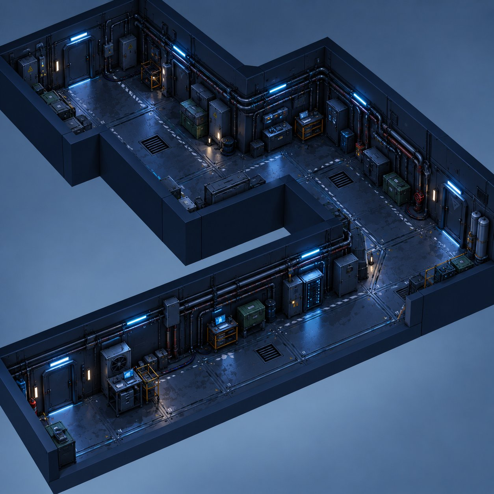

*平面示意（尺寸与内部结构）*

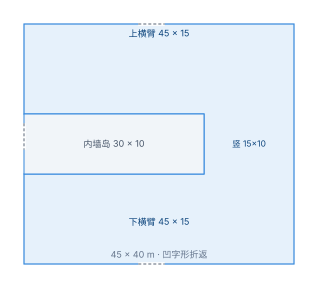

- **结构**：三段 15 m 宽走廊**折返**成"凹"字形（模板 `corridor_45x40` 的 `u_turn` 变体）—— 上横臂 `45 × 15`、右侧竖向 `15 × 10`、下横臂 `45 × 15`，中间夹一块内墙岛，开口朝西。
- **判读依据**：上、下横臂各数到 9 格，宽度均为 3 格；中间竖向段约 2 格。
- **本关作用**：主路第 4 房，双横臂 + 内墙岛给了"绕柱接战"的空间。
- **美术现状**：与拐角走廊01 共用同一个房间种类源（`corridor_45x40`，v003）。按 2026-09-27 裁定，本变体**不另立组件集** —— 全部组件引用 L 型源的既有件（凹口中部内墙岛的三面墙由同一 5 m 实墙族摆出）；变体外轮廓真源仍是 `room_templates/corridor_45x40.json` 的 `variant_footprints.u_turn`。

#### room_05 · 通道桥房间（30 × 60 · 工字型）

*参考图（Blender 造型参考）*

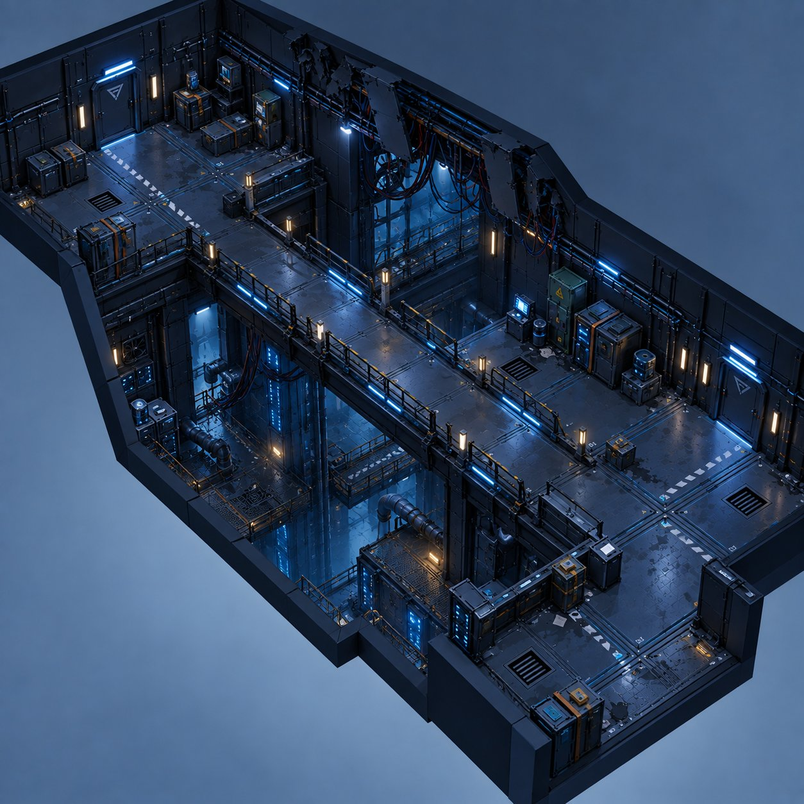

*平面示意（尺寸与内部结构；下沉区与跨桥为示意，坑深待定）*

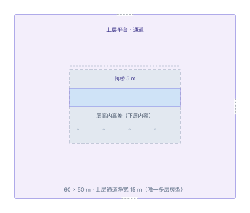

- **结构**：**上下两层，上层平台呈「工」字**。宽 30 m、进深 60 m；**南北两端各 15 m 进深**是满宽 30 m 的**上层平台**（通道），**中间 30 m 进深段**只在中央留一条 **10 m 宽的跨桥**（沿 y 跨，连通南北两端平台）；桥的东西两侧各 **10 m 宽 × 30 m 进深**是**下层**（下沉，附图里的蓝色区域）。桥上有管线与支架，下层有设备与平台 —— **下层内容要做**，不是空腔。
- **判读依据**：宽 6 格 = 30 m、深 12 格 = 60 m；南北平台各 3 格（15 m）、中间段 6 格（30 m）；跨桥 2 格（10 m）、两侧下层各 2 格（10 m）。⚠️ 桥宽按 **10 m（2 格）** 画 —— 取「全宽三等分、全落 5 m 网格」；锁定模板 `bridge_60x50` 的原桥宽是 **5 m**，缩到 30 m 宽带后会出现 12.5 m 的非网格半宽，故此处取 10 m。若要严格沿用 5 m，请明示，我改。
- **取向**：主路在桥房处**沿 y 直行**（北进南出，两门同在房间中线上）⇒ 门只开在南北两块短板（30 m 边）上。✅ 锁定模板 `bridge_60x50` **已同步为同一形态**（`size_m = [30, 60]`，`sunken_pit` 30×30、`bridge_span` 10 m 宽跨桥；见 §3.4）；模板 id 名嵌的旧尺寸按裁定**锁定不改名**。「改模板尺寸」这条路已由业主裁定走通（2026-09-25），**没有新增任何模板 id**（§3.4 / 05.2 §3.6 第 4 条）。
- **本关作用**：主路第 5 房，本关唯一的**立体战斗空间**。高差带来压制位与被压制位，是节奏上的转折点。桥房的门只能开在桥跨向两端墙（短边），两扇门是「进 / 出」一对，且必须同轴 ⇒ 结构上没有第三个门位（§4.4 / 05.2 §3.6 第 8 条）。
- **战斗编排（2026-09-29，单波 5 盒 / 30 只）**：前后端各 2 盒 ＋ **桥心新增 1 盒**。桥心盒 `box_bridge_center` 用**全关唯一的大盒（10×14 m）与唯一的 `wall_recess_tiles: 0`** 一次压 16 只（小僵尸×8 → 1s 壳甲×4 → 2s 警察僵尸×4），把「从桥心直行通过」这段变成**唯一的强制正面冲突**。逐盒实到与硬约束见 §4.5.2 / `触发器刷怪设计.md` §3.1.1 大盒②。
- **美术现状**：**已有房间种类源**（`bridge_room/v002` = 30×60 m 工字型 / 242 个组件包 / 314 输出网格 / 312370 面，QA PASS 17 项断言；v001 保留在同目录历史版本），已登记账本 `ENV-EXPEDITION-L01-BRIDGE-ROOM` v002（✅ 正式美术已接入，组件库 `v010`，见 §3.1.1）。⚠️ 这是本批里**唯一需要多层几何与碰撞**的房型 —— 其余房间都是单层平房。
- **已定（已随 `bridge_room/v002` 源落地）**：坑深 **12 m**（下层占满层高，坑底 Z = −12.0 m）、跨桥宽 **10 m**、两侧下沉区各 10 × 30 m；下层**不可达**、不单独给动线 —— 口径与 §6 工程注意事项一致。

#### room_06 · 数据库房间02（40 × 30）

*参考图（Blender 造型参考）*

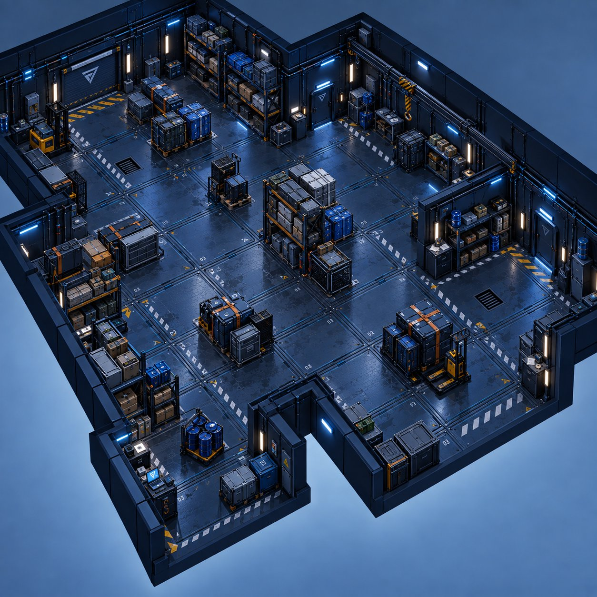

*平面示意（尺寸与内部结构）*

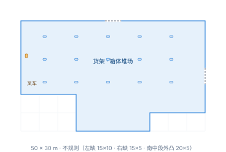

- **结构**：**不规则（缺角）**。三段拼成：左段 `15 × 20`、中段 `10 × 30`、右段 `15 × 25`（相对 40 × 30 的包围盒 = 左下缺 15 × 10、右下缺 15 × 5、南中段外凸 10 × 5）。对应模板 `db_70x50` 的 `db_02` 变体。场内是货架与箱体堆场，西侧有一台叉车。
- **判读依据**：宽 8 格 = 40 m、深 6 格 = 30 m；左段深 4 格、中段深 6 格、右段深 5 格 —— 左下缺 3 格 × 2 格、右下缺 3 格 × 1 格、南中段外凸 2 格 × 1 格。
- **本关作用**：主路第 6 房；堆场布局给的是"视线断续"的遭遇战。⚠️ 示例版图里它之后还有 `room_07`…`room_10` 四间内容房，主路在 `room_10` 之后才拐进 Boss 竞技场。
- **美术现状**：本房设计目标是 `db_02` 缺角变体，但该变体**待另轮制作**。当前运行时为了保持房间可运行，暂重放 `db_70x50` 的 `db_01` 默认布局；这不等同于 `db_02` 已完成。数据库房房型库已登记为 `ENV-EXPEDITION-L01-ROOM-DB-70X50` v014（✅ 房型库已接入）。

#### room_07 · 标准房间（25 × 25）

*平面示意（尺寸与内部结构）*

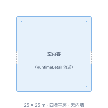

- **结构目标**：四墙平房（25×25，5×5个5m槽，无内墙）；82实例Blender源包含东西贯通主通道、北半办公区与南半机械管廊区。这是待转正的完整陈设目标，不是当前静态TSCN内容的描述。
- **本关作用**：主路第7房；目标是有掩体、有纵深和分区的遭遇战空间。当前通用壳体及RuntimeDetail不能冒充82实例默认陈设已接入。
- **分阶段现状**：`ENV-EXPEDITION-L01-ROOM-STD-25X25` v001源已完成并登记（82实例 / 引用81包 / 自持几何0；9组断言为历史源验收）；复用办公室/通道桥组件，但本房82实例布局尚未转正；`room_07` 当前仅通用壳体TSCN接入。
  - 源：`assets/art/environments/tower_zones/expedition/source/room_types/std_25x25/v001/标准房间种类_四墙平房_25x25m_v001.blend`
  - 门位：**西墙 lane 0（进）+ 东墙 lane 0（出）**，与 §4.2.1 的两处衔接一致。
  - ⚠️ 与参考图的差异（有意为之，2026-09-26 业主裁定）：本页与 `08-标准房间.svg` 原文案为「空内容（RuntimeDetail 流送）」，业主决定本房型改为**拼一个完整陈设房**，故图纸的「空内容」表述已按实际更新为「有默认陈设」。

#### room_08 · 拐角走廊01（45 × 40）

*平面示意（尺寸与内部结构；与其它房型同比例，1 m = 6 px）*

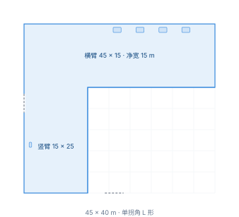

- **结构**：单拐角 L 形走廊（`corridor_45x40` 的 `l_turn` 变体），与 `room_01` 同房型。
- **本关作用**：主路第 8 房；示例版图里 L 形走廊第二次出现 —— 当前固定与room_01复用同一房型，不需要按局抽换。
- **美术现状**：与 `room_01` 共用同一个房间种类源（`corridor_45x40`，v003）。

#### room_09 · 办公室01（30 × 40）

*平面示意（尺寸与内部结构）*

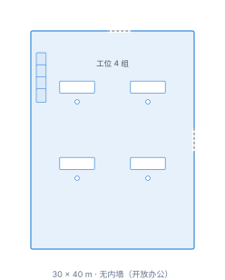

- **结构**：方形开放办公区，无内墙，与 `room_03` 同房型。
- **本关作用**：主路第 9 房；长距离交火位，与 `room_03` 同型。
- **⚠️ 事件 + 战斗双职房（2026-09-26 业主裁定）**：本房内容类型是 `EVENT`（异常信号终端），**同时**显式摆了 4 个触发盒 / 3 波（盒位与同房型的 `room_03` 一致，见 §4.5）。**事件终端照常保留**、也**照常出波** —— 清完 3 波并结算事件，门才放行。机制口径见 §4.5 的「EVENT 双职房」注。
- **美术现状**：与 `room_03` 共用 `office_room/v001` 房型源和v009组件库；`ENV-EXPEDITION-L01-OFFICE-ROOM` 已有正式接入记录，`room_09` 有独立静态TSCN。旧“已登记·未导出”已替代，不把源包数当成唯一组件数。

#### room_10 · 数据库房间01（40 × 30）

*平面示意（尺寸与内部结构）*

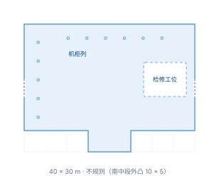

- **结构**：**不规则**（主体 40 × 25 + 南侧中段外凸 10 × 5，`db_70x50` 的 `db_01` 变体），与 `room_02` 同房型。
- **本关作用**：主路第 10 房（**示例版图里最后一间内容房**），之后主路拐进 Boss 竞技场。
- **美术现状**：与 `room_02` 共用数据库房 v014 的 `db_01` 默认布局，已完成 GLB/PackedScene 导出并接入 Godot；运行时组件重放验收通过。账本 `ENV-EXPEDITION-L01-ROOM-DB-70X50` v014（✅ 已接入）。

#### boss · Boss竞技场（50 × 40）

*参考图（Blender 造型参考）* —— 沿用已产出的故障数据库竞技场。

*平面示意（尺寸与内部结构）*

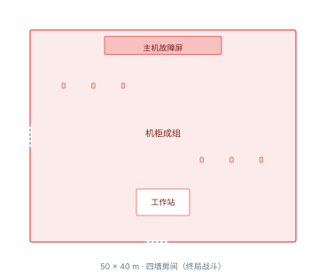

- **结构**：完整四墙房间，场内是故障数据库主题（主屏、机柜成组、工作站）。
- **本关作用**：终局战斗。主路在数据库房间02 之后向东拐进 Boss 房，再向南出撤离屋。
- **美术现状**：房型源v002、独立组件库v011及Boss静态TSCN已有正式接入记录；白模是过程资产，不再以“种类源未登记”描述当前状态（见 §3.1.1）。
- **门位**：旧“南进西出待裁决”是显式端口接入前的记录，已由 §4.4 的局部端口配对与整房旋转替代；不能以旧世界方位覆盖当前端口契约。

#### extraction · 撤离屋（25 × 25）

*平面示意（尺寸与内部结构）*

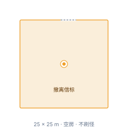

- **结构**：空房 + 常驻撤离信标（`STANDARD`，非锁定），不刷怪。
- **本关作用**：终点。主路最后一房，只有一扇门（接 Boss 房）。
- **美术现状**：通用静态TSCN壳体已接入，正式撤离房型源未完成；信标已有运行资产 `PRP-EXTRACTION-BEACON-3D`，完整信标契约与周界碰撞仍需验收，不能因壳体存在宣布完整美术完成。

### 3.3 支线房型（已取消）

**本节原有的 4 间支线房已于 2026-09-25 裁定取消，不再属于本关** —— 版图改为**主路一条线到底**：安全屋 → **10 间内容房**（`room_01`…`room_10`）→ Boss竞技场 → 撤离屋。

- 原设计是「4 间支线房从锁定房型池取模板、各直挂一间主路内容房」，使被挂的主路房变成 3 门 —— **该设计作废**，主路每间房回到 **2 扇门**（进 + 出）。
- **命运卡构筑次数不变**：原「主路 6 次 + 支线 4 次 = 10 次」改为**主路内容房 10 间 ⇒ 10 次**。
- **房型池不减**：5个 `COMMON_ROOM` 模板保留；旧“每族至少一次再抽取”已由固定房型选择替代（§3.4）。
- 裁定原文与影响面见 §2 顶部「支线取消」块、§4.4 门数表与 §5.1；**设计源 / 验收断言已于 2026-09-25 第三轮同轮同步完毕**。

### 3.4 内容房型池（`content_template_pool`）与固定选择

> 当前 `pin_content_templates=true`，`room_01…room_10` 使用 L2 固定的 `template_id/template_variant`；池子保留给兼容/可选生成策略，不表示本关每局洗牌。房型→房间变体→具体房间的复用不要求随机选择；统一数据登记尚未实现，见 §8。

| 模板 ID | 房型 | 尺寸 宽×深 (m) | 变体 | 模板说明 |
|---|---|---|---|---|
| `corridor_45x40` | 拐角走廊 | 45 × 40 | `l_turn` / `u_turn` | L 形 / 凹字形折返走廊，净宽 15 m |
| `db_70x50` | 数据库房间 | **40 × 30**（🥕 见注） | `db_01` / `db_02` | 不规则轮廓，机柜列 / 货物堆场 |
| `office_60x70` | 办公室 | **30 × 40**（🥕 见注） | — | 方形开放办公区，无内墙 |
| `bridge_60x50` | 通道桥房间 | **30 × 60**（🥕 见注） | — | **工字型**：南北两端各 15 m 为上层平台（通道）+ 中间 30 m 段中央留 **10 m 宽跨桥**（沿 y 跨）+ 桥两侧各 10 m 为**下层**（唯一多层几何）。门只开在**短边**（桥跨向两端 = 南北墙，30 m 那两块短板），故只能有 2 个连接且必须同轴；取向随连接轴定，用 `template_rotation_deg` 表达、不另建 id |
| `std_25x25` | 标准房间 | 25 × 25 | — | 四墙平房，四墙各 5 槽（20 件）；**房型源自带默认陈设**（北半办公区 / 南半机械管廊 / 中央东西向主通道对穿，西进东出） |

> ✅ **「尺寸」列与模板 JSON 已一致（2026-09-25 第三轮）：** `room_templates/db_70x50.json` = **40×30**、`office_60x70.json` = **30×40**、`bridge_60x50.json` = **30×60 工字型**。**模板 id 名嵌了旧尺寸但已按裁定锁定、不改名**（改名会让所有引用失效，且 id 已冻结）。`wall_lane_table` 已按 `count = round(L / 5)` 重算，与模板尺寸同源。

**历史抽取规则（当前已停用）**：原先保证每族至少一次后补足并洗牌；2026-09-26起被固定房型替代。`generation_policy.content_template_pool` 仍保留，不应仅看到字段存在就宣称每局抽取。

> **本关房型 id 锁定为 8 个（2026-09-25 主人裁定）。** 清单就是 §3.1.1 那 8 行：`safe_15x15` / `corridor_45x40` / `db_70x50` / `office_60x70` / `bridge_60x50` / `boss_50x40` / `extraction_25x25` / `std_25x25`。**除主人明示外不得新增 / 改名 / 删除**；关卡只用这 8 个拼接。
>
> ⚠️ **已裁决（2026-09-25）：撤销 `bridge_50x60`。** 曾为「通道桥长边不连」临时新增第 9 个模板 `bridge_50x60`（转置摆法）—— 那等于把桥房拆成「两批代号」，读的人无从判断指的是不是同一个房型。业主裁定**撤销该新增**，转置姿态改用 `template_rotation_deg: 90` 表达（`bridge_60x50` 现状 **30 × 60** ⇒ 转 90° 占位 **60 × 30**，见上表注）。反向门禁：`check_expedition_room_footprints.py` 对任何模板声明 `axis_pose_of` 直接报红。

**桥房取向是约束项**：当前固定在 `room_05`，按声明的短边端口参与整房旋转/平移，保持进出与桥跨同轴。转置用 `template_rotation_deg` 表达，不另建模板id；不是重新抽房型。

**8 个模板 ≠ 5 个池子条目**：`safe_15x15`（安全屋）、`boss_50x40`（Boss竞技场）、`extraction_25x25`（撤离屋）**不在池子里** —— 它们是三个特殊房，模板固定。池子只有 5 个 `COMMON_ROOM` 模板。

**Boss 竞技场的首领身份未定** —— 从名册里挑一位（深渊档案官 / 熔炉狱监 / 空洞合唱团），或者留空让这一关不出 Boss（留空是合法状态，运行时会提示"首领房未指派首领 · 区域已放行"）。

---

## 4. 版图与主路

> ⚠️ **本节几何已落设计源**（`floor_00.json`），跑绿 `LEVEL_PLAN_VALIDATE_OK`。**但要先读这句**：`mode = constrained` ⇒ **实跑版图按种子现算**，本节 §4.2 的坐标只是 **L2 里那份兜底样例（示例版图）**。生成算法见 §4.6。

### 4.1 主路

```text
安全屋 → 拐角走廊01 → 数据库房间01 → 办公室01 → 拐角走廊02 → 通道桥房间 → 数据库房间02 → 标准房间 → 拐角走廊01 → 办公室 → 数据库房间01 → Boss竞技场 → 撤离屋
```

主路 **13 房一线到底**（安全屋 + 10 间内容房 + Boss + 撤离），**十二段衔接全部墙贴墙**（净距 `0` = 相邻两房共墙，不再插过渡走廊模块）。主路房号顺序和房型分配均固定；整房世界坐标/朝向仍由摆位结果决定。

**墙贴墙的机制说明（落地必读）：** 校验器 `LevelPlanValidator` 默认要求父子房之间 `corridor_clear ≥ 5.0`（`corridor_too_short`），仅通过 `edge_policy` 的 `allow_zero_length` 白名单放行净距为 `0` 的父子边。所以主路这 **12 条边**（13 房 ⇒ 安全屋→01、01→…→10、10→Boss、Boss→撤离）**都必须显式写进 `edge_policy`**（见 §7 第 6 条）。⚠️ **constrained 路径下这份白名单由生成器写**（`_constrained_edge_policy` 按实算净距逐条取舍：净距 0 才进白名单，>0 不能进，否则报 `edge_policy_stale`）；L2 里那份是示例版图的白名单。运行时侧 `TowerDescent3D._build_tower_horizontal_corridor` 对 `length ≤ 0.05` 走通用零长分支（墙直接贴着墙），无需额外代码。

### 4.2 坐标草案（示例版图）

> **这是「示例版图」的坐标** —— L2 `floor_00.json` 里存的那份兜底样例。**实跑每局由 `FloorPlanGenerator._generate_constrained_floor` 按种子现算**（固定房型 → 显式端口约束下整房摆位），坐标/朝向可变，房型固有尺寸不变。落地时**不要**把本表当成"实跑一定长这样"，见 §4.6。

| 编号 | 中文名 | 尺寸 宽×深 (m) | 中心 (x, y) | 父房 | 占地 x 区间 | 占地 y 区间 |
|---|---|---|---|---|---|---|
| `entry` | 安全屋 | 15 × 15 | (−107.5, 92.5) | — | −115 ~ −100 | 85 ~ 100 |
| `room_01` | 拐角走廊01 | 45 × 40 | (−77.5, 90) | `entry` | −100 ~ −55 | 70 ~ 110 |
| `room_02` | 数据库房间01 | 40 × 30 | (−80, 55) | `room_01` | −100 ~ −60 | 40 ~ 70 |
| `room_03` | 办公室01 | 30 × 40 | (−45, 50) | `room_02` | −60 ~ −30 | 30 ~ 70 |
| `room_04` | 拐角走廊02 | 45 × 40 | (−47.5, 10) | `room_03` | −70 ~ −25 | −10 ~ 30 |
| `room_05` | 通道桥房间 | 30 × 60 | (−50, −40) | `room_04` | −65 ~ −35 | −70 ~ −10 |
| `room_06` | 数据库房间02 | 40 × 30 | (−50, −85) | `room_05` | −70 ~ −30 | −100 ~ −70 |
| `room_07` | 标准房间 | 25 × 25 | (−17.5, −87.5) | `room_06` | −30 ~ −5 | −100 ~ −75 |
| `room_08` | 拐角走廊01 | 45 × 40 | (17.5, −85) | `room_07` | −5 ~ 40 | −105 ~ −65 |
| `room_09` | 办公室01 | 30 × 40 | (15, −45) | `room_08` | 0 ~ 30 | −65 ~ −25 |
| `room_10` | 数据库房间01 | 40 × 30 | (50, −45) | `room_09` | 30 ~ 70 | −60 ~ −30 |
| `boss` | Boss竞技场 | 50 × 40 | (95, −45) | `room_10` | 70 ~ 120 | −65 ~ −25 |
| `extraction` | 撤离屋 | 25 × 25 | (92.5, −12.5) | `boss` | 80 ~ 105 | −25 ~ 0 |

**包络 235 × 215 m**（x ∈ [−115, 120]，y ∈ [−105, 110]），中心 **(2.5, 2.5) = 场地中心**，**完整落在 250×250 场地（x/y ∈ [−122.5, 127.5]）之内**（x 向余量各 7.5 m、y 向余量各 17.5 m）—— 版图与场地框、核心区**三者同心**。

> 🛠 **本轮重排（2026-09-25 第三轮）：** 主路从 9 房加深到 13 房、支线取消 ⇒ 整条主路**重新排布**。12 段衔接**全部净距 0**、共轴偏移**全部 ≤ 5.0 m**；包络由 185 × 195 变为 **235 × 215 m**，中心仍是 **(2.5, 2.5) = 场地中心**。所有房间中心仍落在「奇数格宽落 `5k+2.5`、偶数格宽落 `5k`」的相位上。

> ✅ **两处已同步（2026-09-25 第三轮）：** ① `floor_00.json` 的兜底样例坐标**已按本表重排**（13 房、主路一条线到底、12 条 `edge_policy`）；`floor_00.json` 的 `provenance.note` 仍把自身定位成"拓扑蓝图 + 兜底样例"、实跑几何按种子现算。② `room_templates/*.json` 的模板尺寸**已缩尺**（`db_70x50 → 40×30`、`office_60x70 → 30×40`、`bridge_60x50 → 30×60 工字型`）。房型 id 里嵌的旧尺寸名（`db_70x50` / `office_60x70` / `bridge_60x50`）按 2026-09-25 裁定**锁定、不改名**。⇒ 本表既是**图纸口径**、也是 **L2 兜底样例**。

> **支线已取消（2026-09-25）。** 原 4 间支线房不再属于本关，本表因此**只列主路 13 房**、不含任何支线坐标（见 §2 顶部裁定）。

#### 4.2.1 主路 12 段衔接的共轴偏移

| 段 | 衔接面 | 共轴偏移 (m) |
|---|---|---|
| `entry` → `room_01` | 东墙 / 西墙（x = −100） | 2.5 |
| `room_01` → `room_02` | 北墙 / 南墙（y = 70） | 2.5 |
| `room_02` → `room_03` | 东墙 / 西墙（x = −60） | 5.0 |
| `room_03` → `room_04` | 北墙 / 南墙（y = 30） | 0 |
| `room_04` → `room_05` | 北墙 / 南墙（y = −10） | 2.5 |
| `room_05` → `room_06` | 北墙 / 南墙（y = −70） | 0 |
| `room_06` → `room_07` | 东墙 / 西墙（x = −30） | 2.5 |
| `room_07` → `room_08` | 东墙 / 西墙（x = −5） | 2.5 |
| `room_08` → `room_09` | 南墙 / 北墙（y = −65） | 2.5 |
| `room_09` → `room_10` | 东墙 / 西墙（x = 30） | 0 |
| `room_10` → `boss` | 东墙 / 西墙（x = 70） | 0 |
| `boss` → `extraction` | 南墙 / 北墙（y = −25） | 2.5 |

12 段全部**净距 0（墙贴墙）**，最大偏移 **5.0 m**。**`room_05`（桥房）在这条链上是沿 y 的一根竖轴** —— 进出两门同在房间中线上、分居南北两块 30 m 短板（§3.2 取向条）。

**版本变化（相对上一版 15 房草案）：** 支线从 **6 间**减为 **4 间**（删掉挂在走廊01 / 走廊02 上的两条标准房间支线），挂点改为**主路内容房各挂 1 间** ⇒ 带支线的主路房各 **3 扇门**，其余主路房 **2 扇**。几何另从"坐标写死"改为**按种子程序化生成**（`mode = constrained`），本表退化为兜底样例。（⚠️ 本段记的支线变化**已于 2026-09-25 作废** —— 支线整体取消，见 §2 顶部裁定。）

**版本变化（2026-09-25 · 通道桥短边重排）：** 桥房「中间是桥、两边才是门」这条硬约束要求主路在桥房处**直行**（进和出同轴），而更早一版排布里 `room_05` 一门朝南、一门朝东（90° 拐角），必然把第二个门挤到长边上 ⇒ 校验器报 3 条 `bridge_long_edge_link`。那次重排做两件事：① `room_05` 改成**沿 y 的竖轴姿态**，主路在那一段沿 y 直行；② **支线 `branch_04` 从 `room_05` 改挂 `room_06`**（桥房腾出第二个门位给主路）。（⚠️ 该支线**已于 2026-09-25 取消**。）

**版本变化（2026-09-25 · 第二轮：四房缩尺 + 桥房改工字型）：** 按业主指示，`room_02` **70 × 50 → 40 × 30**、`room_03` **60 × 70 → 30 × 40**、`room_06` **70 × 50 → 40 × 30**（两间数据库房按 5 m 模数缩小：`room_02` 主体 + 南中段外凸、四角直角；`room_06` 缺角形态），`room_05` **50 × 60 → 30 × 60 工字型**（南北两端各 15 m 为上层平台、中间段中央留 10 m 宽跨桥、桥两侧各 10 m 为下层）。

**版本变化（2026-09-25 · 第三轮：主路加深到 13 房、支线取消 —— 本表当前版）：** 主路内容房由 6 间加深到 10 间（`room_01`…`room_10`），支线整体取消 ⇒ 整条主路重排：

```text
entry --东--> room_01 --北--> room_02 --东--> room_03 --北--> room_04 --北--> room_05 --北--> room_06 --东--> room_07 --东--> room_08 --南--> room_09 --东--> room_10 --东--> boss --南--> extraction
```

重排后 12 段衔接**全部净距 0**、共轴偏移**全部 ≤ 5.0 m**，包络 **235 × 215 m**；`room_05` 仍是**沿 y 的同轴竖轴**（进出轴 = 桥跨向 ⇒ 两门都落在 30 m 短板上）。**原支线 4 条边自 2026-09-25 起不再存在**（支线取消），本表只列主路。

### 4.3 摆位规则（示例版图已校验）

| 规则 | 本草案的实际值 |
|---|---|
| 尺寸与中心过 5 m 模数 | 主路 13 房全部通过（中心 − 尺寸/2 均为 5 的整数倍） |
| 房间不重叠 | 主路 13 房全部通过（两两不相交） |
| ~~在场地内~~ | **已取消**（2026-09-25）：场地外边界退出判据，见 `05.2` §3.7。本版示例版图**已平移至与场地同心**（包络 235 × 215 完整落在 250×250 之内，四周余量 7.5 / 17.5 m）⇒ 现在**既不判、也不出框**；将来若某局拼出探出场地框的版图，也**不再报 `outside_floor_bounds`** |
| **父子衔接净距** | 主路相邻房 **一律 0 m（墙贴墙）**，共 **12 条**边 |
| 父子房共轴偏移 ≤ 5 m | 最大 **5.00 m**（12 条主路边落在 0 / 2.5 / 5.0 —— 见下面那条说明） |
| 与核心区（65×65 居中 2.5,2.5）相交 | 不判定（本关 `enforce_core_exclusion = false`，不避让） |
| **通道桥房只在短边连接** | 通过（`room_05` 30 × 60 工字型，两门同轴、同在 30 m 短板上，见 §3.2 取向条） |

> ⚠️ **上表只针对「示例版图」**（L2 兜底样例）。实跑版图由 `FloorPlanGenerator._generate_constrained_floor` 现算：生成结果仍需实际校验；当前主路边数固定为12，坐标/朝向可变，场地边界不参与判定。显式端口必须精确对齐，不用中心偏移容差代替。

**为什么会有 2.5 m 的偏移：** 5 m 网格下，**奇数格宽的房**（15 / 25 / 45）中心必须落在 `5k + 2.5` 上，**偶数格宽的房**（30 / 40 / 50 / 60）中心必须落在 `5k` 上。两者天然差 2.5 m。2026-09-25 第三轮重排后 12 条主路边的横向错位落在 **0 / 2.5 / 5.0 m**（只有 `room_02 → room_03` 那一段取到 5.0）。这组中心偏移只解释旧矩形样例，旧 `_lateral_candidates` 容差路径保留兼容；本关现用显式端口重合与朝向相反约束，不允许用门口净空吸收真实门洞错位。

**为什么没有过渡走廊：** 拐角走廊与其它房间的衔接不插中间走廊模块 —— 主路 12 条父子边全部 `allow_zero_length`，靠共享墙上的门洞完成通行。constrained 路径下这份白名单由 `_constrained_edge_policy` 按**实算净距**逐条生成。

**南北约定（跨语言红线）：** 平面 `+y` → 世界 `+z` → 南；平面 `−y` → 世界 `−z` → 北。写反不会报几何错，只会让门连错方向。

> ✅ **场地口径（2026-09-25 已简化）。** 场地外边界**不再是判据**：校验器不再报 `outside_floor_bounds`，摆位剪枝也不再考虑越界（见 `05.2` §3.7）。L1 `level_plan.json` 的 `site`（250×250 居中 `(2.5, 2.5)`）**只作坐标原点与绘图参考框**。**本版示例版图已平移至与场地同心**（§4.2），所以总平面图上不再有房间探出此框；但**探出是可预期的、不是错误** —— 实跑每局按种子现算，版图可能落在场地内任意位置。本条取代旧版的「两套场地口径」告警。

### 4.4 门与连接

- 门契约全场统一：净空 **2.2 × 2.5 m**，门槛底 `0.3 m`，门楣底 `2.8 m`。
- 本关使用 `floor_00.json.connection_ports` 作为真实门洞真源；每个端口写稳定 `A/B/C...` 编号、房间局部坐标与局部朝外方向。`RoomDoorLane` 仅保留给未迁移关卡兼容，不再覆盖本关显式门洞。
- 连接按端口编号成对声明：`room01-A ↔ entry-B`、`room01-B ↔ room02-A`；两端锚点世界坐标必须重合，朝外方向必须相反。
- 房间旋转时，端口坐标、端口方向、房型美术与刷怪盒一起旋转。当前固定种子 `77001199` 下 room01 为 `270°`，所以其 A 端口最终朝北并与安全屋南门重合。
- 一条边只生成一套门墙、门扇、碰撞和 `RoomDoor3D`；非所有者端不建第二面共墙，只登记同一门对象。空 `target` 的候选端口必须由本房普通实墙封住。
- 每间房的门数（= 父房边 + 子房边；安全屋另加弃局门）：

| 房间 | 门数 | 连到谁 |
|---|---|---|
| 安全屋 `entry` | 2 | 拐角走廊01（前门）+ 弃局门（无目标） |
| 拐角走廊01 `room_01` | 2 | 安全屋（进）+ 数据库房间01（出） |
| 数据库房间01 `room_02` | 2 | 拐角走廊01（进）+ 办公室01（出） |
| 办公室01 `room_03` | 2 | 数据库房间01（进）+ 拐角走廊02（出） |
| 拐角走廊02 `room_04` | 2 | 办公室01（进）+ 通道桥房间（出） |
| 通道桥房间 `room_05` | **2** | 拐角走廊02（进）+ 数据库房间02（出）—— **两扇门就是桥的两端** |
| 数据库房间02 `room_06` | 2 | 通道桥房间（进）+ 标准房间（出） |
| 标准房间 `room_07` | 2 | 数据库房间02（进）+ 拐角走廊01（出） |
| 拐角走廊01 `room_08` | 2 | 标准房间（进）+ 办公室01（出） |
| 办公室01 `room_09` | 2 | 拐角走廊01（进）+ 数据库房间01（出） |
| 数据库房间01 `room_10` | 2 | 办公室01（进）+ Boss竞技场（出） |
| Boss竞技场 `boss` | 2 | 数据库房间01（进）+ 撤离屋（出） |
| 撤离屋 `extraction` | 1 | Boss竞技场 |

**门数是硬规则、不随种子变**：**主路每间内容房 2 门**（进 + 出）—— 支线取消后本关**不再有 3 门房**；安全屋 2 门（含弃局门）、Boss 竞技场 2 门、撤离屋 1 门。上表的连接顺序与房型当前固定，实跑只改变整房摆位；门数规则不变（生成器把子房按 `parent_key` 紧跟父房插入槽位表，父房四周最空时先占位）。主路 13 房（10 间内容房）下内容房仍是各 2 门。

- **Boss房遵循同一显式端口契约**：局部真实门洞固定，生成器只决定整房旋转/平移及允许的配对。旧“生成后再裁决源门位”已被替代，不能为了某次种子移门或覆盖手调陈设。

### 4.5 内容分配

- **10 间内容房**（全在主路），类型**按房号固定**（2026-09-25 裁定：不再按种子洗牌）。
- 类型多重集 = **10 项**：`[COMBAT ×5, SCAVENGE ×3, STORAGE ×1, EVENT ×1]`（4 种类型 / 10 张牌），与 `level_plan.json` 的 `generation_policy.content_type_pool` **逐值相等**。该池子自本轮起退化为**多重集参照**（生成器不再消费它 —— `_assign_content_types_data_driven` 见设计源已钉死的 `type` 就跳过）。
- Boss 竞技场固定是 `BOSS`；安全屋与撤离屋不是内容房。
- **按房分配 + 刷怪编成（半钉死）**（L2 `floor_00.json` 逐房写死 `content_type` / `enemy_spawn_plan`）：

> **编成口径 = 半钉死（2026-09-25 裁定）**：**波次数按房号钉死**，每波内**种类与数量按局抽** —— 每波写一个**种类池**（`pool`）、抽几种（`kinds` 区间）、总数量（`count` 区间）。抽取种子 = `run_seed + 房 id` 派生 ⇒ **同一局同一房恒定、可复现**，不同局 / 不同房不同。旧写法「逐值固定」`{"monsters":[{"type","count"}]}` 仍**逐字有效**（向后兼容），两写法**互斥**、同波只能二选一。下表「种类」用中文简称，对应 `MonsterInjector.BASE_ENEMY_TYPES` 的英文 id：小菌猪 `melee_chaser` / 孢子射手 `ranged_caster` / 蜂巢怪 `summoner` / 壳甲卫兵 `shielded` / 炸弹果 `exploder` / 地刺虫 `ambusher`。

| 房 | 房型（示例版图） | 内容类型 | 刷怪编成（每波：种类池 → 抽几种 → 总量区间） |
|---|---|---|---|
| `room_01` | 拐角走廊 L | COMBAT | W1 池[小菌猪·地刺虫] → 抽 1 种 → 2–4 |
| `room_02` | 数据库 | SCAVENGE | W1 池[小菌猪·孢子射手·地刺虫] → 抽 1–2 种 → 2–4 |
| `room_03` | 办公室 | COMBAT | W1 池[小菌猪·孢子射手·地刺虫] → 抽 1–2 种 → 3–5；W2 池[壳甲卫兵·孢子射手·蜂巢怪] → 抽 1–2 种 → 3–5 |
| `room_04` | 拐角走廊 凹字 | COMBAT | W1 池[地刺虫·炸弹果·小菌猪] → 抽 1–2 种 → 3–5；W2 池[小菌猪·地刺虫] → 抽 1–2 种 → 3–5 |
| `room_05` | 通道桥 | COMBAT | W1 池[壳甲卫兵·孢子射手·小菌猪] → 抽 1–2 种 → 3–5；W2 池[蜂巢怪·小菌猪·炸弹果·孢子射手] → 抽 2–3 种 → 5–8 |
| `room_06` | 数据库 | SCAVENGE | W1 池[小菌猪·地刺虫·孢子射手] → 抽 1–2 种 → 2–4 |
| `room_07` | 标准房 | STORAGE | W1 池[壳甲卫兵·小菌猪·地刺虫] → 抽 1–2 种 → 2–4 |
| `room_08` | 拐角走廊 L | COMBAT | W1 池[孢子射手·小菌猪·地刺虫] → 抽 2–3 种 → 5–7；W2 池[地刺虫·炸弹果·壳甲卫兵] → 抽 1–2 种 → 3–5 |
| `room_09` | 办公室 | EVENT | **事件 + 战斗双职房**（见 §4.5.0）：事件终端保留 ＋ **4 盒 / 3 波** —— W1 `[0,1]` / W2 `[2]` / W3 `[3]` |
| `room_10` | 数据库 | SCAVENGE | W1 池[小菌猪·孢子射手·壳甲卫兵] → 抽 1–2 种 → 3–5 |

- **房型现已按房号固定**（§3.4 / §4.6）；上表编成列属于旧公式对照，当前以触发盒和遭遇阶段为准（§4.5.0）。编成仍挂房号而非房型，本次不改变玩法规则。
- 数值（血量 / 伤害 / 速度）仍由引擎统一出（`MonsterInjector._generate_basic_enemy` + 层缩放），设计源只写「**要谁**（种类池）、**要几种 / 几只**（区间）」。
- **量纲约束**（`LevelPlanValidator` 静态层）：`count.min ≥ kinds.max`（保证抽中的每种至少分到 1 只）；单波 `count.max ≤ SPAWN_PLAN_MAX_PER_WAVE = 24`、全局 `≤ 64`、波次数 `≤ 6`。

#### 4.5.0 编成承载与 `EVENT` 双职房（2026-09-26）

上表「刷怪编成」列是 **2026-09-25 的公式口径**（`enemy_spawn_plan.waves[]`：每波给 `pool` / `kinds` / `count`）。**2026-09-26 起本关改由触发盒承载** —— `floor_00.json` 的层顶置 `spawn_boxes_only: true`，编成改写成 ② 层 `spawn_placements[]` ＋ ③ 层 `encounter.stages[]`（盒资产自带盒内采样，落点不再走房型地板公式）。逐房盒位与盒编成见 `触发器刷怪设计.md`；本关实测共 **44 盒**（10 间内容房 40 ＋ Boss 房 4）。上表该列保留作**历史编成口径**对照。

#### 4.5.2 触发盒编成现状（2026-09-29，业主逐次点名的三处改动）

> 下面三处是**关卡节奏**决定（属本页），盒资产的机制口径见 `触发器刷怪设计.md` §3.1.1 / §3.2.2 / §3.2.3。
> 数值为**实测实到数**（`probe_expedition01_wave_counts`，种子 77001199），不是数据里的声明区间。

| 房 | 波次 | 盒实例 | 逐盒实到 | 房总 | 改动 |
|---|---|---|---|---|---|
| `room_01` | 1 | 3 | 散兵 6 / 伏击 4 / 弧墙 4 | **14** | 收成单波；每盒 `count_multiplier: 2` |
| `room_02` | 1 | 4 | 伏击 4 / 弧墙 4 / 散兵 6 / 柱列 6 | **20** | 收成单波；每盒 `count_multiplier: 2` |
| `room_05` | 1 | **5** | 散兵 4 / 伏击 2 / 精英 3（含精英 1）/ 散兵 5 / **桥心盒 16** | **30** | 收成单波；**新增桥心盒 `box_bridge_center`** |

- **`room_01` / `room_02` 翻倍怎么做的**：**没有改盒资产**（5 个小盒 ＋ Boss 台被 11 间房反复引用，
  是全关共享资产），而是在**放置实例**上写
  `"count_multiplier": 2`（`floor_00.json` 的 `spawn_placements[]`）。原因：改资产会连带改动
  `room_03`…`room_10` 与 Boss 房的同款盒，业主只要前两房翻倍。机制见 `触发器刷怪设计.md` §3.2.2 / §3.2.3。
- **`room_05` 桥心盒为什么值得单开一个大盒**：本房是**本关唯一的立体战斗空间**（上层工字平台 ＋ 中央跨桥 ＋
  两侧下沉区），前后端原本各摆盒、**桥心是空的** —— 主路从桥心直行通过时没有任何压制。新盒摆在**桥心**
  （`center_m = [2.5, 2.5]`），一次压 **16 只**：**小僵尸×8 起手封路 → 1s 壳甲卫兵×4 顶线 →
  2s 警察僵尸×4 远程压阵**（"血厚"取 `shielded`，"警察僵尸"是 `ranged_caster` 的 3D 模型）。盒参数见
  `触发器刷怪设计.md` §3.1.1 大盒②（10×14 m、`wall_recess_tiles: 0`）。
- **落地实测**：桥心盒 `cap 22 ≥ 16`、盒心漂移 `0.00 m`、**单盒实到 16/16（无截断）**；
  全关 `realized = 177 / design_max = 186 / trunc = 0`、盒实例 **44**。
- ⚠ **待观察（未收口）**：`room_02` 收成单波后是**同波 20 只**（≤ 单波门限 24），其中 3 个盒的
  落地漂移 ≠ 0（1.61 / 1.67 / 1.65 m）—— 落点密度需在真机上看一次；另 `room_08` 第 5 盒
  （`box_room_spread`，声明 `[-5.0, 12.5]`）实测**容量 0 / 漂移 20.00 m**，属于既有缺陷，尚未处理。

**`EVENT` 双职房 —— `room_09` 是本关唯一特例：**

- 内容类型仍是 `EVENT`，**事件终端照常存在、照常交互**；
- 它**同时**显式摆了 `spawn_placements`（4 盒 / 3 波），故**也按盒出波**；
- 判据是「**显式摆了盒**」而非「房型」：`EVENT` **不在**公式刷怪入口门 `ROOM_TYPES_WITH_HOSTILES` 里 —— 只有带盒的 EVENT 房才带战斗，塔楼 / 主题池里**无盒的程序化 EVENT 房照样不刷怪**；
- 放行 = **战斗清完 且 事件已结算**，二者缺一不可（战斗侧由 `Dungeon3D._room_has_pending_combat()` 判）；
- 实现：`GameDesignConfig.room_type_uses_spawn_boxes()` 纳入 `EVENT`（只管「**允许**摆盒」）；`Dungeon3D._event_room_has_authored_combat()` 只看 `room.spawn_placements` 是否非空，进房首帧即定、不看运行态。

#### 4.5.1 刷怪落点契约

- 落点唯一所有者为 `DungeonRoom3D.spawn_point_for_index`；`Dungeon3D` 只负责波次与数量，不改变资产、模板 ID、编成或掉落数值。
- 首波自然零散地分布在有效地板的边缘区域，不能固定四角或固定扇区格心。随机流只由房间 seed（由 run seed 派生）与房间 ID 决定，不消费家具/编成随机流；同 seed、同布局与障碍状态可复现，不同 seed 改变落点。
- 首波、后续波及第 5 只以后的落点均使用同一安全判据。授权房以实际 `floor_tile` 槽位的主通行层区域为准：这些槽位经装配吸附到局部 Y=0；`multi_level_component/pit_floor_tile` 保留下沉高度且不可达，绝不能作为刷怪地面。无授权布局的矩形房才使用自身矩形地板。
- 地板判定须容纳完整出生占地及余量（普通怪安全半径 1.15m，Boss 房 2.2m），不能只查中心、只查房间包围盒、或只用整层承重板射线；凹口、房外、桥两侧悬空区均排除。候选点还须避开实体墙、护栏与家具碰撞；同帧构建家具也必须生效。
- 对合法候选做带种子的边缘优先分散选取；点位不足时向内部寻找合法区域，不允许把合法点绕房心旋转/缩放，不得回退到未经验证的房心。若整个房间无合法落点，显式报错而非伪造安全落点。单波上限 24 的安全与分散必须验收；更大索引仍不得越出地板。
- 独立 headless 专项覆盖真实远征 13 房、桥房两种姿态、多种子、8/24 只及更大索引、确定性与家具阻挡。该专项不替代真实渲染下的美术观感验收。

#### 4.5.2 关卡怪物掉落表（2026-09-26 已落地）

本关普通怪掉落已从「所有怪只按 `floor_level` 选同一深度池」改为**关卡级地图 × 怪物表**。作者编辑面是 [`怪物掉落表_地图x怪物.csv`](../data/怪物掉落表_地图x怪物.csv)，运行时真源是 [`level_plan.json`](../../../source/art/whitebox/tower_zones/expedition_01/v001/data/level_plan.json) 顶层 `monster_drop_table`；程序**不直接读取 CSV**。

**覆盖顺序（高 → 低）：**

```text
房间 reward_plan.kill
    >
当前关卡 monster_drop_table[monster_id]
    >
MonsterInjector.drop_spec_for() 原有楼层深度公式
```

| 怪物 | 本关表行 | 当前规则 |
|---|---:|---|
| 小菌猪 `melee_chaser` | 5 | 26% 触发三选一权重组（豌豆手枪 3 / 废土棒球棍 2 / 标准子弹模块 2）＋ 34% 通用弹药 30–50 ＋ 必掉 `2 + floor × 1` 魂 |
| 孢子射手 `ranged_caster` | 5 | 穿甲弹模块 8% / 回旋镖弹模块 6% / 放大镜瞄具 3% / 通用弹药 34%（30–50），各行独立判定；另必掉 `2 + floor × 1` 魂 |
| 炸弹果 `exploder` | 6 | 必触发四选一权重组（爆炸弹模块 4 / 小型电池 3 / 大型电池 1 / 反胃榴弹筒 0.8）＋ 34% 通用弹药 30–50 ＋ 必掉 `2 + floor × 1` 魂 |
| 壳甲卫兵 `shielded` / 蜂巢怪 `summoner` / 地刺虫 `ambusher` | 0 | 本关表未配置，继续走既有 `floor_level → loot_floor_*` 公式；不静默空掉 |

**数值变更（2026-09-27）：** 普通怪备弹由 **3–8 上调为 30–50**，概率 34% 不变。该改动**同时**落在本表三行与旧公式兜底常量（`MonsterInjector.DROP_AMMO_MIN_NORMAL` / `DROP_AMMO_MAX_NORMAL`），因此本关已配置怪与未配置怪、以及塔楼各层的普通怪备弹量一致；精英 / Boss 的 `DROP_AMMO_MIN_ELITE` / `DROP_AMMO_MAX_ELITE`（8–16）不在本次范围内。

**表语义：** `权重` 留空 = 每行独立掷骰；填写 `权重` = 同怪带权重的行组成一个内联权重组；`@currency:extraction_points` = 魂。独立判定可在同一次击杀中同时命中多件实物，运行时必须全部生成并按索引散开；只有未命中关卡表的旧公式、精英与 Boss 继续保持「最多一件实物 + 一个魂球」。本表只覆盖普通怪，精英与 Boss 的独立结算不被接管。

**维护流程：**

```text
编辑 docs/v0.1/data/怪物掉落表_地图x怪物.csv
  → python3 scripts/export_monster_drop_table.py
  → 写入各关 level_plan.json 的 monster_drop_table
  → python3 scripts/export_monster_drop_table.py --check
```

导出结果带规范化 `rows_sha256`；总门禁会先跑 `--check`，CSV 与 JSON 漂移即失败。`MonsterDropTable.gd` 负责整表编译和拒绝非法行；`LevelPlanValidator` 复用同一编译器，不维护第二套规则。掉落表属于**内容**而非几何，刻意不进入 `_data_driven_layout_id()`：调整掉率不会改变版图存档指纹。当前只落本关 16 行 / 3 种怪试点；原提案中的六个 `loot_monster_<type>` 全局池与深度品质调制尚未制作，未配置怪明确回退现有公式，不凭空编造第二套权重。

### 4.6 随机性边界（`mode = constrained`）

当前 `runtime_enabled=true`、`pin_content_templates=true`。`FloorPlanGenerator._generate_constrained_floor` 仍按种子求整房位置，但不再从池中洗牌房型；不能把 `constrained` 等同于“所有层次都随机”。

1. **固定房型/变体**：按 L2 房号选择 `template_id/template_variant`；`room_06` 的 `db_02` 是未完成的美术目标，当前临时使用 `db_01` 不能伪称变体完成。
2. **整房摆位**：在固定房型与已声明端口范围内搜索平移、直角旋转和允许的进出口配对，保持端口世界坐标重合、朝向相反；静态TSCN与端口/刷怪盒同步旋转。不能征用未开洞的候选墙位，不能移动房内陈设来吸收结构误差，也不保证任意模板组合都可解。
3. **房内布局**：正式TSCN拥有布局/灯光/启用编辑权；默认或变体可以固定复用，不要求每局随机。统一三层变体登记尚未实现。
4. **玩法内容**：类型按房号固定，当前编成由触发盒与遭遇阶段承载（§4.5.0）；旧公式“半钉死”保留为历史兼容，不由本次流程修订改变刷怪随机规则。

主路13房顺序、内容房数量、房型、门数及结构尺寸固定；整房坐标/朝向和版图包络可随种子变化，房间面积合计不会因平移/直角旋转改变。几何种子由 `run_seed ^ level_id.hash() ^ (floor_number << 17) ^ (attempt * 2654435761)` 派生。搜索失败仍保留回退示例版图的分支（`used_fallback=true`）；在固定房型模式下，重试不应描述为重新抽换房型。

**以下为2026-09-25的历史随机房型探针结果，已被后续固定房型和端口链路替代，未在本次复跑：**

> ✅ **实测（2026-09-25 第三轮复测，13 房 + 模板缩尺 + 工字型桥房之后）：300 个种子（`700000 + i×7919`，含生成 + 校验）成功 300 / 回退 0 / 校验不通过 0**，平均 14.8 ms、最慢 18 ms（`probe_expedition01_constrained`）；另一组 324 个种子（`probe_expedition01_bridge_short_edge`）同样是**回落 0**。
>
> ⚠️ **这是复测值，不是历史值。** 上一轮（场地边界退出剪枝后、仍是 15 房口径 + 桥房 50×60 时）的同款探针报的是 **成功 296 / 回退 4（1.3%）**，并在当时明确写「不是 0，别再按 0 回退宣传」。**本轮四房缩尺把长链缩短、桥房改工字型后回退归零**，旧数字与旧告警**均已作废**。即便如此，兜底分支本身**仍然保留**（房源组合穷举不完、将来加模板仍可能触发）—— 「实测 0 回退」是当前抽样结论，**不等于「算法保证 0 回退」**。

### 4.7 场地边界与面积上限（**全项目取消**）

**裁决（2026-09-25，全项目适用）：拼接房间时不再考虑是否超出场地，面积只提供最终数据、不设上限。**

两条一起取消：

| 原判据 | 现状 |
|---|---|
| 场地外边界 `\|x\| ≤ 125, \|y\| ≤ 125`（`MAP_SIZE_M = 250`） | **整条取消**。`MAP_SIZE_M` 退出摆位剪枝与校验判定，只作为**坐标原点与美术参照**保留（L1 的 `site` 键仍在）。生成器删 `_map_rect()`，`_constrained_fits` 与 `validate` / `validate_expedition` 删 `outside_floor_bounds` |
| 面积上限 `area_budget_exceeded` | **不再判定**。`plan.area_budget` 照算并写出**最终面积数据**供查阅，`LevelPlanValidator` 不再读 `enforce_area_budget` |

> ⚠️ **这不是「单层关卡的例外」，是默认行为。** 本关此前拿到的「单层独立关卡可置 `enforce_area_budget: false`」口径，已由本条**推广到全部关卡**（塔楼与单层一视同仁）。口径落在 [05.2 §3.7](../05.2_关卡版图白盒与生成规范.md)；层内的核心区排斥（`occupies_core`）与楼梯厅预留**仍照判**，取消的只有「场地外边界」与「总面积上限」。

**本关已在 `level_plan.json` 写入：**

| 键 | 值 | 作用 |
|---|---|---|
| `enforce_area_budget` | `false` | 历史开关，现已不再是准入判据（数字照算照报） |
| `enforce_core_exclusion` | `false` | 不避让 65×65 核心筒（单层无核心筒） |
| `target_occupancy_ratio` | `0.42` | 仅作参考口径留存，不参与判定 |

**留存的参考数字（仅供对照，不参与判定；为示例版图的值）：**

| 项 | 值 |
|---|---|
| 房间面积合计（包围盒口径） | 16675 m²（主路 13 房） |
| 房间轮廓面积合计（真面积） | 13750 m²（非矩形房按轮廓算） |
| 内墙估算（每房矩形周长 × 0.30） | ≈ 549 m² |
| 走廊估算（全墙贴墙） | 0 m² |
| 估算占用 `used` | ≈ 17224 m² |
| 包络 | 235 × 215 m（中心 = 场地中心 2.5, 2.5） |
| 占用比（示例版图口径，**不再作为分母判定**） | ≈ 27.7% |

> ⚠️ 上表是**示例版图**的数字。当前房型固定，平移/直角旋转不改变房间面积合计，包络可随摆位改变；面积仍只报结果、不作准入约束。口径：面积按**矩形包围盒**（`w × d`）累加，非矩形房因此略偏高（真面积见上表「轮廓面积」行，由鞋带公式算出）；内墙按「每房矩形周长 × 墙厚 0.30」估，与 `render_expedition01_plan_sheet.py` 的算法一致、可复算。

**为什么放开：**
1. **版图几何是拼装结果。** 房间由 8 个**固定模板**拼成（模板尺寸不许改、不许缩放合并），而且每局按种子重拼 ⇒ 面积与包围盒都是几何的**结果**。硬压面积只会逼着砍房间或改模板尺寸，与本关「主路够长」的设计意图直接冲突（示例版图 13 房）。
2. **桥房短边连接要求主路在桥房处直行。** 进出必须同轴 ⇒ 长链沿一个方向铺开；旧口径下首房锚在场地正中、单侧仅 ~122.5 m，`15 + 60 + 70` 这类长链必然越界，生成器只能回落到兜底版图（**当时**实测 24 种子回落 18 —— 这是**取消边界判据的触发证据**，非当前值；当前实测见 §4.6 兜底段：300 种子回退 0）。

**连带：** `LevelAreaBudget` 仍照算（`area_budget_enforced` 随 policy 写出，仅供查阅）；`MAP_SIZE_M` 只留在 `LevelAreaBudget` 里充当面积口径的场地基准，**不再进 `FloorPlanGenerator` 的剪枝与 `LevelPlanValidator` 的判定**。

---

## 5. 设计边界：这一关不做什么

| 不做 | 原因 |
|---|---|
| 下行楼梯 / 电梯 | 单层结构，没有下一层可下。**通道桥房间的"下层"是同层内的高差，不是楼层** |
| 设施房（`facility`） | 那是基地的功能房，不属战斗内容 |
| 塔楼四区块内容 | 独立场景，只挂 `Blocks/Expedition` |
| 由设计源改写玩法数值 | 设计源只写"要谁、几只、掉什么"，单只怪的血量/伤害/速度一律由引擎出 |
| **未审查改房型结构接口** | 模板尺寸和局部真实端口锁定；版图只选择端口配对与整房变换，不能挪门吸收错位。允许在Godot维护房内陈设/灯光/启用；结构变更须先回关卡契约，不与普通房间编辑混淆 |

### 5.1 支线（已取消）

> **支线房已于 2026-09-25 裁定取消**，不再属于本关（见 §2 顶部裁定与 §3.3）。原「4 间支线房直挂主路内容房」的挂点表、"时长由玩家自己选（直线最快、支线全拐最久）"的说法与 `role = "branch"` 的用法**一并作废**：现在**主路一条线到底、每间主路内容房 2 门**，构筑次数由**主路 10 间内容房**直接给定（10 次），不再有"绕不绕支线"这个变量。

---

## 6. 配套美术资产现状

逐房型的资产完成情况、账本 AssetID 与判定级别见 **§3.1（《3.1.1 Blender 资产完成情况》）** —— 那张表与账本同步、有门禁盯着，本节不再重复维护第二份状态表，只留结论与工程注意事项。

**当前分阶段结论：** 安全屋、拐角走廊、数据库 `db_01`、办公室、桥房、Boss 共6个房型已有美术运行接入记录；标准房82实例源完成但布局未转正，`room_07` 仅通用壳体接入；撤离屋已有壳体TSCN但正式房型源及完整验收未闭环。13个具体房间都有静态TSCN，不等于8个房型全部完成；`db_02` 仍待制作。历史验收不代表本次重新通过。

工程注意事项（与完成度无关，但改版图或落资产时要一起想）：

| 房型 | 注意事项 |
|---|---|
| 安全屋 | 复用战局 `v007`，运行时会**按门向把整房旋转 0/90/180/270°** ⇒ 不必为远征另做方位版本 |
| 拐角走廊45×40 | v012共27个唯一组件；`l_turn` 默认121实例，`u_turn` 差异123实例，两变体已接入且不另立组件集。当前房号/变体固定，整房只在已声明的有效端口范围内旋转平移，不允许任意墙面开门 |
| 数据库房间 **40×30** | 不规则轮廓（凸块 / 内凹）要按变体区分（`db_01` 主体+南中段外凸、`db_02` 缺角）。✅ 房间种类源 `db_room/v001` 已落地（**`db_01`** 布局：28 樘墙件 + 42 格地砖 Library Link 复用 `office_room/v001`，37 个新制组件包），**一份源覆盖 `room_02` / `room_06` / `room_10` 三处实例**，当前固定3处复用（组件接入以v014为准）；⚠️ 变体 `db_02`（缺角布局）待另轮制作。⚠️ 模板 id 名仍嵌旧尺寸 70×50（已锁定不改名）；模板文件已缩为 40×30 |
| 通道桥 **30×60 工字型** | **唯一需要多层几何与碰撞**的房型（两端上层平台 + 中央跨桥 + 两侧下沉区）；坑深 12 m / 桥宽 10 m / 下层不可达已定（见 §3.2），**建模时按新尺寸 30×60 做（`bridge_60x50.json` 已同步）**。✅ 房间种类源 `bridge_room/v002` 已落地（242 包）；⚠️ 导出 GLB 前须确认多层碰撞与 `collision_owner` 归属 |
| 办公室 **30×40** | 开放办公区，无内墙，默认组件陈设由正式TSCN持有，RuntimeDetail仅负责其余运行内容；room_03有门口净空差异，room_09继承默认。⚠️ 缩尺后已**不再是「最大单间」**（原 60×70 = 4200 m²，现 1200 m²；当前最大单间为 Boss 竞技场 2000 m²）。✅ 房间种类源 `office_room/v001` 已落地（106 包），一份源覆盖 `room_03` / `room_09` 两处实例 |
| 标准房间25×25 | 固定room_07；82实例源的默认陈设未转正，当前通用壳体接入不等于完整房型接入 |
| Boss竞技场 | 房型源v002/组件库v011/静态TSCN已接入；旧南进西出争议已由显式局部端口与整房旋转替代，按§4.4复核 |
| 撤离屋 | 已有通用壳体TSCN；正式房型源、信标契约与完整周界碰撞仍待闭环 |

---

## 7. 落地要连带做的事

改这一关的版图不是"改一个 json"就完事 —— 数据、代码、验收三边都要动，缺一边就静默不生效或直接红：

| # | 要改的 | 为什么 |
|---|---|---|
| 1 | 设计源 L1/L2/L3 | 8 个房型对应的模板文件（已缩尺）+ `floor_00.json` 的 **13 房表**（已落：**主路 13 房一线到底、无支线、12 条 `edge_policy`**）。⚠️ `mode = constrained` ⇒ L2 房表退化为**拓扑蓝图（key / role / parent_key）+ 兜底样例**，实跑几何按种子现算 |
| 2 | 内容池长度 | **10 项**（5 战斗 + 3 搜刮 + 1 储藏 + 1 事件），与 **10 间内容房**（支线取消后即主路 `room_01`…`room_10`）一一对应 ⇒ **池子长度不用改**。⚠️ 2026-09-25 起内容类型**按房号钉死**（§4.5）⇒ 池子退化为「多重集参照」，生成器不再消费它 |
| 3 | 逐关卡断言的期望值 | `verify_expedition_level01_flow.gd` 里写死了房间清单、主路房数、房型池 —— 版图一变就红 |
| 4 | **场地边界与面积口径** | 场地外边界与面积上限**全项目取消**：生成器删 `_map_rect()` 与 `outside_floor_bounds` 剪枝，`LevelPlanValidator` 不再报 `outside_floor_bounds` / `area_budget_exceeded`；`plan.area_budget` 仍照算供查阅。`level_plan.json` 保留 `enforce_area_budget: false`（历史键，含 `enforce_core_exclusion` / `target_occupancy_ratio`）。见 §4.7 |
| 5 | `min_main_content_rooms` 与 `branch_count_range` | **已落**：主路内容房 **10**（`room_01…room_10`）、`branch_count_range = [0, 0]`（无支线），写在 `level_plan.json` 的 `generation_policy` |
| 6 | `floor_00.json` 的 `edge_policy` | 墙贴墙的父子边必须写 `allow_zero_length`（见 §4.1），否则全部报 `corridor_too_short`。**已落 12 条，全在主路**（13 房 ⇒ 12 段）。⚠️ constrained 路径下这份白名单**由生成器按实算净距写**，L2 里的只是示例版图的那份 |
| 7 | 玩法身份与当前装配绑定分开 | 玩法身份主要靠role/type，入口/撤离有字面量依赖；美术链还存在room_03/room_04字典、房型适用房号与静态TSCN路径绑定。不能宣称其余房号可任意改名；目标为数据登记，尚未实现。见§7.1与§8.3 |

**第 7 条必须分两层说，否则会做错。** 房间身份由 **`role`** 承担，**不是由 key 名字承担**；而验收脚本又按名字断言，所以「运行时能改什么」与「改了就红什么」是两件事。

#### 7.1 玩法身份契约与当前美术绑定

下表说明玩法身份，不是全工程房号依赖清单。当前 `ROOM_INSTANCE_LAYOUT_SOURCES` 硬编码 `room_03/room_04`，走廊默认布局还有适用房号列表，静态场景按房号定位。重命名须审查这些绑定；用数据登记消除特例是目标，尚未实现。

判据的唯一口径是 `GameDesignConfig.is_boss_room()` 与 `FloorPlanGenerator.FUNCTIONAL_ROLES`：

| 房间 | 运行时怎么认 | 连带影响 |
|---|---|---|
| 入口安全房 | `role = "stair_entry"` **＋ 运行时 id 必须字面量 `start`** | `role` 决定尺寸取 `SAFE_ROOM_SIZE`（15×15）、缺省 `type = "STAIR_LOBBY"`；运行时 id 被 `TowerDescent3D` 的远征分支直取 —— `_room_by_id.get("start")` 用来算玩家出生点（`_expedition_entry_spawn_offset()`）并触发 `_on_room_entered` ⇒ **role 与运行时 id 两项都是硬依赖**。设计源 key 可以叫 `entry`，`legacy_room_id = "start"` 负责把它映射成运行时 id |
| 撤离房 | `role = "extraction"` / `content_type = "EXTRACTION"` **＋ key 必须字面量 `extraction`** | 缺省 `type = "EXTRACTION"`；`validate_expedition()` 用 `room_by_key.get("extraction", {})` **直取** ⇒ **key 名是硬依赖**；另断言「撤离房必须是主路最后一房的子房」（`extraction_not_after_last_room`）—— ⚠️ **这条只在内置路径的 `validate_expedition()` 里**，设计源走的是 `LevelPlanValidator.validate_normalized()`，**没有**这条检查；13 房设计源的撤离房父房是 **`boss`**（主路 01—10 之后还有 Boss 房），与内置路径的「父房 = `room_05`」不同 |
| Boss 房 | `role = "boss"` **或** `content_type = "BOSS"`（两种写法都认） | 运行时会把它**钉成** `type = "BOSS"`（玩法不变量）⇒ 设计源即便不写 `content_type` 也不会丢身份。**没有 key 名约束** |
| 主路内容房 | `role = "main"` | `main_path_keys` 就是按 `role == "main"` 收的；**数量必须等于 `min_main_content_rooms`**（本关为 **10**），否则报 `main_content_rooms_*` 类错误 |
| 支线房（**已取消**） | ~~`role = "branch"`~~ | 本关不再有支线房，`branch_count_range` = **`[0, 0]`**（已落 `level_plan.json`）。机制本身保留、供其它关卡使用 —— 若某关要用，仍按「顶级支线」计数（父房 `role` 不是 `branch` 的才算一条） |

⇒ **结论，分两类**：

- **真硬依赖**（改了就静默不生效或直接红）：各房间的 `role` 取值、入口房运行时 id 必为 `start`、撤离房 key 必为 `extraction`、主路房数（= `min_main_content_rooms`）、`branch_count_range`（支线取消后为 `[0, 0]`）。
- **编号不是通用玩法身份规则，但当前存在装配依赖**：`room_0N` 被静态TSCN路径、房型适用列表和具体房间差异字典消费，不能只改验收脚本就改名。统一数据登记完成前必须显式同步这些既有绑定。

> ⚠️ **本条历经两轮修正。** 最初写成「入口房 id 必须是 `start`、主路首房 key 必须是 `room_01`、Boss 房 key 必须是 `boss`、撤离房 key 必须是 `extraction`」并统称「代码里的硬依赖」—— 逐处核对后：`start` 与 `extraction` **为真**，`room_01` 与 `boss` **不成立**。照原表述施工会误以为**四**个 key 名都不可动。

#### 7.2 验收脚本层（与运行装配绑定分别核对）

`tests/verification/verify_expedition_level01_flow.gd` 里**两条路径的期望值不一样**，改版图时要同时看：

| 断言 | 位置（常量名） | 内置回退路径（`generate_expedition`） | 数据驱动路径（`generate_from_level_plan`，本关实际走这条） |
|---|---|---|---|
| 主路房间清单 | `BUILTIN_MAIN_ROOM_IDS` / `PLAN_MAIN_ROOM_IDS` | `room_01` … `room_05`（5 项） | `room_01` … `room_10`（10 项） |
| 全房间清单 | `BUILTIN_ROOM_IDS` / `PLAN_ROOM_IDS` | `start, room_01 … room_05, extraction`（7 房，**有序**比） | `start, room_01 … room_10, boss, extraction`（13 房，按**排序后集合**比） |
| 房间尺寸 | 逐房断言 | 除入口房外一律 25×25 | 入口 15×15 / Boss 50×40 / 撤离 25×25 固定；**其余 10 间内容房的尺寸 ∈ 8 个模板的尺寸集合**（当前按房号固定模板；旋转可能交换宽深，不再每局抽换，见 §4.6） |
| 内容池 | `BUILTIN_ROOM_TYPE_POOL` / `PLAN_CONTENT_TYPE_POOL` | `[COMBAT, COMBAT, SCAVENGE, STORAGE, EVENT]`（5 项，只覆盖主路 5 房） | 10 项，覆盖 10 间内容房；断言多重集恒等于池子（2026-09-25 起类型按房号钉死 ⇒ 仍恒等） |
| 拓扑计数 | `content_room_count` / `branch_count` / `branch_room_count` | 不判 | **10 / 0 / 0**（支线取消） |
| 支线挂法（**已取消**） | ~~`PLAN_BRANCH_PARENT`~~ | 不判 | 支线不再存在 ⇒ 该常量与断言**已从 `verify_expedition_level01_flow.gd` 移除** |
| 撤离房父房 | `PLAN_EXTRACTION_PARENT` | 主路最后一房（`room_05`，由 `validate_expedition` 断言） | **`boss`**（主路 01—10 之后还有 Boss 房，见 §4.4） |
| 未回退 | `plan.used_fallback` | 不适用 | 必须为 `false`：回退后清单/尺寸/内容池全对，只有「每局版图不同」失效，单点断言看不出来 |
| 入口房取用 | `_room_by_id.get("start")` | **按运行时 id 取** | 不变（设计源 key 是 `entry`，靠 `legacy_room_id` 映射） |
| 包络判据 | `_verify_level_enclosure()` | 按内置路径的房间包围盒 | 按 13 房的包围盒 + 一格（5 m）留白 |

> 内置回退路径（`generate_expedition`）仍留作"设计源缺失时"的兜底，因此它的旧 7 房期望值**必须保留**；数据驱动路径的 13 房期望值另立 `PLAN_*` 常量，两者互不干扰。
>
> **房序为什么按集合比。** `constrained` 生成器按拓扑顺序把房间插入槽位表（实测序是 `start, room_01, room_02, …`），而生成失败回退到 L2 样例时是**文件序**（`entry, room_01…10, boss, extraction, …`）⇒ 顺序不是契约，集合才是。内置路径两条分支的房序一致，故仍按有序比。
>
> **为什么另加一段多种子扫描（`_verify_constrained_generation_seeds`）。** 生成器整体失效时会**静默回退**到 L2 样例 —— 此时房间清单、尺寸、内容池**全都仍然正确**，只看单点断言会全绿，而随机化已经没了。故对 16 个种子逐个断言 `used_fallback == false`。

#### 7.3 那通用房编号为什么定成 `room_01…room_10`

编号最初按可读性与扩展性命名，当前已被装配映射和TSCN路径引用，不能再声称没有运行时约束：`room_NN` 与「主路第 N 间」一一对应（支线取消后只保留 `room_NN` 这一套）；走廊/门的调试日志、验收断言、平面图编号都能直接对上；而 `common_01` 这类名字会与房型名（`COMMON_ROOM`）混淆。**中文名（拐角走廊01、办公室01…）是纯展示层，改它不影响任何代码。**

---

## 8. 制作路径与编辑所有权

### 8.1 关卡结构

先改主设计，再同步 L1/L2/L3 并运行结构校验；不要绕过设计只改 `floor_00.json`。这里的JSON真源限于关卡拓扑、房间身份、尺寸和端口，不延伸为房内视觉摆放的唯一所有者。

```text
① 说「准备生成一个新关卡」/「改远征关卡01 的版图」
   → 技能把《新关卡设计表》第一部分原样发给你
② 你填表（关卡本身 / 层清单 / 房间模板 / 房间表 / 主路 / 例外）
③ 技能按表产出 L1 / L2 / L3 三层设计源
④ 技能跑校验 —— 两条判据都要看到：
   LEVEL_PLAN_VALIDATE_OK（设计数据自洽）+ LEVEL_PLAN_RUNTIME_GUARD_OK（产出可用）
⑤ 登记与报告
⑥ 若要真能玩到：打开运行时开关 + 登记关卡清单 + 对齐房间编号 + 写专属门禁
```

设计表的模板在 [`新关卡设计表.md`](新关卡设计表.md)，已填过的实例是 [`新关卡设计表_测试关卡99.md`](新关卡设计表_测试关卡99.md)。

工具派生的运行时编号、版图id、世界侧向和面积结果不另手抄；显式局部端口及连接是作者结构输入，须与模板和房间场景一致，不应统称为工具推导量。

### 8.2 房型组件与正式房间

1. **02先规划、01再建模**：建模前冻结不超过50个组件的计划，同族常规最多3个、有明确状态轴最多5个；Blender原始源用组件母版和链接实例拼成房型，不先做整屋再拆。该50/3/5预算仅约束后续新资产，历史资产按既有路径/版本/组件集合保留，不追溯整改；新房型、新增组件/变体或新几何定义不因引用旧库、追加旧版本而豁免。仅修改既有房间布局不触发历史归并；历史整理须另行授权，不沿用其顺序作为新制作要求。
2. **组件逐件导入**：几何、材质、原点与接口归Blender源，导出稳定GLB/PackedScene；不产整屋GLB。运行路径不带版本号，版本保留在源、manifest、账本和metadata。
3. **03可选**：具体房间可直接继承默认；有差异可在Godot维护房间变体/正式房间，也可做Blender差异布局，不强制重建整屋。
4. **04首次装配后交给正式TSCN维护**：`component_instances.json` / `room_layout.json` 只承担初始化、来源追溯和经审查的再导入。正式 `runtime/room_instances/expedition_01/f00_<room_id>_static_layout.tscn` 拥有实例布局、灯光、启用和参数编辑权。玩法运行状态仍归代码，不因可编辑TSCN转移门、刷怪、存档或结算所有权。
5. **组件更新不覆盖房间编辑**：通常只更新稳定组件资源，保留房间变换与覆写；涉及原点/接口变化先审查受影响房间。房间只持有顶层组件实例，不复制内部网格。

**必须说明的工具缺口：** `scripts/generate_expedition01_room_static_scenes.gd` 先关闭静态场景加载，按动态路径重建后直接 `ResourceSaver.save` 到原文件，**尚无自动合并保护**；`SS_STATIC_ROOMS` 只缩小覆盖范围。禁止未审查重生成正式TSCN。需要重建时先保全原文件与手调差异、审阅候选并人工合并后复验，不承诺工具已经自动保护。

### 8.3 三层复用目标与当前限制

- **房型**：固定结构接口与组件集合，提供默认实例。
- **房间变体**：复用同套组件，可直接继承默认或在Godot维护布局/灯光/启用差异；不因变体另造组件集，不要求每局随机。
- **具体房间**：按数据登记选择房型/变体/正式场景，关卡计划再确定世界坐标、连接与玩法身份。

**以上数据登记与通用解析是新目标，尚未实现。** 当前 `FloorPlanGenerator.ROOM_INSTANCE_LAYOUT_SOURCES` 仍硬编码 `room_03` 的办公室差异和 `room_04` 的 `u_turn` 差异；已有静态TSCN不等于该字典已迁出。`room_03` 已有门口陈设移除差异，不应与 `room_09` 的默认布局统称为完全相同。迁移须另做数据/代码与独立验收，本次只改文档。

### 8.4 分阶段验收

分别登记源完成、组件转正、房间接入。标准房82实例源完成不代表该布局已转正或进入 `room_07`，当前仅通用壳体；`db_02` 与撤离完整美术保留未完成状态。验收要分别验证组件来源、实例布局/灯光/启用保留、结构端口/碰撞、玩法加载及真实渲染；仅文档校验或历史通过数不能替代本次运行验收。

---

## 9. 与其他文档的关系

本页对外接通**四类**文档。除第一类（账本）是资产事实权威外，其余三类都是本页的解释来源或下游，**不反向定义本页的设计意图**。

### 9.1 账本文档（资产事实的唯一权威）

§3.1.1 的完成情况表是下面这些文件的**转述**，不是第二份账。

| 文档 | 用途 |
|---|---|
| [美术资产账本入口](../../../assets/registry/README.md) | 总目录 + 9 本分账本的路径、域归属、跨文件契约与门禁清单 |
| [`ledger_index.json`](../../../assets/registry/ledger_index.json) | **单一映射真源**：「域 → 文件 → 大类 → AssetID 前缀 → Prefab 分页」只在这里定义；**任何门禁、工具、Skill 与文档都不许硬编码账本路径** |
| [`ShellStorm2_场景账本_v001.xlsx`](../../../assets/registry/ledgers/ShellStorm2_场景账本_v001.xlsx) | 本关房型资产所在的分账本（域 `scenes`，AssetID 前缀 `ENV` / `ART` / `BPK` / `PRP`） |
| 同分账本的 **《资产主表》** 页 | 资产行**只落这里**；`3D-场景通用` 等分页只是 Prefab 分类视图，用同一个 AssetID 关联 |
| [`ledger_split_baseline.json`](../../../assets/registry/ledger_split_baseline.json) | 拆分无损基线 —— **基线外的 AssetID 会被 `verify_ledger_split.py` 直接判失败** ⇒ 本关新增房型资产必须做最小外科补录 |

> 与账本对接**只用 AssetID，不用中文名**。同名房间可能是不同资产，同一资产也可能被多关复用（本关的安全屋就是复用战局区块的 `ENV-BATTLE-L01-SAFE-ENTRY`）。

### 9.2 同类玩法的关卡产出文档

| 文档 | 关系 |
|---|---|
| [新关卡设计表](新关卡设计表.md) | **改本关版图必须走的填表入口**（模板）。同类关卡共用同一张表 |
| [新关卡设计表 · 测试关卡99](新关卡设计表_测试关卡99.md) | **同族单层关卡**已填完的实例 —— 区块同为 `expedition`、版图同为 `authored`。本关填表可直接照它的字段口径 |
| [关卡区块设计](../05.1_关卡区块设计.md) | 五区块归属；本关的 `Blocks/Expedition` 契约在 **§3.0** |
| [天台组件库](rooftop_component_library.md) | 塔楼区块（天台 / 99F / 98F）的组件制作范围、尺寸与接口 —— 与本关同属「区块级关卡产出」，口径可互参 |
| [远征关卡01 建设记录](../development/2026-09-19_expedition_level01_buildout.md) | 本关从内置房表切到设计源那次的**实际交付记录**（记当时怎么做的，不是目标） |
| [`怪物掉落表_地图x怪物.csv`](../data/怪物掉落表_地图x怪物.csv) | **普通怪掉落的跨关卡作者编辑面**。本关当前 16 行 / 3 种怪；由 `scripts/export_monster_drop_table.py` 导出到 L1，规则与边界见 §4.5.2 |
| [远征关卡01 Boss竞技场白模](../development/2026-09-22_远征01竞技场白盒.md) | Boss 房 50×40 白模的交付记录，含「精确 1/3 无法落地」的两条硬约束推导（5m 整模数 + 禁缩放/合并） |

### 9.3 设计来源与施工对照

| 文档 | 关系 |
|---|---|
| [关卡版图白盒与生成规范](../05.2_关卡版图白盒与生成规范.md) | 本关版图 schema（L1/L2/L3）、门槽 lane 公式、运行时包络与「干净场景」契约。**§7.4 / §7.5 的 7 房口径（25×25 房型表、主路恰好 5 房、包络 `Rect2(-10,-50,135,70)`）自 2026-09-25 起已就地标注为「只描述内置回退路径」**（`generate_expedition()`；本关实跑走数据驱动，见 §10.1）—— 该页 §7.4 已改成导航段、§7.5 的 `Rect2` 与 `outer_visual_scale_y` 也标注为「内置回退路径专属，数据驱动路径由 `_verify_level_enclosure()` 按当次生成结果现算」。以本页 §3 的 **13 房**为目标设计。 |
| [关卡区块设计 §3.0](../05.1_关卡区块设计.md) | 区块归属、进入链路、场景树契约（本页 §1 的来源之一）。§3.0 已加导航指针 |
| [关卡生成与爬楼](../05_技术施工_关卡生成与爬楼.md) | 生成器接口、门与楼层、撤离与结算的**实现口径**。§3.0 是本页 §1 的另一来源，且已加导航指针（明示「固定单层 7 房」为内置回退形态、本页 13 房（constrained）为设计源形态） |

### 9.4 验收与门禁

| 入口 | 管什么 |
|---|---|
| `tests/verification/verify_expedition_level01_flow` | 本关专属门禁（已注册进 `core` 批次）。除写死的房间清单与尺寸期望外，还断言 L1 掉落表为 16 行 / 3 种怪、与 seed 无关、真实场景协调器已装载且不进入版图指纹 —— 见 §4.5.2 / §7.2 |
| `tests/verification/verify_level_plan_design_source` | 设计源自洽 + 运行时产出护栏（`LEVEL_PLAN_VALIDATE_OK` / `LEVEL_PLAN_RUNTIME_GUARD_OK`）；本关应输出 `monster_drop_rows=16` |
| `tests/verification/verify_reward_service_flow` / `verify_reward_ground_handoff` | 掉落编译、覆盖链、权重/独立判定、未配置怪回退，以及场景中「旧公式一实物 + 一魂球 / 表驱动多实物 + 一魂球」的真实地面交接 |
| `scripts/export_monster_drop_table.py --check` | 跨关卡 CSV 与各关 L1 `monster_drop_table` 的漂移门禁；已接入 `run_verification_suite.sh` 导入前置步骤 |
| `scripts/check_expedition_room_asset_status.py` | 盯本页 §3.1.1 ↔ 场景分账本 的同步（判据 A / B / B2 / C / D） |
| `tests/tooling/test_check_expedition_room_asset_status.py` | 上条门禁自己的自测（一个对照组 + 四类不一致各报红一次） |
| `scripts/check_expedition_room_footprints.py` | 盯 `room_templates/*.json` 的**非矩形外轮廓**（`variant_footprints`）与**通道桥多层几何**（`sunken_pit` / `bridge_span`）。判据：轮廓 key 集 == `variants`；顶点落 5m 网格、在包围盒内、轴对齐、不自交、面积 > 0、包围盒 == `size_m`；每向 ≥1 个可开槽；坑体在盒内、`depth_m > 0`、下层 `accessible = false`、`enclosure` / `floor` 非空；`bridge_span` 落在坑内且宽度与跨度一致。输出 `EXPEDITION_FOOTPRINTS_OK` |
| `tests/tooling/test_check_expedition_room_footprints.py` | 上条门禁自己的自测（一个对照组 + 十二类不一致各报红一次） |
| `scripts/render_expedition01_plan_sheet.py` | 本页图纸的生成器。**图由本页表格驱动**，改表就重跑；`db_01` / `db_02` / `corridor u_turn` 的轮廓顶点与 `room_templates/*.json` 的 `variant_footprints` **逐值一致** |
| `python3 scripts/check_documentation_contracts.py` | 全库文档总门禁（链接、版本、功能追踪、域边界、媒体资产） |

---

## 10. 其它地方的约束（改本关之前先读这一节）

本关的设计意图只在本页定义，但**落地会被下面这些地方卡住**。它们不是本页的下游，而是必须先满足的硬约束 —— 漏一条就是静默不生效或直接红。

### 10.1 代码里的常量（`src/map/FloorPlanGenerator.gd`）

| 常量 | 当前值 | 含义 |
|---|---|---|
| `EXPEDITION_ROOM_SIZE` | `Vector2(25, 25)` | 内置路径的内容房与撤离房尺寸（**本关已走数据驱动，此值只在内置回退路径生效**） |
| `EXPEDITION_ROOM_COUNT` | `5` | **内置路径的主路内容房数**，`validate_expedition()` 直接断言（**本关已走数据驱动，此值只在内置回退路径生效**） |
| `EXPEDITION_CONTENT_TYPES` | `["COMBAT","COMBAT","SCAVENGE","STORAGE","EVENT"]` | 内置路径的 5 项内容池（**本关已走数据驱动，此值只在内置回退路径生效**） |
| `EXPEDITION_GRID_STEP_M` | `35.0` | 内置路径的蛇形格步 = 25m 房 + 10m 门间净距（**本关已 authored，此值只在内置回退路径生效**） |
| `EXPEDITION_GRID_ORIGIN_M` | `2.5` | 内置路径房间中心落在 `2.5 + 5k` 上（**本关已 authored，此值只在内置回退路径生效**） |

> ⚠️ 本关（`expedition_01`）**已提供设计源**（`level_plan.json` 的 `runtime_enabled = true`），运行时走 `generate_from_level_plan` 数据驱动路径 —— **13 房拓扑、10 间主路内容房、10 项内容池**都由 `level_plan.json` + `floor_00.json` 决定，且 `mode = constrained` ⇒ **几何按种子现算**。**上表的内置常量一律不在本关生效**。它们只被"设计源缺失时的兜底路径"与个别断言引用，改版图时按需复核。

### 10.2 房间身份与装配绑定

玩法身份以role/type为主，入口通过 `legacy_room_id="start"` 映射；主路数量是玩法契约，但数量本身不强制编号字面量。当前代码还硬编码 `room_03/room_04` 差异、默认布局适用房号及静态TSCN路径，因此不能声称“除start/extraction外运行时不管房号”。见§7.1、§8.3；迁为房型→变体→房间的数据登记尚未实现。

### 10.3 治理与索引侧的约束

| 约束 | 位置 |
|---|---|
| 主设计排序须「玩法设计在前、技术施工在后」 | [文档驱动开发规范 §8](../../DOCUMENTATION_STANDARD.md)。本页在 `MODULE_INDEX.md` 与 `feature_registry.json` 的 `WORLD-PLAN` 条目里都已按此排到最前 |
| 37 项功能追踪门禁 | `scripts/check_feature_traceability.py` 断言 `MODULE_INDEX` 里的设计链接**必须**出现在 `feature_registry.json` 的 `design_docs` 里 ⇒ **删本页链接或改文件名会直接红** |
| 本关的待裁决登记 | [`docs/v0.2/PLAN.md`](../../v0.2/PLAN.md) 附录 **A16**（「远征 01 走廊白模与 BOSS 房席位」，模块 `WORLD`，承接口 `WORLD-PLAN`）—— 属 v0.1 既存的「v0.2 / 待裁决 / 待施工」**引用区**，不是正式条目 |
| 文档区归类与账本边界 | [设计区索引](README.md) 的「按关卡编号归类的关卡设计」小节 |
| ~~场地口径两套~~ | **已取消**（2026-09-25）：§4.3 的告警已改写为《场地口径（已简化）》—— 场地外边界**不再是判据**（校验器不报 `outside_floor_bounds`、剪枝不考虑越界），L1 `site`（250×250 居中 `2.5, 2.5`）只作**坐标原点与绘图参考框**，见 §4.7 |
