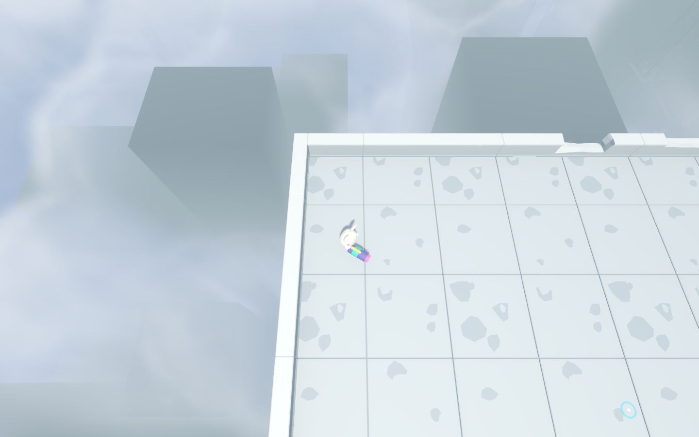

# 正式楼角云消失修复

日期：2026-09-30；记录ID：OUTDOOR-CLOUD-PLACEMENT-FIX；功能ID：VFX-POOL / WORLD-BLOCKS / ASSET-PIPELINE；工程版本0.1.0；资产v002。设计依据：[室外云雾r4](../design/outdoor_cloud_sea.md)。交付：既有工作区，未提交。

用户在100F西北楼角只能看到全场景距离雾。复现发现Skyline楼体布局在上次烘焙后再次更新，旧遮罩检测不匹配便隐藏全部云：主云0、小云0。问题是整套停用的兜底政策过于激进。

配置阶段按变动建筑完整包络生成保守解析禁云区，与原建筑距离纹理取更严格距离；最多16区，超过时合并余量。其余区域继续显示，室内和模型仍禁云。重测最新场景700条边界并离线重烘焙；无模型、碰撞或全场景曝光修改。旧烘焙位置在兜底时暂时多留空，可重烘焙消除。当前已运行的游戏需重新启动加载。

| 验收 | 结果 | 证据 |
|---|---|---|
| 重烘焙前保留旧遮罩 | 30208项通过；失效遮罩下仍有1主云、24小云；独立障碍与实际Shader兜底数组避让通过 | [日志](../../art/outdoor_clouds/placement_fix/fallback_before_bake.log) |
| 最新正式场景真实Forward+专项 | 退出0，30209项通过；686独立障碍、GPU距离与解析兜底、建筑移动负向控制、暂停/60秒流动；无非预期脚本错误 | [日志](../../art/outdoor_clouds/placement_fix/placement_fix_verification.log) |
| 用户西北楼角开关对照 | 玩家(-48,0.05,-31)，原环境、520m视距，云区域平均RGB差0.12260，明确可见 | [开启](../../art/outdoor_clouds/placement_fix/player_rooftop.png)、[关闭](../../art/outdoor_clouds/placement_fix/player_without_clouds.png) |
| 其他玩家镜头与短视距 | 520m差0.05957；145m差0.03165；峰值0.76471，无白色剪切 | 同专项日志 |
| 当前配置 | mask_valid=true，fallback_count=0，主云1、小云24、拒绝0；移动建筑时仅增加禁云区，主云保留 | [原始渲染与性能](../../art/outdoor_clouds/placement_fix/performance.json) |

1440×900、RTX4060Ti、高档全场景GPU中位14.972～15.049ms，对照2.783～2.787ms；中档10.499ms、低档6.899ms。依然是用户要求的品质阶段，未做专项优化。

同一AssetID `VFX-ENV-CLOUD-SEA-3D` 同步特效账本原行、Manifest依赖和资产自身基线。其他资产指纹与无关单元格保留。账本结构及分账本门禁结果随事务记录保存。本修复不改变VFX-POOL整体partial状态。

最终完整性：主表和Prefab两事务门禁通过，保留其余985资产指纹；Manifest依赖哈希一致；媒体独立门禁73资产通过。文档161页、1105本地链接有效，仍有3个既有未注册验收及系统python3缺openpyxl；运行命名仍有既有14文件/3目录/97引用债务。特效全库5项既有哈希问题与修复前完全一致。本次未修改这些其他资产。[完整性记录](../../art/outdoor_clouds/placement_fix/final_integrity.json)。
