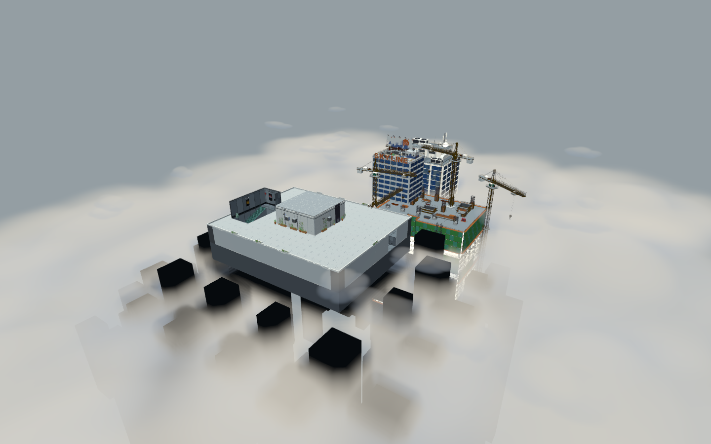
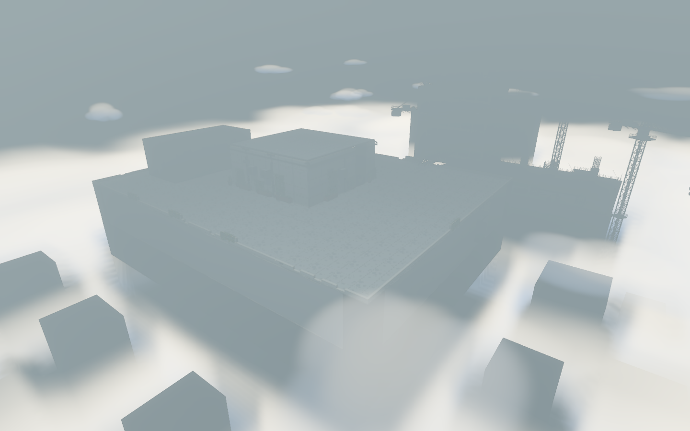

# 室外连续云海与空中薄雾交付

日期：2026-09-30；记录ID：OUTDOOR-CLOUDS-20260930；功能ID：VFX-POOL / WORLD-BLOCKS / ASSET-PIPELINE；工程版本：0.1.0。
设计依据与修订：[室外云雾 r2](../design/outdoor_cloud_sea.md)及用户三张风格参考、两张追加流动薄雾参考；代码基线：本次既有工作区；交付提交：工作区，未提交。

## 变更与原因

用16块大型连续体积云填满主塔与周边建筑的99F以下区域，另有24块大小、高度错落的空中薄雾。暖白与淡蓝半透明色层保持原城市风格，参考追加图片的大尺度连续密度与流动形式。静态盒内的低频噪声缓慢变化，暂停冻结；不通过搬动云块产生穿插。

正式Prefab `assets/art/vfx/environment_3d/cloud_sea/vfx_env_cloud_sea_root_top3d.tscn`，AssetID `VFX-ENV-CLOUD-SEA-3D`；场景 `OutdoorClouds` 拥有生命周期，随场景释放。主塔全高度禁区、路线所有网格（包括隐藏模型）与96个城市楼体合计700条边界形成保守离线距离遮罩。云体内部密度裁切，场景深度截断；模型布局变化触发整套隐藏，须重烘焙。无碰撞、无阴影、无新增灯光。

性能使用预烘焙R8距离纹理5.63MiB和32³噪声，最多16步体积采样、提前终止和距离剔除。高/中/低分别16/12/8步；低档薄雾12块。RTX4060Ti、Forward+、1440×900，每轮预热25帧、测90帧：高画质GPU增量两轮1.154/1.230ms，新增40绘制；中档GPU中位3.541ms，低档3.255ms，同场景基线2.740/2.732ms。数值属于该机器和视角，不作为所有设备保证；[原始数据](../../art/outdoor_clouds/performance.json)。

## 验证结果

| 场景/检查 | 环境与隔离 | 结果 | 证据 |
|---|---|---|---|
| `verify_outdoor_clouds.tscn` | Godot4.6.3真实Forward+，启动前隔离APPDATA | 14985项通过；GPU实际纹理采样、700边界覆盖、室内拒绝、24/12薄雾、三档材质、暂停与60秒流动、失效遮罩隐藏 | 专项脚本可复跑 |
| `verify_cross_tower_route` | 隔离APPDATA | 308项通过，桥楼碰撞回归 | 正式验收入口 |
| `render_outdoor_clouds.gd` | 真实Forward+，1440×900 | 连续云海、模型净空、流动双帧与性能对照通过 | 下列截图与原始数据 |
| 特效账本结构与分账本基线 | 两次独立openpyxl事务 | 通过；733个既有资产基线保留，新增后734个 | 特效资产主表22行、3D-特效23行 |

双帧：[t=24秒](../../art/outdoor_clouds/overview_t24.png)；[天桥与周边大楼](../../art/outdoor_clouds/bridge_and_towers.png)。检查镜头和原环境截图分别保存，未把调试后处理写进正式场景。

## 遗留与状态更新

特效账本登记状态“已优化并正式接入”，稳定Prefab哈希与分账本无损基线同步。全库既有特效哈希5项红项保留，未以新资产检查替代全库通过。运行命名、其他验收注册的既有问题单独保留；本次新增验收进入visual组。VFX-POOL总体partial状态保留，因为既有explosion旧池迁移尚未完成。

纹理烘焙必须使用Forward+：Godot4.6.3 Compatibility的Texture3D读回出现切片偏移，作者转换脚本拒绝无RenderingDevice的烘焙；Forward+ GPU字节与原始R8数据一致。移除主场景OutdoorClouds实例即可退役；布局变化后按源脚本重烘焙，禁止继续使用过期遮罩。

最终文档门禁：159文档、1079本地链接、37功能，新增文档和验收引用有效；仅3个既有未注册验收与系统python3缺少openpyxl导致全库失败。用带依赖的Python单独执行媒体门禁通过（73资产），特效全库前后5项问题完全一致。
