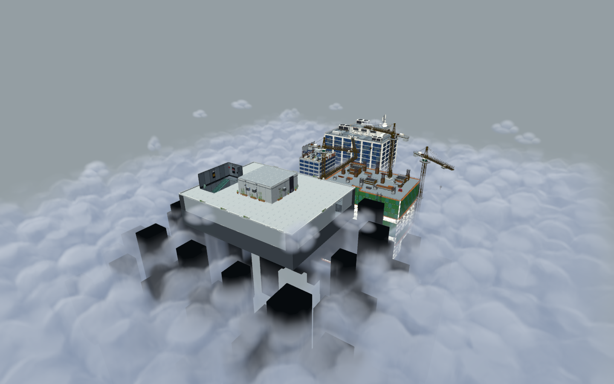

# 室外云海v002品质重制

日期：2026-09-30；记录ID：OUTDOOR-CLOUDS-V002；功能ID：VFX-POOL / WORLD-BLOCKS / ASSET-PIPELINE；工程版本0.1.0。
设计依据：[室外云雾r3](../design/outdoor_cloud_sea.md)与用户指出的硬边、过曝、层次弱及光遇风格参考。代码基线：本次既有工作区；交付：工作区，未提交。

## 变更与原因

v001由重叠大盒和高度色带形成白色平层，云顶起伏及内部明暗不足。v002改为连续世界云密度、周期3D圆团结构、定向透射和密度梯度曲面光照。云顶与下沉薄雾分开；楼边密度渐隐，使下方楼体可透过薄雾。24块空中小云有缓慢横移、浮动和形变，几何包络保持稳定且室外限定。

`sofunny-image`调用`gpt-image-2`基于两张用户风格参考制作原创1024²灰度密度贴图，保留原图与provenance；运行时仅用线性灰度数据。周期128³RGB体积补足真实三维结构，密度贴图镜像重复避免接缝。所有颜色在Shader中控制，不改全场景曝光。Shader使用Godot的双面片元方向与深度输出约定，见[官方空间Shader参考](https://docs.godotengine.org/en/4.6/tutorials/shaders/shader_reference/spatial_shader.html)。

新增近面绘制入口解决大体积远边界被短视距裁掉的问题，相机在内/外只绘制一次。运行核对纠正了早期把Player3D资源130m默认值当作实际天台视距的判断：正式TowerDescent3D天台为520m、下层为145m。本轮两种视距均实测，未修改玩法相机。

制作期间其他场景工作更新了Skyline08的位置/旋转，旧建筑遮罩按契约隐藏。以最新实际几何重新测量700条边界并烘焙。专项独立包络也新增Skyline08，覆盖686个独立实际建筑网格/楼体障碍。原模型、碰撞和桥未改。

## 验证结果

| 检查 | 环境/隔离 | 结果 | 证据 |
|---|---|---|---|
| verify_outdoor_clouds.tscn | Godot4.6.3真实Forward+，独立APPDATA | 24044项通过，无非预期脚本错误；楼体覆盖/GPU纹理/生命周期/画质/失效遮罩负向对照 | [日志](../../art/outdoor_clouds/v002/verification.log) |
| 正式玩家镜头开关 | 原环境、相机520m，冻结场景时间 | 云区域平均RGB差0.08994，峰值0.85490，云可见且亮部有余量 | [启用](../../art/outdoor_clouds/v002/player_rooftop.png)、[关闭](../../art/outdoor_clouds/v002/player_without_clouds.png) |
| 99F短视距渲染 | 相机145m，同镜头控制 | 平均RGB差0.03096，云可见 | 同专项日志 |
| 云顶/下层/漂动 | 真实渲染，60帧×0.2s，5fps播放；未加速 | 12秒实时运动，静态包络保持稳定 | [视频](../../art/outdoor_clouds/v002/cloud_drift_realtime.mp4) |
| 账本升级 | 主表与Prefab表两次独立openpyxl事务 | 原行22/23升级v002，其他资产指纹及无关单元格不变；结构/分账本基线通过 | [主表事务](../../art/outdoor_clouds/v002/main_transaction.json)、[Prefab事务](../../art/outdoor_clouds/v002/prefab_transaction.json) |

高画质RTX4060Ti、1440×900、每轮预热25帧测90帧：GPU中位从2.649/2.651ms增加到14.464/14.632ms，云雾增量11.815/11.981ms，增加27绘制调用；中档10.216ms、低档6.767ms为整场景GPU中位。当前按用户要求优先品质，尚未专项优化；不能再引用v001的约1.2ms增量。[原始性能数据](../../art/outdoor_clouds/v002/performance.json)。

[原场景环境](../../art/outdoor_clouds/v002/gameplay_environment.png)；[楼边与下方楼层](../../art/outdoor_clouds/v002/player_edge_lower_floors.png)；[云顶斜视](../../art/outdoor_clouds/v002/cloud_top_oblique.png)。检查镜头的临时环境未写入游戏。

## 遗留与状态更新

AssetID `VFX-ENV-CLOUD-SEA-3D`保持，账本改为“正式美术已接入”v002，备注明确品质阶段未专项优化；更新稳定Prefab哈希与其自身基线，不接受其他既有特效哈希漂移。VFX-POOL整体partial继续保留，战斗旧池问题不属于本次。

全库既有文档验收注册、系统python3缺少openpyxl和运行命名问题单独保留；本次资产专项、媒体独立门禁与账本结构通过。下一阶段可在保留本轮视觉基准下优化光照密度采样、空域跳过和体积缓存；本轮不降低默认品质来压回旧预算。

最终门禁：文档160页、1095本地链接，新引用有效；仅3个既有未注册验收及系统python3缺openpyxl。媒体独立门禁73资产通过；特效全库5项既有哈希问题前后完全相同。账本事务保留其余985个资产指纹，原云资产更新成功。60个运动帧首尾平均像素变化2.939/255；Manifest所有依赖哈希一致。见[最终完整性记录](../../art/outdoor_clouds/v002/final_integrity.json)。
